GOM Contaminated Sediments Analysis: PAHs
================
Joshua Harkness and Autumn Pauly
2023-10-28

``` r
library(tidyverse)
```

    ## ── Attaching core tidyverse packages ──────────────────────── tidyverse 2.0.0 ──
    ## ✔ dplyr     1.1.3     ✔ readr     2.1.4
    ## ✔ forcats   1.0.0     ✔ stringr   1.5.0
    ## ✔ ggplot2   3.4.4     ✔ tibble    3.2.1
    ## ✔ lubridate 1.9.3     ✔ tidyr     1.3.0
    ## ✔ purrr     1.0.2     
    ## ── Conflicts ────────────────────────────────────────── tidyverse_conflicts() ──
    ## ✖ dplyr::filter() masks stats::filter()
    ## ✖ dplyr::lag()    masks stats::lag()
    ## ℹ Use the conflicted package (<http://conflicted.r-lib.org/>) to force all conflicts to become errors

``` r
library(sf)
```

    ## Linking to GEOS 3.8.0, GDAL 3.0.4, PROJ 6.3.1; sf_use_s2() is TRUE

``` r
library(leaflet)
library(ggplot2)
library(RColorBrewer)
```

\#Loading data

``` r
PAHs <- read.csv(paste0("/cloud/project/data/datasets_csv/PAHs_loc.csv"), header = T)
#PAHs <- PAHs_loc
```

\#Glimpsing PAH

``` r
glimpse(PAHs)
```

    ## Rows: 7,847
    ## Columns: 63
    ## $ UNIQUE_ID   <chr> "US00001", "US00002", "US00003", "US00004", "US00005", "US…
    ## $ LATITUDE    <dbl> 42.35972, 42.36028, 42.38500, 42.38500, 42.38500, 42.38500…
    ## $ LONGITUDE   <dbl> -71.02861, -71.02778, -71.04611, -71.04611, -71.04611, -71…
    ## $ SOUNDING_M  <dbl> NA, NA, NA, NA, NA, NA, NA, NA, NA, NA, NA, NA, NA, NA, NA…
    ## $ STATE_NAME  <chr> "MA", "MA", "MA", "MA", "MA", "MA", "MA", "MA", "MA", "MA"…
    ## $ QUAD_NAME   <chr> NA, NA, NA, NA, NA, NA, NA, NA, NA, NA, NA, NA, NA, NA, NA…
    ## $ GEN_LOC_NM  <chr> "Boston Inner Harbor", "Boston Inner Harbor", "Boston Inne…
    ## $ SPECFC_LOC  <chr> "BIH", "BIH", "BIH", "BIH", "BIH", "BIH", "BIH", "BIH", "B…
    ## $ AREA_CODE   <int> 1, 1, 1, 1, 1, 1, 1, 1, 1, 2, 2, 1, 1, 1, 1, 1, 1, 1, 1, 1…
    ## $ SAMP_DATE1  <chr> NA, NA, "5/1/1981", "5/1/1981", "5/1/1981", "5/1/1981", "5…
    ## $ TO_SMP_DT2  <chr> NA, NA, NA, NA, NA, NA, NA, NA, NA, NA, NA, NA, NA, NA, NA…
    ## $ DPTH_N_COR  <chr> NA, NA, NA, NA, NA, NA, NA, NA, NA, NA, NA, NA, NA, NA, "0…
    ## $ DPTH_CODE   <chr> "Unknown", "Unknown", "Depth", "Depth", "Unknown", "Unknow…
    ## $ COR_GRB_CD  <chr> "Grab", "Grab", "Core", "Core", "Grab", "Grab", "Grab", "G…
    ## $ site        <chr> "BIH", "BIH", "BIH", "BIH", "BIH", "BIH", "BIH", "BIH", "B…
    ## $ BENZNE_C    <int> NA, NA, NA, NA, NA, NA, NA, NA, NA, NA, NA, NA, NA, NA, NA…
    ## $ X2BZTPN_C   <dbl> NA, NA, NA, NA, NA, NA, NA, NA, NA, NA, NA, NA, NA, NA, NA…
    ## $ X2BZTPN_T_C <dbl> NA, NA, NA, NA, NA, NA, NA, NA, NA, NA, NA, NA, NA, NA, NA…
    ## $ C1DIBZTPNC  <dbl> NA, NA, NA, NA, NA, NA, NA, NA, NA, NA, NA, NA, NA, NA, NA…
    ## $ C2DIBZTPNC  <dbl> NA, NA, NA, NA, NA, NA, NA, NA, NA, NA, NA, NA, NA, NA, NA…
    ## $ C3DIBZTPNC  <dbl> NA, NA, NA, NA, NA, NA, NA, NA, NA, NA, NA, NA, NA, NA, NA…
    ## $ X2BZFRN_T_C <lgl> NA, NA, NA, NA, NA, NA, NA, NA, NA, NA, NA, NA, NA, NA, NA…
    ## $ NAPHTHLN_C  <dbl> NA, NA, NA, NA, NA, NA, NA, NA, NA, NA, NA, NA, NA, NA, NA…
    ## $ NPHTLN_T_C  <dbl> NA, NA, NA, NA, NA, NA, NA, NA, NA, NA, NA, NA, NA, NA, NA…
    ## $ C1NPHTLN_C  <dbl> NA, NA, NA, NA, NA, NA, NA, NA, NA, NA, NA, NA, NA, NA, NA…
    ## $ X1MTYLNAP_C <lgl> NA, NA, NA, NA, NA, NA, NA, NA, NA, NA, NA, NA, NA, NA, NA…
    ## $ X2MTYLNAP_C <lgl> NA, NA, NA, NA, NA, NA, NA, NA, NA, NA, NA, NA, NA, NA, NA…
    ## $ C2NPHTLN_C  <dbl> NA, NA, NA, NA, NA, NA, NA, NA, NA, NA, NA, NA, NA, NA, NA…
    ## $ C3NPHTLN_C  <dbl> NA, NA, NA, NA, NA, NA, NA, NA, NA, NA, NA, NA, NA, NA, NA…
    ## $ C4NPHTLN_C  <dbl> NA, NA, NA, NA, NA, NA, NA, NA, NA, NA, NA, NA, NA, NA, NA…
    ## $ BIPHENYL_C  <dbl> NA, NA, NA, NA, NA, NA, NA, NA, NA, NA, NA, NA, NA, NA, NA…
    ## $ ACNPHTHN_C  <dbl> NA, NA, NA, NA, NA, NA, NA, NA, NA, NA, NA, NA, NA, NA, NA…
    ## $ ACNPHTYL_C  <dbl> NA, NA, NA, NA, NA, NA, NA, NA, NA, NA, NA, NA, NA, NA, NA…
    ## $ FLUORENE_C  <dbl> NA, NA, NA, NA, NA, NA, NA, NA, NA, NA, NA, NA, NA, NA, NA…
    ## $ C1FLORNE_C  <dbl> NA, NA, NA, NA, NA, NA, NA, NA, NA, NA, NA, NA, NA, NA, NA…
    ## $ C2FLORNE_C  <dbl> NA, NA, NA, NA, NA, NA, NA, NA, NA, NA, NA, NA, NA, NA, NA…
    ## $ C3FLORNE_C  <dbl> NA, NA, NA, NA, NA, NA, NA, NA, NA, NA, NA, NA, NA, NA, NA…
    ## $ PHNANTHR_C  <dbl> NA, NA, NA, NA, NA, NA, NA, NA, NA, NA, NA, NA, NA, NA, NA…
    ## $ X1MT_PHE_C  <dbl> NA, NA, NA, NA, NA, NA, NA, NA, NA, NA, NA, NA, NA, NA, NA…
    ## $ C2PHNANT_C  <dbl> NA, NA, NA, NA, NA, NA, NA, NA, NA, NA, NA, NA, NA, NA, NA…
    ## $ C3PHNANT_C  <dbl> NA, NA, NA, NA, NA, NA, NA, NA, NA, NA, NA, NA, NA, NA, NA…
    ## $ C4PHNANT_C  <dbl> NA, NA, NA, NA, NA, NA, NA, NA, NA, NA, NA, NA, NA, NA, NA…
    ## $ ANTHRACN_C  <dbl> NA, NA, NA, NA, NA, NA, NA, NA, NA, NA, NA, NA, NA, NA, NA…
    ## $ BZ_A_ANT_C  <dbl> NA, NA, NA, NA, NA, NA, NA, NA, NA, NA, NA, NA, NA, NA, NA…
    ## $ X2_AH_ANT_C <dbl> NA, NA, NA, NA, NA, NA, NA, NA, NA, NA, NA, NA, NA, NA, NA…
    ## $ PYRENE_C    <dbl> NA, NA, NA, NA, NA, NA, NA, NA, NA, NA, NA, NA, NA, NA, NA…
    ## $ C1PYRENE_C  <lgl> NA, NA, NA, NA, NA, NA, NA, NA, NA, NA, NA, NA, NA, NA, NA…
    ## $ BZ_A_PYR_C  <dbl> NA, NA, NA, NA, NA, NA, NA, NA, NA, NA, NA, NA, NA, NA, NA…
    ## $ BZ_E_PYR_C  <dbl> NA, NA, NA, NA, NA, NA, NA, NA, NA, NA, NA, NA, NA, NA, NA…
    ## $ IN_123_PYC  <dbl> NA, NA, NA, NA, NA, NA, NA, NA, NA, NA, NA, NA, NA, NA, NA…
    ## $ X3_4BNZPY_C <lgl> NA, NA, NA, NA, NA, NA, NA, NA, NA, NA, NA, NA, NA, NA, NA…
    ## $ FLORNTHN_C  <dbl> NA, NA, NA, NA, NA, NA, NA, NA, NA, NA, NA, NA, NA, NA, NA…
    ## $ C1FLRNTHNC  <dbl> NA, NA, NA, NA, NA, NA, NA, NA, NA, NA, NA, NA, NA, NA, NA…
    ## $ BZ_B_FLUOC  <dbl> NA, NA, NA, NA, NA, NA, NA, NA, NA, NA, NA, NA, NA, NA, NA…
    ## $ BZ_K_FLUOC  <dbl> NA, NA, NA, NA, NA, NA, NA, NA, NA, NA, NA, NA, NA, NA, NA…
    ## $ CHRYSENE_C  <chr> NA, NA, NA, NA, NA, NA, NA, NA, NA, NA, NA, NA, NA, NA, NA…
    ## $ CHRYS_C1_C  <lgl> NA, NA, NA, NA, NA, NA, NA, NA, NA, NA, NA, NA, NA, NA, NA…
    ## $ CHRYS_C2_C  <lgl> NA, NA, NA, NA, NA, NA, NA, NA, NA, NA, NA, NA, NA, NA, NA…
    ## $ CHRYS_C3_C  <lgl> NA, NA, NA, NA, NA, NA, NA, NA, NA, NA, NA, NA, NA, NA, NA…
    ## $ CHRYS_C4_C  <lgl> NA, NA, NA, NA, NA, NA, NA, NA, NA, NA, NA, NA, NA, NA, NA…
    ## $ PERYLENE_C  <dbl> NA, NA, NA, NA, NA, NA, NA, NA, NA, NA, NA, NA, NA, NA, NA…
    ## $ BNZ_G_PYLC  <lgl> NA, NA, NA, NA, NA, NA, NA, NA, NA, NA, NA, NA, NA, NA, NA…
    ## $ B_GHI_PYLC  <dbl> NA, NA, NA, NA, NA, NA, NA, NA, NA, NA, NA, NA, NA, NA, NA…

# Joining the Station Information to the PAH dataset

Joining the station data with the PAH sample taken. The dataset is
pivoted so that each observation is the PAH that was observed.

``` r
PAHs <- PAHs %>%
  mutate(CHRYSENE_C = as.numeric(CHRYSENE_C)) %>%
  pivot_longer(cols = `BENZNE_C`:`B_GHI_PYLC`, 
               names_to = "pah_detected", 
               values_to = "amount_detected")

PAHs = select(PAHs, c(UNIQUE_ID, LATITUDE, LONGITUDE, SOUNDING_M, QUAD_NAME, GEN_LOC_NM, SPECFC_LOC, AREA_CODE, SAMP_DATE1, TO_SMP_DT2, DPTH_N_COR, DPTH_CODE, COR_GRB_CD, site, pah_detected, amount_detected))

glimpse(PAHs)
```

    ## Rows: 376,656
    ## Columns: 16
    ## $ UNIQUE_ID       <chr> "US00001", "US00001", "US00001", "US00001", "US00001",…
    ## $ LATITUDE        <dbl> 42.35972, 42.35972, 42.35972, 42.35972, 42.35972, 42.3…
    ## $ LONGITUDE       <dbl> -71.02861, -71.02861, -71.02861, -71.02861, -71.02861,…
    ## $ SOUNDING_M      <dbl> NA, NA, NA, NA, NA, NA, NA, NA, NA, NA, NA, NA, NA, NA…
    ## $ QUAD_NAME       <chr> NA, NA, NA, NA, NA, NA, NA, NA, NA, NA, NA, NA, NA, NA…
    ## $ GEN_LOC_NM      <chr> "Boston Inner Harbor", "Boston Inner Harbor", "Boston …
    ## $ SPECFC_LOC      <chr> "BIH", "BIH", "BIH", "BIH", "BIH", "BIH", "BIH", "BIH"…
    ## $ AREA_CODE       <int> 1, 1, 1, 1, 1, 1, 1, 1, 1, 1, 1, 1, 1, 1, 1, 1, 1, 1, …
    ## $ SAMP_DATE1      <chr> NA, NA, NA, NA, NA, NA, NA, NA, NA, NA, NA, NA, NA, NA…
    ## $ TO_SMP_DT2      <chr> NA, NA, NA, NA, NA, NA, NA, NA, NA, NA, NA, NA, NA, NA…
    ## $ DPTH_N_COR      <chr> NA, NA, NA, NA, NA, NA, NA, NA, NA, NA, NA, NA, NA, NA…
    ## $ DPTH_CODE       <chr> "Unknown", "Unknown", "Unknown", "Unknown", "Unknown",…
    ## $ COR_GRB_CD      <chr> "Grab", "Grab", "Grab", "Grab", "Grab", "Grab", "Grab"…
    ## $ site            <chr> "BIH", "BIH", "BIH", "BIH", "BIH", "BIH", "BIH", "BIH"…
    ## $ pah_detected    <chr> "BENZNE_C", "X2BZTPN_C", "X2BZTPN_T_C", "C1DIBZTPNC", …
    ## $ amount_detected <dbl> NA, NA, NA, NA, NA, NA, NA, NA, NA, NA, NA, NA, NA, NA…

# Plotting PAHs Detected in GOM

As shown in the plot below, there is a high concentration of
Fluoranthene, followed by Pyrene, Chrysene, and Phenanthrene.

``` r
PAHs %>%
  filter(pah_detected %in% c("BENZNE_C", "BENZNE_C", "NAPHTHLN_C", "BIPHENYL_C", "ACNPHTHN_C", "ACNPHTYL_C", "FLUORENE_C", "PHNANTHR_C", "ANTHRACN_C", "PYRENE_C", "FLORNTHN_C", "CHRYSENE_C", "PERYLENE_C")) %>%
  ggplot(aes(x = fct_rev(fct_reorder(pah_detected, amount_detected)), y = amount_detected, fill = pah_detected))+
  geom_col()+
  scale_fill_viridis_d() +
  theme_bw()+
  coord_flip()+
  theme(legend.position = "none")+
  labs(title = "PAHs Detected in Gulf of Maine Sediments",
       x = "PAH Detected",
       y = "Amount Detected")
```

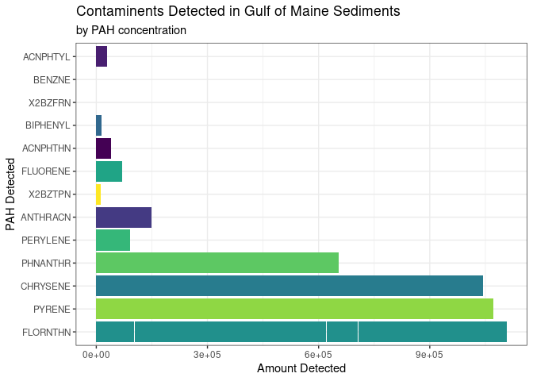<!-- -->

The table below is visualizing the mean, standard deviation, count, and
principal square root values of PAH concentrations for the general
locations.

As shown below, Mass Bays (8505) has the higest count of PAHs, followed
by Northwest Boston Harbor (4243) and Gulf of Maine (\>50m Isobath)
(1953). This does not suggest that these locations will have the highest
concentrations of PAHs, as this does not reflect the quantity of PAHs
collected. Boston Inner Harbor (1843.90) has the highest mean PAH
concentration, followed by Northwest Boston Harbor (610.55) and Central
Boston Harbor (502.36). In addition to this, Boston Inner Harbor has the
highest standard deviation (14235.68), followed by Northwest Boston
Harbor (3132.97) and “43.5N to 44N; to 50M isobath” (1842.51).

``` r
Summary_PAHs <- PAHs %>%
  group_by(GEN_LOC_NM) %>%
  drop_na(amount_detected) %>%
  summarise(mean_PAH = mean(amount_detected),
    sd_PAH = sd(amount_detected),
    n_PAH = n(),
    SE_PAH = sd(amount_detected) / sqrt(n()))

Summary_PAHs
```

    ## # A tibble: 14 × 5
    ##    GEN_LOC_NM                    mean_PAH   sd_PAH n_PAH  SE_PAH
    ##    <chr>                            <dbl>    <dbl> <int>   <dbl>
    ##  1 Boston Inner Harbor           1844.    14236.    1523 365.   
    ##  2 Cape Ann to Cape Elizabeth     257.      601.    1898  13.8  
    ##  3 Cape Code Bay                   34.1      50.8    684   1.94 
    ##  4 Cape Elizabeth to Rockland     345.     1843.    1721  44.4  
    ##  5 Central Boston Harbor          502.     1209.     824  42.1  
    ##  6 Gulf of Maine (<=50m Isobath)    2.45      3.51    21   0.765
    ##  7 Gulf of Maine (>50m Isobath)    26.4      54.4   1953   1.23 
    ##  8 Harbor Approaches              189.      293.      46  43.2  
    ##  9 Inland/Rivers                   53.4      68.2     94   7.03 
    ## 10 Intertidal Alantic Canada        0.929     1.01     8   0.359
    ## 11 Massachusetts Bays              93.0     211.    8505   2.29 
    ## 12 Northwest Boston Harbor        611.     3133.    4243  48.1  
    ## 13 Rockland to north              127.      300.    1399   8.02 
    ## 14 Southeast Boston Harbor        141.      429.    1109  12.9

The graph below is showing which site has the highest mean PAH
concentrations in the Gulf of Maine. As shown, the site with the highest
PAH concentration is Boston Inner Harbor, followed by Northwest Boston
Harbor, Central Boston Harbor, and the area between 43.5N and 44N (Cape
Elizabeth to Rockland, ME).

``` r
Summary_PAHs %>%
  ggplot(aes(x = fct_rev(fct_reorder(GEN_LOC_NM, mean_PAH)), y = mean_PAH, fill = GEN_LOC_NM))+
  geom_col(col = "black")+
  geom_errorbar(aes(ymin = mean_PAH - SE_PAH, ymax = mean_PAH + SE_PAH), width = 0.2)+
  coord_flip()+
  scale_fill_viridis_d()+
  theme_bw()+
  theme(legend.position = "none")+
  labs(title = "PAH Concentrations in Gulf of Maine Sediments",
       x = "General location",
       y = "Mean total PAH concentration ng/g",
       caption = "Error bars = 1 standard error")
```

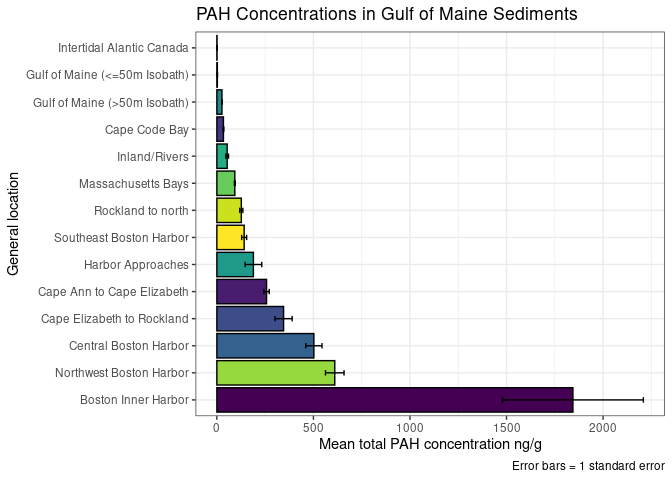<!-- -->

### Specific Locations

The plot below visualizes the summary of PAHs found at each location,
including the mean, standard deviation, count, and principal square
root.

``` r
Sum_PAH_site <- PAHs %>%
  group_by(GEN_LOC_NM) %>%
  drop_na(amount_detected) %>%
  summarise(mean_PAH = mean(amount_detected),
    sd_PAH = sd(amount_detected),
    n_PAH = n(),
    SE_PAH = sd(amount_detected) / sqrt(n())) %>%
  arrange(desc(sd_PAH))

Sum_PAH_site
```

    ## # A tibble: 14 × 5
    ##    GEN_LOC_NM                    mean_PAH   sd_PAH n_PAH  SE_PAH
    ##    <chr>                            <dbl>    <dbl> <int>   <dbl>
    ##  1 Boston Inner Harbor           1844.    14236.    1523 365.   
    ##  2 Northwest Boston Harbor        611.     3133.    4243  48.1  
    ##  3 Cape Elizabeth to Rockland     345.     1843.    1721  44.4  
    ##  4 Central Boston Harbor          502.     1209.     824  42.1  
    ##  5 Cape Ann to Cape Elizabeth     257.      601.    1898  13.8  
    ##  6 Southeast Boston Harbor        141.      429.    1109  12.9  
    ##  7 Rockland to north              127.      300.    1399   8.02 
    ##  8 Harbor Approaches              189.      293.      46  43.2  
    ##  9 Massachusetts Bays              93.0     211.    8505   2.29 
    ## 10 Inland/Rivers                   53.4      68.2     94   7.03 
    ## 11 Gulf of Maine (>50m Isobath)    26.4      54.4   1953   1.23 
    ## 12 Cape Code Bay                   34.1      50.8    684   1.94 
    ## 13 Gulf of Maine (<=50m Isobath)    2.45      3.51    21   0.765
    ## 14 Intertidal Alantic Canada        0.929     1.01     8   0.359

This plot shows us the exact quantity of PAH found at each site.

``` r
PAHs %>%
  group_by(GEN_LOC_NM, pah_detected) %>%
  summarise(amount_detected = sum(amount_detected, na.rm = TRUE)) %>%
  arrange(desc(amount_detected))
```

    ## `summarise()` has grouped output by 'GEN_LOC_NM'. You can override using the
    ## `.groups` argument.

    ## # A tibble: 672 × 3
    ## # Groups:   GEN_LOC_NM [14]
    ##    GEN_LOC_NM              pah_detected amount_detected
    ##    <chr>                   <chr>                  <dbl>
    ##  1 Boston Inner Harbor     CHRYSENE_C           569679.
    ##  2 Boston Inner Harbor     BZ_A_ANT_C           508889.
    ##  3 Boston Inner Harbor     PYRENE_C             346680.
    ##  4 Boston Inner Harbor     FLORNTHN_C           319594.
    ##  5 Northwest Boston Harbor PYRENE_C             315904.
    ##  6 Northwest Boston Harbor FLORNTHN_C           312943.
    ##  7 Boston Inner Harbor     BZ_A_PYR_C           259279.
    ##  8 Boston Inner Harbor     PHNANTHR_C           221666.
    ##  9 Northwest Boston Harbor PHNANTHR_C           219061.
    ## 10 Northwest Boston Harbor CHRYSENE_C           200784.
    ## # ℹ 662 more rows

## Boston Inner Harbor Concentrations

This plot visualizes the specific PAHs present in Boston Inner Harbor.
As shown in the plot, Chrysene (569,679.08 ng/g) has the highest
concentration in the harbor. This is followed by Benz(a) anthracene
(508889.40 ng/g), Pyrene (346679.56 ng/g), and Fluoranthene (319594.32
ng/g)

``` r
PAHs %>%
  group_by(GEN_LOC_NM, pah_detected) %>%
  summarise(amount_detected = sum(amount_detected, na.rm = TRUE)) %>%
  filter(GEN_LOC_NM == "BOSTON INNER HARBOR") %>%
  arrange(desc(amount_detected))
```

    ## `summarise()` has grouped output by 'GEN_LOC_NM'. You can override using the
    ## `.groups` argument.

    ## # A tibble: 0 × 3
    ## # Groups:   GEN_LOC_NM [0]
    ## # ℹ 3 variables: GEN_LOC_NM <chr>, pah_detected <chr>, amount_detected <dbl>

``` r
PAHs %>%
  group_by(GEN_LOC_NM, pah_detected) %>%
  summarise(amount_detected = sum(amount_detected, na.rm = TRUE)) %>%
  filter(GEN_LOC_NM == "BOSTON INNER HARBOR") %>%
 ggplot(aes(x = fct_rev(fct_reorder(pah_detected, amount_detected)), y = amount_detected, fill = pah_detected))+
  geom_col()+
  coord_flip()+
  theme(legend.position = "none")+
  labs(title = "PAH Concentrations in Boston Inner Harbor",
       x = "PAH Detected",
       y = "Amount Detected (ng/g)")
```

    ## `summarise()` has grouped output by 'GEN_LOC_NM'. You can override using the
    ## `.groups` argument.

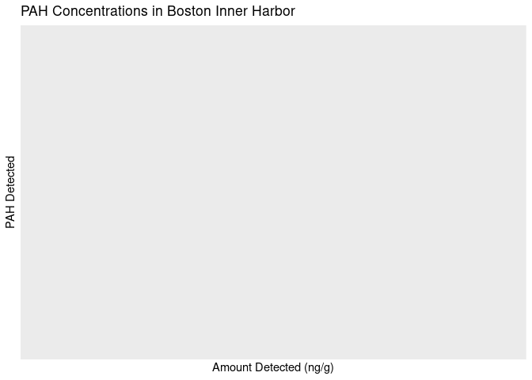<!-- -->

``` r
#select out NA values. 
```

## Northwest Boston Harbor Concentrations

This plot visualizes the specific PAHs present in Northwest Boston
Harbor.  
As shown in the plot, Pyrene (315,904.49 ng/g) has the highest
concentration in the harbor. This is followed by Fluoranthene
(312,942.98 ng/g), Phenanthrene (219061.23 ng/g), and Chrysene
(200784.37 ng/g).

``` r
PAHs %>%
  group_by(GEN_LOC_NM, pah_detected) %>%
  summarise(amount_detected = sum(amount_detected, na.rm = TRUE)) %>%
  filter(GEN_LOC_NM == "NORTHWEST BOSTON HARBOR") %>%
  arrange(desc(amount_detected))
```

    ## `summarise()` has grouped output by 'GEN_LOC_NM'. You can override using the
    ## `.groups` argument.

    ## # A tibble: 0 × 3
    ## # Groups:   GEN_LOC_NM [0]
    ## # ℹ 3 variables: GEN_LOC_NM <chr>, pah_detected <chr>, amount_detected <dbl>

``` r
PAHs %>%
  drop_na(amount_detected) %>%
  filter(GEN_LOC_NM %in% c("NORTHWEST BOSTON HARBOR")) %>%
  ggplot(aes(x = fct_rev(fct_reorder(pah_detected, amount_detected)), y = amount_detected, fill = pah_detected))+
  geom_col()+
  coord_flip()+
  theme(legend.position = "none")+
  labs(title = "PAH Concentrations in Northwest Boston Harbor",
       x = "PAH Detected",
       y = "Amount Detected (ng/g)")
```

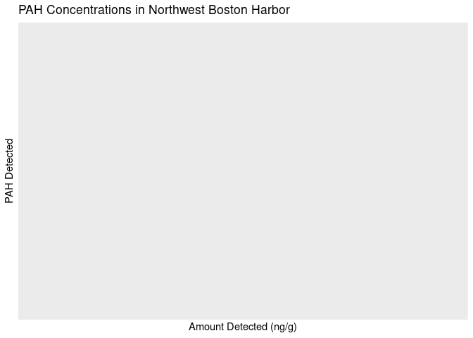<!-- -->

## Central Boston Harbor Concentrations

This plot visualizes the specific PAHs present from Central Boston
Harbor.  
As shown in the plot, Pyrene (71,710.28 ng/g) has the highest
concentration in the harbor. This is followed by Fluoranthene (64,217.22
ng/g), and Phenanthrene (43304.62 ng/g).

``` r
PAHs %>%
  group_by(GEN_LOC_NM, pah_detected) %>%
  summarise(amount_detected = sum(amount_detected, na.rm = TRUE)) %>%
  filter(GEN_LOC_NM == "CENTRAL BOSTON HARBOR") %>%
  arrange(desc(amount_detected))
```

    ## `summarise()` has grouped output by 'GEN_LOC_NM'. You can override using the
    ## `.groups` argument.

    ## # A tibble: 0 × 3
    ## # Groups:   GEN_LOC_NM [0]
    ## # ℹ 3 variables: GEN_LOC_NM <chr>, pah_detected <chr>, amount_detected <dbl>

``` r
PAHs %>%
  drop_na(amount_detected) %>%
  filter(GEN_LOC_NM %in% c("CENTRAL BOSTON HARBOR")) %>%
 ggplot(aes(x = fct_rev(fct_reorder(pah_detected, amount_detected)), y = amount_detected, fill = pah_detected))+
  geom_col()+
  coord_flip()+
  theme(legend.position = "none")+
  labs(title = "PAH Concentrations in Central Boston Harbor",
       x = "PAH Detected",
       y = "Amount Detected (ng/g)")
```

<!-- -->

## Cape Ann to Cape Elizabeth Concentrations

This plot visualizes the specific PAHs present from Cape Ann to Cape
Elizabeth.  
As shown in the plot, Fluoranthene (116,706.13 ng/g) has the highest
concentration in the harbor. Chrysene (112,928.05 ng/g) and Pyrene
(110687.93 ng/g) are the second and third most abundant PAHs.

``` r
PAHs %>%
  group_by(GEN_LOC_NM, pah_detected) %>%
  summarise(amount_detected = sum(amount_detected, na.rm = TRUE)) %>%
  filter(GEN_LOC_NM == "43.5N to 44N; to 50M isobath") %>%
  arrange(desc(amount_detected))
```

    ## `summarise()` has grouped output by 'GEN_LOC_NM'. You can override using the
    ## `.groups` argument.

    ## # A tibble: 0 × 3
    ## # Groups:   GEN_LOC_NM [0]
    ## # ℹ 3 variables: GEN_LOC_NM <chr>, pah_detected <chr>, amount_detected <dbl>

``` r
PAHs %>%
  drop_na(amount_detected) %>%
  filter(GEN_LOC_NM %in% c("43.5N to 44N; to 50M isobath")) %>%
 ggplot(aes(x = fct_rev(fct_reorder(pah_detected, amount_detected)), y = amount_detected, fill = pah_detected))+
  geom_col()+
  coord_flip()+
  theme(legend.position = "none")+
  labs(title = "PAH Concentrations from Cape Ann to Cape Elizabeth",
       x = "PAH Detected",
       y = "Amount Detected (ng/g)")
```

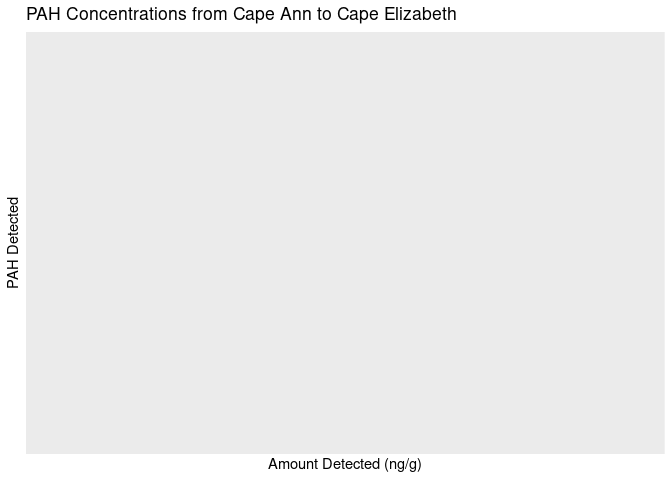<!-- -->

## Statistical tests

### Difference between general locations

Does total PAH concentration differ significantly between general
locations?

``` r
hist(PAHs$amount_detected)
```

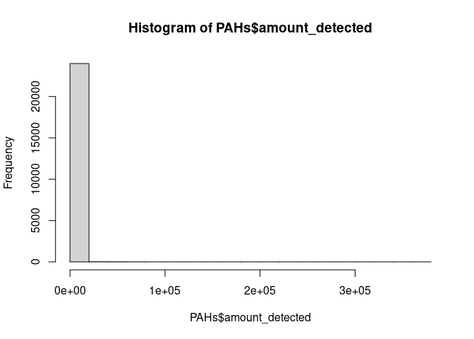<!-- -->

``` r
kw1=kruskal.test(PAHs$amount_detected ~ PAHs$GEN_LOC_NM)
kw1
```

    ## 
    ##  Kruskal-Wallis rank sum test
    ## 
    ## data:  PAHs$amount_detected by PAHs$GEN_LOC_NM
    ## Kruskal-Wallis chi-squared = 1773.1, df = 13, p-value < 2.2e-16

This shows that it is significant. We will now run a Dunn post-hoc test
to identify any significance between locations.

``` r
#install.packages("dunn.test")
#library(dunn.test)

#dunn=dunn.test(PAHs$amount_detected,Organics$GEN_LOC_NM,method="bh")
```

Interpretation: Most general locations have significantly different mean
total PAH concentrations.

## Map Plots

### Static maps

``` r
GOM_states <- st_read("/cloud/project/extra/GOM_DD.shp")
```

    ## Reading layer `GOM_DD' from data source `/cloud/project/extra/GOM_DD.shp' using driver `ESRI Shapefile'
    ## Simple feature collection with 8 features and 6 fields
    ## Geometry type: MULTIPOLYGON
    ## Dimension:     XY
    ## Bounding box:  xmin: -73.72972 ymin: 40.98249 xmax: -59.69256 ymax: 48.06532
    ## Geodetic CRS:  NAD83

``` r
Bathy <- st_read("/cloud/project/extra/BATHYMGM_ARC.shp")
```

    ## Reading layer `BATHYMGM_ARC' from data source 
    ##   `/cloud/project/extra/BATHYMGM_ARC.shp' using driver `ESRI Shapefile'
    ## Simple feature collection with 5383 features and 2 fields
    ## Geometry type: LINESTRING
    ## Dimension:     XY
    ## Bounding box:  xmin: 174878.8 ymin: 577731.9 xmax: 923912.7 ymax: 1311467
    ## Projected CRS: NAD83 / Massachusetts Mainland

Bathymetry data is in projected coordinate system (NAD83), other data is
geodetic (NAD83).  
Wasn’t able to add this layer to map plot – need to change projection.

``` r
st_crs(Bathy)
```

    ## Coordinate Reference System:
    ##   User input: NAD83 / Massachusetts Mainland 
    ##   wkt:
    ## PROJCRS["NAD83 / Massachusetts Mainland",
    ##     BASEGEOGCRS["NAD83",
    ##         DATUM["North American Datum 1983",
    ##             ELLIPSOID["GRS 1980",6378137,298.257222101,
    ##                 LENGTHUNIT["metre",1]]],
    ##         PRIMEM["Greenwich",0,
    ##             ANGLEUNIT["degree",0.0174532925199433]],
    ##         ID["EPSG",4269]],
    ##     CONVERSION["SPCS83 Massachusetts Mainland zone (meters)",
    ##         METHOD["Lambert Conic Conformal (2SP)",
    ##             ID["EPSG",9802]],
    ##         PARAMETER["Latitude of false origin",41,
    ##             ANGLEUNIT["degree",0.0174532925199433],
    ##             ID["EPSG",8821]],
    ##         PARAMETER["Longitude of false origin",-71.5,
    ##             ANGLEUNIT["degree",0.0174532925199433],
    ##             ID["EPSG",8822]],
    ##         PARAMETER["Latitude of 1st standard parallel",42.6833333333333,
    ##             ANGLEUNIT["degree",0.0174532925199433],
    ##             ID["EPSG",8823]],
    ##         PARAMETER["Latitude of 2nd standard parallel",41.7166666666667,
    ##             ANGLEUNIT["degree",0.0174532925199433],
    ##             ID["EPSG",8824]],
    ##         PARAMETER["Easting at false origin",200000,
    ##             LENGTHUNIT["metre",1],
    ##             ID["EPSG",8826]],
    ##         PARAMETER["Northing at false origin",750000,
    ##             LENGTHUNIT["metre",1],
    ##             ID["EPSG",8827]]],
    ##     CS[Cartesian,2],
    ##         AXIS["easting (X)",east,
    ##             ORDER[1],
    ##             LENGTHUNIT["metre",1]],
    ##         AXIS["northing (Y)",north,
    ##             ORDER[2],
    ##             LENGTHUNIT["metre",1]],
    ##     USAGE[
    ##         SCOPE["unknown"],
    ##         AREA["USA - Massachusetts - SPCS - mainland"],
    ##         BBOX[41.46,-73.5,42.89,-69.86]],
    ##     ID["EPSG",26986]]

``` r
Bathy <- st_transform(Bathy, "+init=epsg:4269")
```

    ## Warning in CPL_crs_from_input(x): GDAL Message 1: +init=epsg:XXXX syntax is
    ## deprecated. It might return a CRS with a non-EPSG compliant axis order.

Now the Bathy shapefile is in geodetic NAD83 format.

``` r
unique(Bathy$CONTOUR)
```

    ##  [1]    -5   -40   -15   -20   -10     0   -50   -30   -70   -60  -100   -90
    ## [13]   -80  -120  -220  -200  -160  -180  -140  -240  -300  -280  -260  -500
    ## [25]  -400 -2000 -1000 -3000 -4000

``` r
Bathy_low_res <- Bathy%>%
 filter(CONTOUR %in% c("-100","-500","-1000","-2000","-3000","-4000"))
ggplot(Bathy_low_res) +
  geom_sf(aes())
```

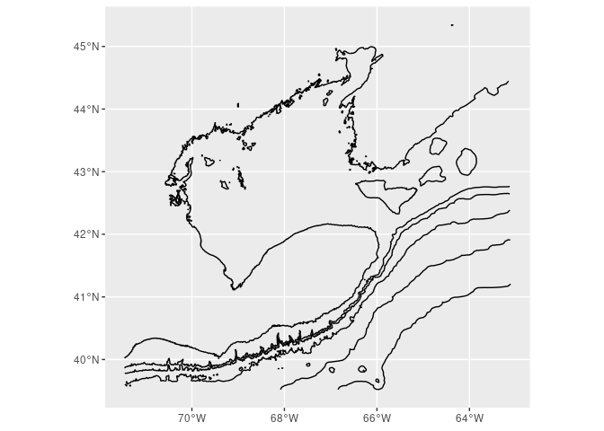<!-- -->

``` r
Bathy_hi_res <- Bathy%>%
 filter(CONTOUR %in% c("-40","-80","-120","160","200","240"))
ggplot(Bathy_hi_res) +
  geom_sf(aes())
```

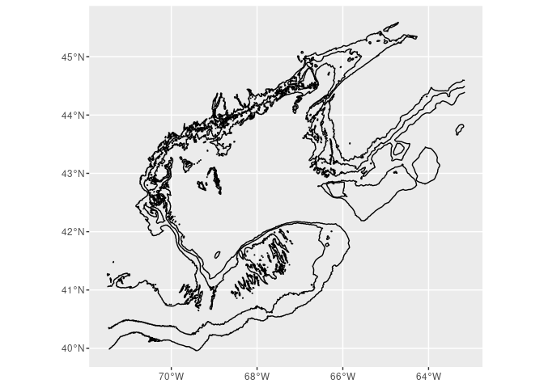<!-- -->

``` r
PAH_no_na <- PAHs %>%
  drop_na(amount_detected)

PAH_no_na_specific_pah <- PAH_no_na %>%
  filter(pah_detected %in% c("BENZNE_C", "BENZNE_C", "NAPHTHLN_C", "BIPHENYL_C", "ACNPHTHN_C", "ACNPHTYL_C", "FLUORENE_C", "PHNANTHR_C", "ANTHRACN_C", "PYRENE_C", "FLORNTHN_C", "CHRYSENE_C", "PERYLENE_C"))
```

``` r
ggplot(GOM_states)+
  geom_sf(aes())+
  geom_sf(data = Bathy_low_res, color = "gray80", width = 1)+
  geom_point(data = PAH_no_na, (aes(x = LONGITUDE, y = LATITUDE, size = amount_detected, alpha = 0.5)))+
  xlim(-72,-65)+
  ylim(40,45)+
  theme_bw()+
  labs(title = "Distribution and concentration of PAHs",
       subtitle ="Gulf of Maine sediments",
       x = "Longitude",
       y = "Latitude")+
  guides(size = guide_legend(title = "PAH ng/g"))+
  guides(alpha = FALSE)+
  ggspatial::annotation_scale(
    location = "bl",
    bar_cols = c("grey60", "white"),
    text_family = "ArcherPro Book"
  ) +
  ggspatial::annotation_north_arrow(
    location = "tr", which_north = "true",
    pad_x = unit(0, "in"), pad_y = unit(0.2, "in"),
    style = ggspatial::north_arrow_nautical(
      fill = c("grey40", "white"),
      line_col = "grey20",
      text_family = "ArcherPro Book"))
```

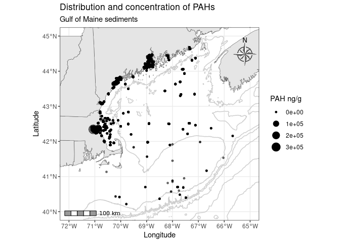<!-- --> Above is the
Distribution and concentration of PAHs in the Gulf of Maine sediments.

``` r
ggplot(GOM_states)+
  geom_sf(aes())+
  geom_sf(data = Bathy_hi_res, color = "gray80", width = 1)+
  geom_point(data=PAH_no_na, (aes(x = LONGITUDE, y = LATITUDE, size = amount_detected, alpha = 0.5)))+
  xlim(-69.2,-68)+
  ylim(44,44.5)+
  theme_bw()+
  labs(title = "Distribution and concentration of PAHs",
       subtitle ="MDI and Penobscot Bay sediments",
       x = "Longitude",
       y = "Latitude")+
  guides(size = guide_legend(title = "PAH ng/g"))+
  guides(alpha = FALSE)+
  ggspatial::annotation_scale(
    location = "bl",
    bar_cols = c("grey60", "white"),
    text_family = "ArcherPro Book"
  ) +
  ggspatial::annotation_north_arrow(
    location = "tr", which_north = "true",
    pad_x = unit(0, "in"), pad_y = unit(0.2, "in"),
    style = ggspatial::north_arrow_nautical(
      fill = c("grey40", "white"),
      line_col = "grey20",
      text_family = "ArcherPro Book"))
```

    ## Warning in layer_sf(geom = GeomSf, data = data, mapping = mapping, stat = stat,
    ## : Ignoring unknown parameters: `width`

    ## Warning: Removed 22932 rows containing missing values (`geom_point()`).

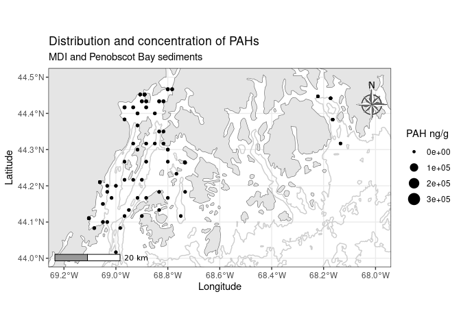<!-- --> Above is the
Distribution and concentration of PAHs in MDI and Penobscot Bay
sediments.

``` r
ggplot(GOM_states)+
  geom_sf(aes())+
  geom_sf(data = Bathy_hi_res, color = "gray80", width = 1)+
  geom_point(data=PAH_no_na, (aes(x = LONGITUDE, y = LATITUDE, size = amount_detected, alpha = 0.5)))+
  xlim(-71.2,-69.5)+
  ylim(41.8,43)+
  theme_bw()+
  labs(title = "Distribution and concentration of PAHs",
       subtitle ="Boston, MA and Cape Cod Bay sediments",
       x = "Longitude",
       y = "Latitude")+
  guides(size = guide_legend(title = "PAH ng/g"))+
  guides(alpha = FALSE)+
  ggspatial::annotation_scale(
    location = "bl",
    bar_cols = c("grey60", "white"),
    text_family = "ArcherPro Book"
  ) +
  ggspatial::annotation_north_arrow(
    location = "tr", which_north = "true",
    pad_x = unit(0, "in"), pad_y = unit(0.1, "in"),
    style = ggspatial::north_arrow_nautical(
      fill = c("grey40", "white"),
      line_col = "grey20",
      text_family = "ArcherPro Book"))
```

    ## Warning in layer_sf(geom = GeomSf, data = data, mapping = mapping, stat = stat,
    ## : Ignoring unknown parameters: `width`

    ## Warning: Removed 6670 rows containing missing values (`geom_point()`).

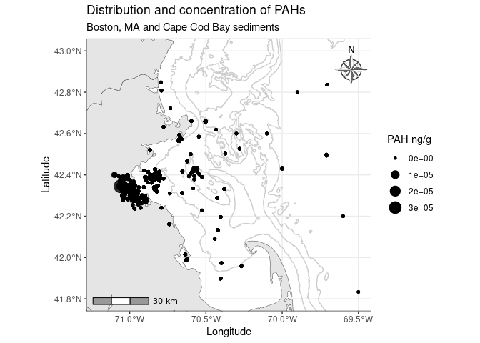<!-- -->
Above is the Distribution and concentration of PAHs in Boston, MA and
Cape Cod Bay sediments.

``` r
ggplot(GOM_states)+
  geom_sf(aes())+
  geom_sf(data = Bathy_hi_res, color = "gray80", width = 1)+
  geom_point(data=PAH_no_na_specific_pah, (aes(x = LONGITUDE, y = LATITUDE, size = amount_detected, color = pah_detected, alpha = 0.5)))+
  xlim(-71.2,-69.5)+
  ylim(41.8,43)+
  theme_bw()+
  labs(title = "Distribution and concentration of PAHs",
       subtitle ="Boston, MA and Cape Cod Bay sediments",
       x = "Longitude",
       y = "Latitude")+
  guides(size = guide_legend(title = "PAH ng/g"))+
  guides(alpha = FALSE)+
  ggspatial::annotation_scale(
    location = "bl",
    bar_cols = c("grey60", "white"),
    text_family = "ArcherPro Book"
  ) +
  ggspatial::annotation_north_arrow(
    location = "tr", which_north = "true",
    pad_x = unit(0, "in"), pad_y = unit(0.1, "in"),
    style = ggspatial::north_arrow_nautical(
      fill = c("grey40", "white"),
      line_col = "grey20",
      text_family = "ArcherPro Book"))
```

    ## Warning in layer_sf(geom = GeomSf, data = data, mapping = mapping, stat = stat,
    ## : Ignoring unknown parameters: `width`

    ## Warning: Removed 3235 rows containing missing values (`geom_point()`).

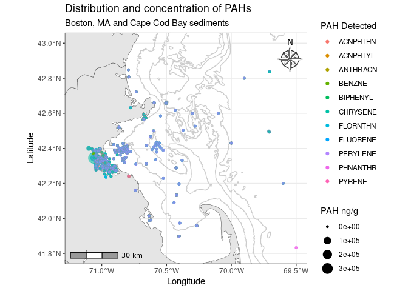<!-- -->
Above is the same graph, but now we are coloring the points by the
specific pah that was detected.

### Interactive map

``` r
#labels <- sprintf("<strong>%s</strong><br/>%g ng/g", 
#                 PAH_no_na$SPECFC_LOC, PAH_no_na$amount_detected) %>%
# lapply(htmltools::HTML)
#
#head(labels, 1)
```

``` r
#leaflet(data = PAH_no_na) %>%
  #addProviderTiles(providers$Esri.WorldTopoMap) %>%
  #setView(lng = -68.5, 
    #      lat = 43.5, 
     #     zoom = 6) %>%
  #addCircleMarkers(lng = ~LONGITUDE, lat = ~LATITUDE, popup = c(~SPECFC_LOC, ~amount_detected), label = labels)
```

Note that the two above code chunks are commented out as .rmd will not
knit to github document with html functions. Uncomment to run and change
output type to `html_document` to knit.
