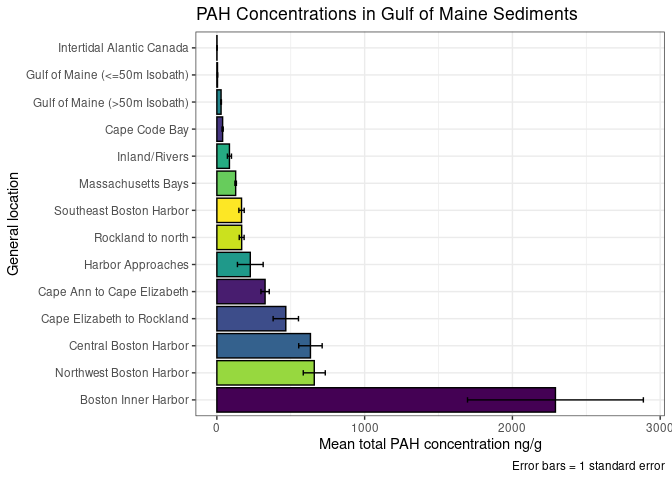
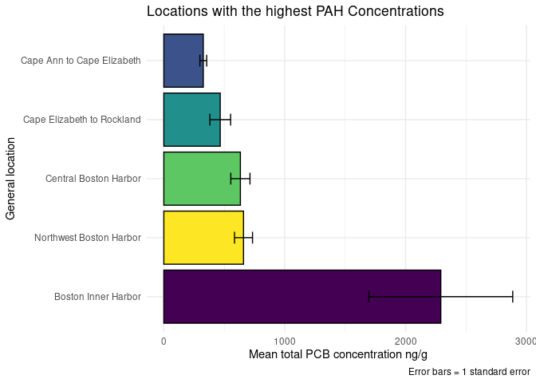
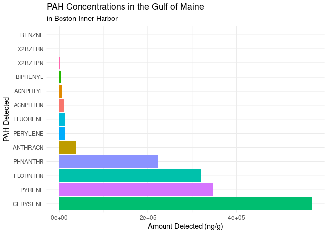
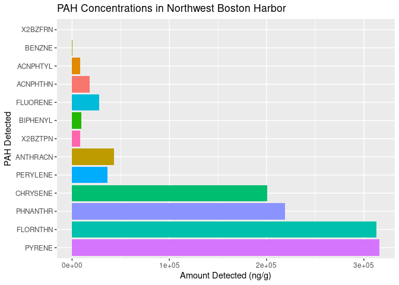
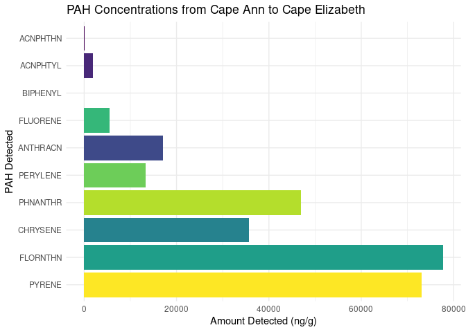
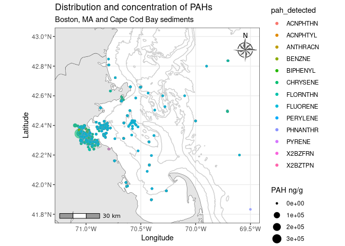

GOM Contaminated Sediments Analysis: PAHs
================
Joshua Harkness and Autumn Pauly
2023-10-28

# Introduction

This document is an analysis of distributions and concentrations of
Polycyclic aromatic hydrocarbons (PAH) contaminants that were reported
in a publication by the U.S. Geological Survey on contaminated sediments
in the Gulf of Maine. These are the types of chemicals that naturally
occur in crude oil, coal, and gasoline.

### Loading Packages

``` r
library(tidyverse)
```

    ## ── Attaching core tidyverse packages ──────────────────────── tidyverse 2.0.0 ──
    ## ✔ dplyr     1.1.3     ✔ readr     2.1.4
    ## ✔ forcats   1.0.0     ✔ stringr   1.5.0
    ## ✔ ggplot2   3.4.4     ✔ tibble    3.2.1
    ## ✔ lubridate 1.9.3     ✔ tidyr     1.3.0
    ## ✔ purrr     1.0.2     
    ## ── Conflicts ────────────────────────────────────────── tidyverse_conflicts() ──
    ## ✖ dplyr::filter() masks stats::filter()
    ## ✖ dplyr::lag()    masks stats::lag()
    ## ℹ Use the conflicted package (<http://conflicted.r-lib.org/>) to force all conflicts to become errors

``` r
library(sf)
```

    ## Linking to GEOS 3.8.0, GDAL 3.0.4, PROJ 6.3.1; sf_use_s2() is TRUE

``` r
library(leaflet)
library(ggplot2)
library(RColorBrewer)
```

### Loading PAH Dataset

``` r
PAHs <- read.csv(paste0("/cloud/project/data/datasets_csv/PAHs_loc.csv"), header = T)
```

### Glimpsing the PAH Dataset

``` r
glimpse(PAHs)
```

    ## Rows: 7,847
    ## Columns: 28
    ## $ UNIQUE_ID   <chr> "US00001", "US00002", "US00003", "US00004", "US00005", "US…
    ## $ LATITUDE    <dbl> 42.35972, 42.36028, 42.38500, 42.38500, 42.38500, 42.38500…
    ## $ LONGITUDE   <dbl> -71.02861, -71.02778, -71.04611, -71.04611, -71.04611, -71…
    ## $ SOUNDING_M  <dbl> NA, NA, NA, NA, NA, NA, NA, NA, NA, NA, NA, NA, NA, NA, NA…
    ## $ STATE_NAME  <chr> "MA", "MA", "MA", "MA", "MA", "MA", "MA", "MA", "MA", "MA"…
    ## $ QUAD_NAME   <chr> NA, NA, NA, NA, NA, NA, NA, NA, NA, NA, NA, NA, NA, NA, NA…
    ## $ GEN_LOC_NM  <chr> "Boston Inner Harbor", "Boston Inner Harbor", "Boston Inne…
    ## $ SPECFC_LOC  <chr> "BIH", "BIH", "BIH", "BIH", "BIH", "BIH", "BIH", "BIH", "B…
    ## $ AREA_CODE   <int> 1, 1, 1, 1, 1, 1, 1, 1, 1, 2, 2, 1, 1, 1, 1, 1, 1, 1, 1, 1…
    ## $ SAMP_DATE1  <chr> NA, NA, "5/1/1981", "5/1/1981", "5/1/1981", "5/1/1981", "5…
    ## $ TO_SMP_DT2  <chr> NA, NA, NA, NA, NA, NA, NA, NA, NA, NA, NA, NA, NA, NA, NA…
    ## $ DPTH_N_COR  <chr> NA, NA, NA, NA, NA, NA, NA, NA, NA, NA, NA, NA, NA, NA, "0…
    ## $ DPTH_CODE   <chr> "Unknown", "Unknown", "Depth", "Depth", "Unknown", "Unknow…
    ## $ COR_GRB_CD  <chr> "Grab", "Grab", "Core", "Core", "Grab", "Grab", "Grab", "G…
    ## $ site        <chr> "BIH", "BIH", "BIH", "BIH", "BIH", "BIH", "BIH", "BIH", "B…
    ## $ BENZNE_C    <int> NA, NA, NA, NA, NA, NA, NA, NA, NA, NA, NA, NA, NA, NA, NA…
    ## $ X2BZTPN_C   <dbl> NA, NA, NA, NA, NA, NA, NA, NA, NA, NA, NA, NA, NA, NA, NA…
    ## $ X2BZFRN_T_C <lgl> NA, NA, NA, NA, NA, NA, NA, NA, NA, NA, NA, NA, NA, NA, NA…
    ## $ BIPHENYL_C  <dbl> NA, NA, NA, NA, NA, NA, NA, NA, NA, NA, NA, NA, NA, NA, NA…
    ## $ ACNPHTHN_C  <dbl> NA, NA, NA, NA, NA, NA, NA, NA, NA, NA, NA, NA, NA, NA, NA…
    ## $ ACNPHTYL_C  <dbl> NA, NA, NA, NA, NA, NA, NA, NA, NA, NA, NA, NA, NA, NA, NA…
    ## $ FLUORENE_C  <dbl> NA, NA, NA, NA, NA, NA, NA, NA, NA, NA, NA, NA, NA, NA, NA…
    ## $ PHNANTHR_C  <dbl> NA, NA, NA, NA, NA, NA, NA, NA, NA, NA, NA, NA, NA, NA, NA…
    ## $ ANTHRACN_C  <dbl> NA, NA, NA, NA, NA, NA, NA, NA, NA, NA, NA, NA, NA, NA, NA…
    ## $ PYRENE_C    <dbl> NA, NA, NA, NA, NA, NA, NA, NA, NA, NA, NA, NA, NA, NA, NA…
    ## $ FLORNTHN_C  <dbl> NA, NA, NA, NA, NA, NA, NA, NA, NA, NA, NA, NA, NA, NA, NA…
    ## $ CHRYSENE_C  <chr> NA, NA, NA, NA, NA, NA, NA, NA, NA, NA, NA, NA, NA, NA, NA…
    ## $ PERYLENE_C  <dbl> NA, NA, NA, NA, NA, NA, NA, NA, NA, NA, NA, NA, NA, NA, NA…

## Data Transformation

### Pivoting PAHs into a Longer Format

This function creates two columns to properly contain the values of PAHs
measured during these surveys - the `pah_detected` column contains the
type of PAH that was measured and the `amount_detected` column contains
the values for each measurement. Selecting specific variables within the
`PAHs` data set will allow for a more concise data frame that is more
applicable to the analysis.

``` r
PAHs <- PAHs %>%
  mutate(CHRYSENE_C = as.numeric(CHRYSENE_C)) %>%
  pivot_longer(cols = `BENZNE_C`:`PERYLENE_C`, 
               names_to = "pah_detected", 
               values_to = "amount_detected")

PAHs = select(PAHs, c(UNIQUE_ID, LATITUDE, LONGITUDE, SOUNDING_M, QUAD_NAME, GEN_LOC_NM, SPECFC_LOC, AREA_CODE, SAMP_DATE1, TO_SMP_DT2, DPTH_N_COR, DPTH_CODE, COR_GRB_CD, site, pah_detected, amount_detected))

glimpse(PAHs)
```

    ## Rows: 102,011
    ## Columns: 16
    ## $ UNIQUE_ID       <chr> "US00001", "US00001", "US00001", "US00001", "US00001",…
    ## $ LATITUDE        <dbl> 42.35972, 42.35972, 42.35972, 42.35972, 42.35972, 42.3…
    ## $ LONGITUDE       <dbl> -71.02861, -71.02861, -71.02861, -71.02861, -71.02861,…
    ## $ SOUNDING_M      <dbl> NA, NA, NA, NA, NA, NA, NA, NA, NA, NA, NA, NA, NA, NA…
    ## $ QUAD_NAME       <chr> NA, NA, NA, NA, NA, NA, NA, NA, NA, NA, NA, NA, NA, NA…
    ## $ GEN_LOC_NM      <chr> "Boston Inner Harbor", "Boston Inner Harbor", "Boston …
    ## $ SPECFC_LOC      <chr> "BIH", "BIH", "BIH", "BIH", "BIH", "BIH", "BIH", "BIH"…
    ## $ AREA_CODE       <int> 1, 1, 1, 1, 1, 1, 1, 1, 1, 1, 1, 1, 1, 1, 1, 1, 1, 1, …
    ## $ SAMP_DATE1      <chr> NA, NA, NA, NA, NA, NA, NA, NA, NA, NA, NA, NA, NA, NA…
    ## $ TO_SMP_DT2      <chr> NA, NA, NA, NA, NA, NA, NA, NA, NA, NA, NA, NA, NA, NA…
    ## $ DPTH_N_COR      <chr> NA, NA, NA, NA, NA, NA, NA, NA, NA, NA, NA, NA, NA, NA…
    ## $ DPTH_CODE       <chr> "Unknown", "Unknown", "Unknown", "Unknown", "Unknown",…
    ## $ COR_GRB_CD      <chr> "Grab", "Grab", "Grab", "Grab", "Grab", "Grab", "Grab"…
    ## $ site            <chr> "BIH", "BIH", "BIH", "BIH", "BIH", "BIH", "BIH", "BIH"…
    ## $ pah_detected    <chr> "BENZNE_C", "X2BZTPN_C", "X2BZFRN_T_C", "BIPHENYL_C", …
    ## $ amount_detected <dbl> NA, NA, NA, NA, NA, NA, NA, NA, NA, NA, NA, NA, NA, NA…

## Data Visualizations

### Descriptive Visualizations

First, the number of observations collected at each location will be
visualized. By counting the observations at each general location, this
graph reflects sampling intensity. The greatest number of observations
are in the Gulf of Maine below the 50m isobath (as a product of area and
sampling intensity); Massachusetts Bays, and Boston Harbor sites. The
MA/NH/ME coast are all generally heavily sampled.

``` r
PAHs %>%
  ggplot(aes(x = fct_infreq(GEN_LOC_NM), fill = fct_infreq(GEN_LOC_NM))) +
  geom_bar(stat = "count", color = "black") +
  coord_flip() +
  theme_minimal() +
  scale_fill_viridis_d() +
  theme(legend.position = "none") +
  labs(title = "Number of Observations by General Location",
       subtitle = "for PAH Contaminents",
       x = "General Location",
       y = "Count (n Observations)")
```

<!-- -->

## General PAH Concentration

As shown in the plot below, there is a high concentration of
Fluoranthene, followed by Pyrene, Chrysene, and Phenanthrene.

``` r
PAHs %>%
  ggplot(aes(x = fct_rev(fct_reorder(pah_detected, amount_detected)), y = amount_detected, fill = fct_infreq(pah_detected)))+
  geom_col()+
  scale_fill_viridis_d() +
  theme_bw()+
  coord_flip()+
  theme(legend.position = "none")+
  labs(title = "Contaminents Detected in Gulf of Maine Sediments",
       subtitle = "by PAH concentration",
       x = "PAH Detected",
       y = "Amount Detected")
```

<!-- -->

# PAH Site to Site Comparisons

## General PAH Sumary Statistics

The table below is visualizing the mean, standard deviation, count, and
principal square root values of PAH concentrations for the general
locations. Massachusetts Bays has the highest count of PAHs with 3,105
observation, followed by Northwest Boston Harbor (1,820 observations)
and Cape Elizabeth to Rockland (860 observations). This does not suggest
that these locations will have the highest concentrations of PAHs, as
this does not reflect the quantity of PAHs collected. Boston Inner
Harbor (2,291.16 ng/g) has the highest mean PAH concentration, followed
by Northwest Boston Harbor (659.17 ng/g) and Central Boston Harbor
(633.28 ng/g). In addition to this, Boston Inner Harbor has the highest
standard deviation (15,446.77), followed by Northwest Boston Harbor
(3,177.42) and Cape Elizabeth to Rockland (2,514.69).

``` r
Summary_PAHs <- PAHs %>%
  group_by(GEN_LOC_NM) %>%
  drop_na(amount_detected) %>%
  summarise(mean_PAH = mean(amount_detected),
    sd_PAH = sd(amount_detected),
    n_PAH = n(),
    SE_PAH = sd(amount_detected) / sqrt(n())) 

Summary_PAHs
```

    ## # A tibble: 14 × 5
    ##    GEN_LOC_NM                    mean_PAH   sd_PAH n_PAH  SE_PAH
    ##    <chr>                            <dbl>    <dbl> <int>   <dbl>
    ##  1 Boston Inner Harbor           2291.    15447.     674 595.   
    ##  2 Cape Ann to Cape Elizabeth     326.      809.     831  28.1  
    ##  3 Cape Code Bay                   39.0      60.8    242   3.91 
    ##  4 Cape Elizabeth to Rockland     467.     2515.     860  85.8  
    ##  5 Central Boston Harbor          633.     1548.     381  79.3  
    ##  6 Gulf of Maine (<=50m Isobath)    4.29      2.04     7   0.772
    ##  7 Gulf of Maine (>50m Isobath)    28.5      64.7    836   2.24 
    ##  8 Harbor Approaches              226.      369.      18  87.1  
    ##  9 Inland/Rivers                   85.1      87.0     40  13.8  
    ## 10 Intertidal Alantic Canada        0.921     1.04     6   0.424
    ## 11 Massachusetts Bays             127.      275.    3105   4.93 
    ## 12 Northwest Boston Harbor        659.     3177.    1820  74.5  
    ## 13 Rockland to north              168.      416.     633  16.5  
    ## 14 Southeast Boston Harbor        167.      404.     499  18.1

AP- I’m not sure where to put the graph below. This plot shows us the
exact quantity of PAH found at each site.

``` r
PAHs %>%
  group_by(GEN_LOC_NM, pah_detected) %>%
  summarise(amount_detected = sum(amount_detected, na.rm = TRUE)) %>%
  arrange(desc(amount_detected))
```

    ## `summarise()` has grouped output by 'GEN_LOC_NM'. You can override using the
    ## `.groups` argument.

    ## # A tibble: 182 × 3
    ## # Groups:   GEN_LOC_NM [14]
    ##    GEN_LOC_NM                 pah_detected amount_detected
    ##    <chr>                      <chr>                  <dbl>
    ##  1 Boston Inner Harbor        CHRYSENE_C           569679.
    ##  2 Boston Inner Harbor        PYRENE_C             346680.
    ##  3 Boston Inner Harbor        FLORNTHN_C           319594.
    ##  4 Northwest Boston Harbor    PYRENE_C             315904.
    ##  5 Northwest Boston Harbor    FLORNTHN_C           312943.
    ##  6 Boston Inner Harbor        PHNANTHR_C           221666.
    ##  7 Northwest Boston Harbor    PHNANTHR_C           219061.
    ##  8 Northwest Boston Harbor    CHRYSENE_C           200784.
    ##  9 Cape Elizabeth to Rockland FLORNTHN_C           116706.
    ## 10 Cape Elizabeth to Rockland CHRYSENE_C           112928.
    ## # ℹ 172 more rows

The graph below is showing which site has the highest mean PAH
concentrations in the Gulf of Maine. As was reflected above, the site
with the highest PAH concentration is Boston Inner Harbor, followed by
Northwest Boston Harbor, Central Boston Harbor, and Cape Elizabeth to
Rockland, ME.

``` r
Summary_PAHs %>%
  ggplot(aes(x = fct_rev(fct_reorder(GEN_LOC_NM, mean_PAH)), y = mean_PAH, fill = GEN_LOC_NM))+
  geom_col(col = "black")+
  geom_errorbar(aes(ymin = mean_PAH - SE_PAH, ymax = mean_PAH + SE_PAH), width = 0.2)+
  coord_flip()+
  scale_fill_viridis_d()+
  theme_bw()+
  theme(legend.position = "none")+
  labs(title = "PAH Concentrations in Gulf of Maine Sediments",
       x = "General location",
       y = "Mean total PAH concentration ng/g",
       caption = "Error bars = 1 standard error")
```

<!-- -->

# Visualizing Specific PAH Concentrations

## PCB Summary Statistics of Harbors With Highest Concentrations

This graph looks specifically at the locations with the highest
concentrations of PCBs.

``` r
Summary_PAHs %>%
  filter(GEN_LOC_NM %in% c("Boston Inner Harbor", "Northwest Boston Harbor", "Central Boston Harbor", "Cape Elizabeth to Rockland", "Cape Ann to Cape Elizabeth")) %>%
  ggplot(aes(x = fct_rev(fct_reorder(GEN_LOC_NM, mean_PAH)), y = mean_PAH, fill = GEN_LOC_NM)) +
  geom_col() +
  geom_errorbar(aes(ymin = mean_PAH - SE_PAH, ymax = mean_PAH + SE_PAH), width = 0.2) +
  scale_fill_brewer(type = "qual", palette = 4, direction = 1, aesthetics = "fill") +
  theme_minimal() +
  scale_fill_viridis_d()+
  coord_flip() +
  theme(legend.position = "none") +
  labs(title = "Locations with the highest PAH Concentrations",
       x = "General location",
       y = "Mean total PCB concentration ng/g",
       caption = "Error bars = 1 standard error")
```

    ## Scale for fill is already present.
    ## Adding another scale for fill, which will replace the existing scale.

<!-- -->

### Boston Inner Harbor Concentrations

This plot visualizes the specific PAHs present in Boston Inner Harbor.
As shown in the plot, Chrysene (569,679.08 ng/g) has the highest
concentration in the harbor. This is followed by Pyrene (346679.56
ng/g), Fluoranthene (319594.32 ng/g), and Phenanthrene (221,665.68
ng/g).

    ## # A tibble: 13 × 3
    ## # Groups:   GEN_LOC_NM [1]
    ##    GEN_LOC_NM          pah_detected amount_detected
    ##    <chr>               <chr>                  <dbl>
    ##  1 Boston Inner Harbor CHRYSENE_C           569679.
    ##  2 Boston Inner Harbor PYRENE_C             346680.
    ##  3 Boston Inner Harbor FLORNTHN_C           319594.
    ##  4 Boston Inner Harbor PHNANTHR_C           221666.
    ##  5 Boston Inner Harbor ANTHRACN_C            38519.
    ##  6 Boston Inner Harbor PERYLENE_C            13082.
    ##  7 Boston Inner Harbor FLUORENE_C            12657.
    ##  8 Boston Inner Harbor ACNPHTHN_C            11540.
    ##  9 Boston Inner Harbor ACNPHTYL_C             6568.
    ## 10 Boston Inner Harbor BIPHENYL_C             2757.
    ## 11 Boston Inner Harbor X2BZTPN_C              1502.
    ## 12 Boston Inner Harbor X2BZFRN_T_C               3 
    ## 13 Boston Inner Harbor BENZNE_C                  0

``` r
PAHs %>%
  group_by(GEN_LOC_NM, pah_detected) %>%
  summarise(amount_detected = sum(amount_detected, na.rm = TRUE)) %>%
  filter(GEN_LOC_NM == "Boston Inner Harbor") %>%
 ggplot(aes(x = fct_rev(fct_reorder(pah_detected, amount_detected)), y = amount_detected, fill = pah_detected))+
  geom_col()+
  coord_flip()+
  theme_minimal() +
  theme(legend.position = "none")+
  labs(title = "PAH Concentrations in the Gulf of Maine",
       subtitle = "in Boston Inner Harbor",
       x = "PAH Detected",
       y = "Amount Detected (ng/g)")
```

    ## `summarise()` has grouped output by 'GEN_LOC_NM'. You can override using the
    ## `.groups` argument.

<!-- -->

### Northwest Boston Harbor Concentrations

This plot visualizes the specific PAHs present in Northwest Boston
Harbor.  
As shown in the plot, Pyrene (315,904.49 ng/g) has the highest
concentration in the harbor. This is followed by Fluoranthene
(312,942.98 ng/g), Phenanthrene (219,061.23 ng/g), and Chrysene
(200,784.37 ng/g).

    ## # A tibble: 13 × 3
    ## # Groups:   GEN_LOC_NM [1]
    ##    GEN_LOC_NM              pah_detected amount_detected
    ##    <chr>                   <chr>                  <dbl>
    ##  1 Northwest Boston Harbor PYRENE_C             315904.
    ##  2 Northwest Boston Harbor FLORNTHN_C           312943.
    ##  3 Northwest Boston Harbor PHNANTHR_C           219061.
    ##  4 Northwest Boston Harbor CHRYSENE_C           200784.
    ##  5 Northwest Boston Harbor ANTHRACN_C            42851.
    ##  6 Northwest Boston Harbor PERYLENE_C            36082.
    ##  7 Northwest Boston Harbor FLUORENE_C            27910.
    ##  8 Northwest Boston Harbor ACNPHTHN_C            17916.
    ##  9 Northwest Boston Harbor BIPHENYL_C             9573.
    ## 10 Northwest Boston Harbor ACNPHTYL_C             8512.
    ## 11 Northwest Boston Harbor X2BZTPN_C              8047.
    ## 12 Northwest Boston Harbor BENZNE_C                 76 
    ## 13 Northwest Boston Harbor X2BZFRN_T_C              35

``` r
PAHs %>%
  drop_na(amount_detected) %>%
  filter(GEN_LOC_NM %in% c("Northwest Boston Harbor")) %>%
  ggplot(aes(x = fct_rev(fct_reorder(pah_detected, amount_detected)), y = amount_detected, fill = pah_detected))+
  geom_col()+
  coord_flip()+
  theme(legend.position = "none")+
  labs(title = "PAH Concentrations in Northwest Boston Harbor",
       x = "PAH Detected",
       y = "Amount Detected (ng/g)")
```

<!-- -->

## Central Boston Harbor Concentrations

This plot visualizes the specific PAHs present from Central Boston
Harbor.  
As shown in the plot, Pyrene (71,710.28 ng/g) has the highest
concentration in the harbor. This is followed by Fluoranthene (64,217.22
ng/g), and Phenanthrene (43304.62 ng/g).

    ## # A tibble: 13 × 3
    ## # Groups:   GEN_LOC_NM [1]
    ##    GEN_LOC_NM            pah_detected amount_detected
    ##    <chr>                 <chr>                  <dbl>
    ##  1 Central Boston Harbor PYRENE_C              71710.
    ##  2 Central Boston Harbor FLORNTHN_C            64217.
    ##  3 Central Boston Harbor PHNANTHR_C            43305.
    ##  4 Central Boston Harbor CHRYSENE_C            35620.
    ##  5 Central Boston Harbor ANTHRACN_C            10180.
    ##  6 Central Boston Harbor PERYLENE_C             7696.
    ##  7 Central Boston Harbor FLUORENE_C             5194.
    ##  8 Central Boston Harbor ACNPHTHN_C             2184.
    ##  9 Central Boston Harbor ACNPHTYL_C              510.
    ## 10 Central Boston Harbor BIPHENYL_C              428.
    ## 11 Central Boston Harbor X2BZTPN_C               233.
    ## 12 Central Boston Harbor BENZNE_C                  0 
    ## 13 Central Boston Harbor X2BZFRN_T_C               0

``` r
PAHs %>%
  drop_na(amount_detected) %>%
  filter(GEN_LOC_NM %in% c("Central Boston Harbor")) %>%
 ggplot(aes(x = fct_rev(fct_reorder(pah_detected, amount_detected)), y = amount_detected, fill = pah_detected))+
  geom_col()+
  coord_flip()+
  theme(legend.position = "none")+
  labs(title = "PAH Concentrations in Central Boston Harbor",
       x = "PAH Detected",
       y = "Amount Detected (ng/g)")
```

<!-- -->

## Cape Ann to Cape Elizabeth Concentrations

This plot visualizes the specific PAHs present from Cape Ann to Cape
Elizabeth.  
As shown in the plot, Fluoranthene (77,701.85 ng/g) has the highest
concentration in the harbor. This is followed by Pyrene (73,067.06
ng/g), Phenanthrene (46,915.83 ng/g), and Chrysene (35,656.56 ng/g).

    ## # A tibble: 13 × 3
    ## # Groups:   GEN_LOC_NM [1]
    ##    GEN_LOC_NM                 pah_detected amount_detected
    ##    <chr>                      <chr>                  <dbl>
    ##  1 Cape Ann to Cape Elizabeth FLORNTHN_C          77702.  
    ##  2 Cape Ann to Cape Elizabeth PYRENE_C            73067.  
    ##  3 Cape Ann to Cape Elizabeth PHNANTHR_C          46916.  
    ##  4 Cape Ann to Cape Elizabeth CHRYSENE_C          35657.  
    ##  5 Cape Ann to Cape Elizabeth ANTHRACN_C          17027.  
    ##  6 Cape Ann to Cape Elizabeth PERYLENE_C          13284.  
    ##  7 Cape Ann to Cape Elizabeth FLUORENE_C           5512.  
    ##  8 Cape Ann to Cape Elizabeth ACNPHTYL_C           1900.  
    ##  9 Cape Ann to Cape Elizabeth ACNPHTHN_C            121.  
    ## 10 Cape Ann to Cape Elizabeth BIPHENYL_C              8.43
    ## 11 Cape Ann to Cape Elizabeth BENZNE_C                0   
    ## 12 Cape Ann to Cape Elizabeth X2BZFRN_T_C             0   
    ## 13 Cape Ann to Cape Elizabeth X2BZTPN_C               0

``` r
PAHs %>%
  drop_na(amount_detected) %>%
  filter(GEN_LOC_NM %in% c("Cape Ann to Cape Elizabeth")) %>%
 ggplot(aes(x = fct_rev(fct_reorder(pah_detected, amount_detected)), y = amount_detected, fill = pah_detected))+
  geom_col()+
  coord_flip()+
  theme_minimal() +
  scale_fill_viridis_d() +
  theme(legend.position = "none")+
  labs(title = "PAH Concentrations from Cape Ann to Cape Elizabeth",
       x = "PAH Detected",
       y = "Amount Detected (ng/g)")
```

<!-- -->

## Cape Elizabeth to Rockland Concentrations

This plot visualizes the specific PAHs present from Cape Elizabeth to
Rockland.  
As shown in the plot, Fluoranthene (116,706.129 ng/g) has the highest
concentration in the harbor. This is followed by Chrysene (112,928.05
ng/g), Pyrene (110,687.928 ng/g), and Phenanthrene (40,140.04 ng/g).

    ## # A tibble: 13 × 3
    ## # Groups:   GEN_LOC_NM [1]
    ##    GEN_LOC_NM                 pah_detected amount_detected
    ##    <chr>                      <chr>                  <dbl>
    ##  1 Cape Elizabeth to Rockland FLORNTHN_C          116706. 
    ##  2 Cape Elizabeth to Rockland CHRYSENE_C          112928. 
    ##  3 Cape Elizabeth to Rockland PYRENE_C            110688. 
    ##  4 Cape Elizabeth to Rockland PHNANTHR_C           40140. 
    ##  5 Cape Elizabeth to Rockland ANTHRACN_C            9849. 
    ##  6 Cape Elizabeth to Rockland FLUORENE_C            4590. 
    ##  7 Cape Elizabeth to Rockland ACNPHTHN_C            2842. 
    ##  8 Cape Elizabeth to Rockland ACNPHTYL_C            2559. 
    ##  9 Cape Elizabeth to Rockland PERYLENE_C             891. 
    ## 10 Cape Elizabeth to Rockland BIPHENYL_C              16.3
    ## 11 Cape Elizabeth to Rockland BENZNE_C                 0  
    ## 12 Cape Elizabeth to Rockland X2BZFRN_T_C              0  
    ## 13 Cape Elizabeth to Rockland X2BZTPN_C                0

``` r
PAHs %>%
  drop_na(amount_detected) %>%
  filter(GEN_LOC_NM %in% c("Cape Elizabeth to Rockland")) %>%
 ggplot(aes(x = fct_rev(fct_reorder(pah_detected, amount_detected)), y = amount_detected, fill = pah_detected))+
  geom_col()+
  coord_flip()+
  theme_minimal() +
  scale_fill_viridis_d() +
  theme(legend.position = "none")+
  labs(title = "PAH Concentrations from Cape Elizabeth to Rockland",
       x = "PAH Detected",
       y = "Amount Detected (ng/g)")
```

<!-- -->

``` r
PAHs %>%
  drop_na(amount_detected) %>%
  filter(GEN_LOC_NM %in% c("Cape Elizabeth to Rockland")) %>%
ggplot(aes(x="", y = amount_detected, fill = pah_detected)) +
  geom_bar(stat="identity", width=1) +
  coord_polar("y", start=0)
```

<!-- -->

## Statistical tests

### Difference between general locations

Does total PAH concentration differ significantly between general
locations?

``` r
hist(PAHs$amount_detected)
```

<!-- -->

``` r
kw1=kruskal.test(PAHs$amount_detected ~ PAHs$GEN_LOC_NM)
kw1
```

    ## 
    ##  Kruskal-Wallis rank sum test
    ## 
    ## data:  PAHs$amount_detected by PAHs$GEN_LOC_NM
    ## Kruskal-Wallis chi-squared = 655.87, df = 13, p-value < 2.2e-16

This shows that it is significant. We will now run a Dunn post-hoc test
to identify any significance between locations.

``` r
#install.packages("dunn.test")
#library(dunn.test)

#dunn=dunn.test(PAHs$amount_detected,Organics$GEN_LOC_NM,method="bh")
```

Interpretation: Most general locations have significantly different mean
total PAH concentrations.

## Map Plots

### Static maps

``` r
GOM_states <- st_read("/cloud/project/extra/GOM_DD.shp")
```

    ## Reading layer `GOM_DD' from data source `/cloud/project/extra/GOM_DD.shp' using driver `ESRI Shapefile'
    ## Simple feature collection with 8 features and 6 fields
    ## Geometry type: MULTIPOLYGON
    ## Dimension:     XY
    ## Bounding box:  xmin: -73.72972 ymin: 40.98249 xmax: -59.69256 ymax: 48.06532
    ## Geodetic CRS:  NAD83

``` r
Bathy <- st_read("/cloud/project/extra/BATHYMGM_ARC.shp")
```

    ## Reading layer `BATHYMGM_ARC' from data source 
    ##   `/cloud/project/extra/BATHYMGM_ARC.shp' using driver `ESRI Shapefile'
    ## Simple feature collection with 5383 features and 2 fields
    ## Geometry type: LINESTRING
    ## Dimension:     XY
    ## Bounding box:  xmin: 174878.8 ymin: 577731.9 xmax: 923912.7 ymax: 1311467
    ## Projected CRS: NAD83 / Massachusetts Mainland

Bathymetry data is in projected coordinate system (NAD83), other data is
geodetic (NAD83).  
Wasn’t able to add this layer to map plot – need to change projection.

``` r
st_crs(Bathy)
```

    ## Coordinate Reference System:
    ##   User input: NAD83 / Massachusetts Mainland 
    ##   wkt:
    ## PROJCRS["NAD83 / Massachusetts Mainland",
    ##     BASEGEOGCRS["NAD83",
    ##         DATUM["North American Datum 1983",
    ##             ELLIPSOID["GRS 1980",6378137,298.257222101,
    ##                 LENGTHUNIT["metre",1]]],
    ##         PRIMEM["Greenwich",0,
    ##             ANGLEUNIT["degree",0.0174532925199433]],
    ##         ID["EPSG",4269]],
    ##     CONVERSION["SPCS83 Massachusetts Mainland zone (meters)",
    ##         METHOD["Lambert Conic Conformal (2SP)",
    ##             ID["EPSG",9802]],
    ##         PARAMETER["Latitude of false origin",41,
    ##             ANGLEUNIT["degree",0.0174532925199433],
    ##             ID["EPSG",8821]],
    ##         PARAMETER["Longitude of false origin",-71.5,
    ##             ANGLEUNIT["degree",0.0174532925199433],
    ##             ID["EPSG",8822]],
    ##         PARAMETER["Latitude of 1st standard parallel",42.6833333333333,
    ##             ANGLEUNIT["degree",0.0174532925199433],
    ##             ID["EPSG",8823]],
    ##         PARAMETER["Latitude of 2nd standard parallel",41.7166666666667,
    ##             ANGLEUNIT["degree",0.0174532925199433],
    ##             ID["EPSG",8824]],
    ##         PARAMETER["Easting at false origin",200000,
    ##             LENGTHUNIT["metre",1],
    ##             ID["EPSG",8826]],
    ##         PARAMETER["Northing at false origin",750000,
    ##             LENGTHUNIT["metre",1],
    ##             ID["EPSG",8827]]],
    ##     CS[Cartesian,2],
    ##         AXIS["easting (X)",east,
    ##             ORDER[1],
    ##             LENGTHUNIT["metre",1]],
    ##         AXIS["northing (Y)",north,
    ##             ORDER[2],
    ##             LENGTHUNIT["metre",1]],
    ##     USAGE[
    ##         SCOPE["unknown"],
    ##         AREA["USA - Massachusetts - SPCS - mainland"],
    ##         BBOX[41.46,-73.5,42.89,-69.86]],
    ##     ID["EPSG",26986]]

``` r
Bathy <- st_transform(Bathy, "+init=epsg:4269")
```

    ## Warning in CPL_crs_from_input(x): GDAL Message 1: +init=epsg:XXXX syntax is
    ## deprecated. It might return a CRS with a non-EPSG compliant axis order.

Now the Bathy shapefile is in geodetic NAD83 format.

``` r
unique(Bathy$CONTOUR)
```

    ##  [1]    -5   -40   -15   -20   -10     0   -50   -30   -70   -60  -100   -90
    ## [13]   -80  -120  -220  -200  -160  -180  -140  -240  -300  -280  -260  -500
    ## [25]  -400 -2000 -1000 -3000 -4000

``` r
Bathy_low_res <- Bathy%>%
 filter(CONTOUR %in% c("-100","-500","-1000","-2000","-3000","-4000"))
ggplot(Bathy_low_res) +
  geom_sf(aes())
```

<!-- -->

``` r
Bathy_hi_res <- Bathy%>%
 filter(CONTOUR %in% c("-40","-80","-120","160","200","240"))
ggplot(Bathy_hi_res) +
  geom_sf(aes())
```

<!-- -->

``` r
PAH_no_na <- PAHs %>%
  drop_na(amount_detected)

PAH_no_na_specific_pah <- PAH_no_na %>%
  filter(pah_detected %in% c("BENZNE_C", "BENZNE_C", "NAPHTHLN_C", "BIPHENYL_C", "ACNPHTHN_C", "ACNPHTYL_C", "FLUORENE_C", "PHNANTHR_C", "ANTHRACN_C", "PYRENE_C", "FLORNTHN_C", "CHRYSENE_C", "PERYLENE_C"))
```

``` r
ggplot(GOM_states)+
  geom_sf(aes())+
  geom_sf(data = Bathy_low_res, color = "gray80", width = 1)+
  geom_point(data = PAH_no_na, (aes(x = LONGITUDE, y = LATITUDE, size = amount_detected, alpha = 0.5)))+
  xlim(-72,-65)+
  ylim(40,45)+
  theme_bw()+
  labs(title = "Distribution and concentration of PAHs",
       subtitle ="Gulf of Maine sediments",
       x = "Longitude",
       y = "Latitude")+
  guides(size = guide_legend(title = "PAH ng/g"))+
  guides(alpha = FALSE)+
  ggspatial::annotation_scale(
    location = "bl",
    bar_cols = c("grey60", "white"),
    text_family = "ArcherPro Book"
  ) +
  ggspatial::annotation_north_arrow(
    location = "tr", which_north = "true",
    pad_x = unit(0, "in"), pad_y = unit(0.2, "in"),
    style = ggspatial::north_arrow_nautical(
      fill = c("grey40", "white"),
      line_col = "grey20",
      text_family = "ArcherPro Book"))
```

<!-- --> Above is the
Distribution and concentration of PAHs in the Gulf of Maine sediments.

``` r
ggplot(GOM_states)+
  geom_sf(aes())+
  geom_sf(data = Bathy_hi_res, color = "gray80", width = 1)+
  geom_point(data=PAH_no_na, (aes(x = LONGITUDE, y = LATITUDE, size = amount_detected, alpha = 0.5)))+
  xlim(-69.2,-68)+
  ylim(44,44.5)+
  theme_bw()+
  labs(title = "Distribution and concentration of PAHs",
       subtitle ="MDI and Penobscot Bay sediments",
       x = "Longitude",
       y = "Latitude")+
  guides(size = guide_legend(title = "PAH ng/g"))+
  guides(alpha = FALSE)+
  ggspatial::annotation_scale(
    location = "bl",
    bar_cols = c("grey60", "white"),
    text_family = "ArcherPro Book"
  ) +
  ggspatial::annotation_north_arrow(
    location = "tr", which_north = "true",
    pad_x = unit(0, "in"), pad_y = unit(0.2, "in"),
    style = ggspatial::north_arrow_nautical(
      fill = c("grey40", "white"),
      line_col = "grey20",
      text_family = "ArcherPro Book"))
```

    ## Warning in layer_sf(geom = GeomSf, data = data, mapping = mapping, stat = stat,
    ## : Ignoring unknown parameters: `width`

    ## Warning: Removed 9465 rows containing missing values (`geom_point()`).

<!-- --> Above is the
Distribution and concentration of PAHs in MDI and Penobscot Bay
sediments.

``` r
ggplot(GOM_states)+
  geom_sf(aes())+
  geom_sf(data = Bathy_hi_res, color = "gray80", width = 1)+
  geom_point(data=PAH_no_na, (aes(x = LONGITUDE, y = LATITUDE, size = amount_detected, alpha = 0.5)))+
  xlim(-71.2,-69.5)+
  ylim(41.8,43)+
  theme_bw()+
  labs(title = "Distribution and concentration of PAHs",
       subtitle ="Boston, MA and Cape Cod Bay sediments",
       x = "Longitude",
       y = "Latitude")+
  guides(size = guide_legend(title = "PAH ng/g"))+
  guides(alpha = FALSE)+
  ggspatial::annotation_scale(
    location = "bl",
    bar_cols = c("grey60", "white"),
    text_family = "ArcherPro Book"
  ) +
  ggspatial::annotation_north_arrow(
    location = "tr", which_north = "true",
    pad_x = unit(0, "in"), pad_y = unit(0.1, "in"),
    style = ggspatial::north_arrow_nautical(
      fill = c("grey40", "white"),
      line_col = "grey20",
      text_family = "ArcherPro Book"))
```

    ## Warning in layer_sf(geom = GeomSf, data = data, mapping = mapping, stat = stat,
    ## : Ignoring unknown parameters: `width`

    ## Warning: Removed 3106 rows containing missing values (`geom_point()`).

<!-- -->
Above is the Distribution and concentration of PAHs in Boston, MA and
Cape Cod Bay sediments.

``` r
ggplot(GOM_states)+
  geom_sf(aes())+
  geom_sf(data = Bathy_hi_res, color = "gray80", width = 1)+
  geom_point(data=PAH_no_na_specific_pah, (aes(x = LONGITUDE, y = LATITUDE, size = amount_detected, color = pah_detected, alpha = 0.5)))+
  xlim(-71.2,-69.5)+
  ylim(41.8,43)+
  theme_bw()+
  labs(title = "Distribution and concentration of PAHs",
       subtitle ="Boston, MA and Cape Cod Bay sediments",
       x = "Longitude",
       y = "Latitude")+
  guides(size = guide_legend(title = "PAH ng/g"))+
  guides(alpha = FALSE)+
  ggspatial::annotation_scale(
    location = "bl",
    bar_cols = c("grey60", "white"),
    text_family = "ArcherPro Book"
  ) +
  ggspatial::annotation_north_arrow(
    location = "tr", which_north = "true",
    pad_x = unit(0, "in"), pad_y = unit(0.1, "in"),
    style = ggspatial::north_arrow_nautical(
      fill = c("grey40", "white"),
      line_col = "grey20",
      text_family = "ArcherPro Book"))
```

    ## Warning in layer_sf(geom = GeomSf, data = data, mapping = mapping, stat = stat,
    ## : Ignoring unknown parameters: `width`

    ## Warning: Removed 3089 rows containing missing values (`geom_point()`).

<!-- -->
Above is the same graph, but now we are coloring the points by the
specific pah that was detected.

### Interactive map

``` r
#labels <- sprintf("<strong>%s</strong><br/>%g ng/g", 
#                 PAH_no_na$SPECFC_LOC, PAH_no_na$amount_detected) %>%
# lapply(htmltools::HTML)
#
#head(labels, 1)
```

``` r
#leaflet(data = PAH_no_na) %>%
  #addProviderTiles(providers$Esri.WorldTopoMap) %>%
  #setView(lng = -68.5, 
    #      lat = 43.5, 
     #     zoom = 6) %>%
  #addCircleMarkers(lng = ~LONGITUDE, lat = ~LATITUDE, popup = c(~SPECFC_LOC, ~amount_detected), label = labels)
```

Note that the two above code chunks are commented out as .rmd will not
knit to github document with html functions. Uncomment to run and change
output type to `html_document` to knit.
