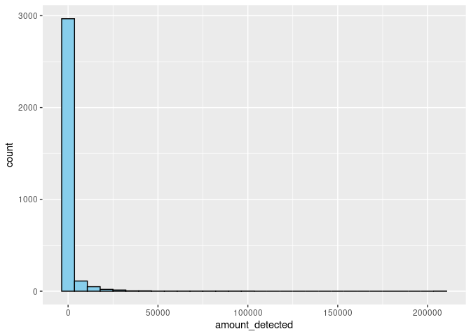
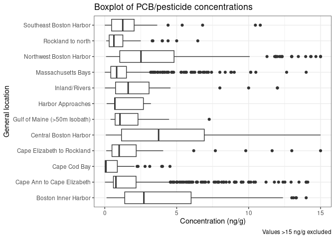
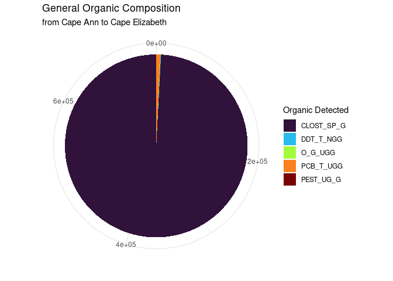
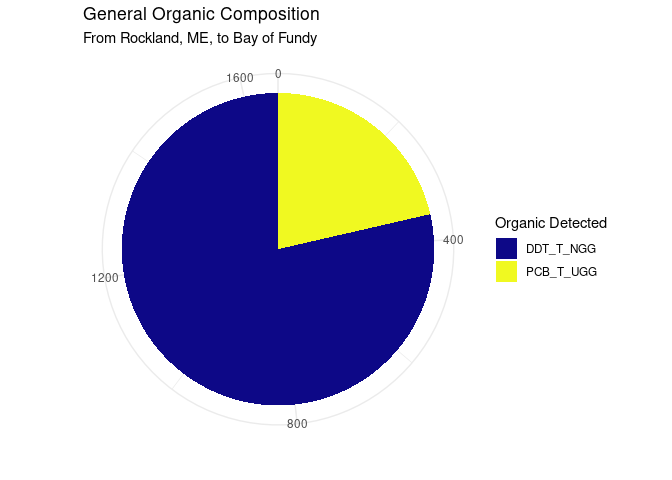

GOM Contaminated Sediments Analysis: PCBs
================
Joshua Harkness and Autumn Pauly
2023-10-28

## Introduction

This document is an analysis of distributions and concentrations of PCB
and Organic contaminants that were reported in a publication by the U.S.
Geological Survey on contaminated sediments in the Gulf of Maine. In
this data set, we analyzed the prevalence of oil and grease, petroleum
Hydrocarbons, polychlorinated biphenyls, DDT compounds, DDE compounds,
DDD compounds, pesticide compounds, lipids, clostridium perfringens,
monobutyl tin, dibutyl tin, tributyl tin, tetrabutyl tin, PCB congeners
\#52-209, DDT 4,4’, DDT 2,4’, DDD 4,4’, DDD 4,2’, endrin, endrin
aldehyde, aldrin, dieldrin, chlordane, mirex, methoxychlor,
hexachlorocyclohexane alpha/beta/gamma isomer, and lindane.

### Background

Polychlorinated biphenyls (PCBs) constitute a group of persistent
synthetic organic pollutants characterized by two interconnected phenyl
rings, forming aromatic structures with a double bond, and chlorine
atoms affixed to the phenyl rings. Due to their notable thermal
stability and chemical properties, PCBs found extensive use in diverse
industrial applications spanning the 1930s to the 1970s. The prohibition
of PCBs in the United States in 1979 resulted from substantial harm
inflicted upon both human and environmental health. The Stockholm
Convention on Persistent Organic Pollutants, initiated in 2001 as an
international treaty, is dedicated to mitigating the production and use
of persistent organic pollutants, including PCBs.

Research suggests that PCBs can induce cancer in animals as well as
various severe non-cancer health impacts, including having effects on
the immune, reproductive, nervous, and endocrine systems. The
International Agency for Research on Cancer (IARC) has classified PCBs
as probable human carcinogens. Their deleterious influence extends to
marine ecosystems, where their exceptional stability, poor
biodegradability, and lipid solubility contribute to bioaccumulation
(Kennish 1996). Functioning as endocrine-disrupting compounds, PCBs
perturb the hormonal equilibrium in animals, potentially leading to
immunodeficiency and reproductive challenges (Clark 1999).

### Loading packages

These are the packages that will be used for analysis.

``` r
library(tidyverse)
library(sf)
library(leaflet)
library(RColorBrewer)
#install.packages("dplyr")
library(dplyr)
library(ggridges)
library(rmarkdown)
library(dunn.test)
```

### Loading PCB and Organics Datasets

This loads the datasets from .csv files and reads them into the
environment.

``` r
PCBs <- read.csv(paste0("/cloud/project/data/datasets_csv/PCBs_loc.csv"), header = T)
Organics <- read.csv(paste0("/cloud/project/data/datasets_csv/Organics_loc.csv"), header = T)
```

### Glimpsing the PCB and Organics Datasets

These data sets are quite large and contain a lot of information.
Pivoting will need to be done to restructure this into a format that
will be easier to interpret.

``` r
glimpse(PCBs)
```

    ## Rows: 7,848
    ## Columns: 39
    ## $ UNIQUE_ID  <chr> "US00001", "US00002", "US00003", "US00004", "US00005", "US0…
    ## $ LATITUDE   <dbl> 42.35972, 42.36028, 42.38500, 42.38500, 42.38500, 42.38500,…
    ## $ LONGITUDE  <dbl> -71.02861, -71.02778, -71.04611, -71.04611, -71.04611, -71.…
    ## $ SOUNDING_M <dbl> NA, NA, NA, NA, NA, NA, NA, NA, NA, NA, NA, NA, NA, NA, NA,…
    ## $ STATE_NAME <chr> "MA", "MA", "MA", "MA", "MA", "MA", "MA", "MA", "MA", "MA",…
    ## $ QUAD_NAME  <chr> NA, NA, NA, NA, NA, NA, NA, NA, NA, NA, NA, NA, NA, NA, NA,…
    ## $ GEN_LOC_NM <chr> "Boston Inner Harbor", "Boston Inner Harbor", "Boston Inner…
    ## $ SPECFC_LOC <chr> "BIH", "BIH", "BIH", "BIH", "BIH", "BIH", "BIH", "BIH", "BI…
    ## $ AREA_CODE  <int> 1, 1, 1, 1, 1, 1, 1, 1, 1, 2, 2, 1, 1, 1, 1, 1, 1, 1, 1, 1,…
    ## $ SAMP_DATE1 <chr> NA, NA, "5/1/1981", "5/1/1981", "5/1/1981", "5/1/1981", "5/…
    ## $ TO_SMP_DT2 <chr> NA, NA, NA, NA, NA, NA, NA, NA, NA, NA, NA, NA, NA, NA, NA,…
    ## $ DPTH_N_COR <chr> NA, NA, NA, NA, NA, NA, NA, NA, NA, NA, NA, NA, NA, NA, "0"…
    ## $ DPTH_CODE  <chr> "Unknown", "Unknown", "Depth", "Depth", "Unknown", "Unknown…
    ## $ COR_GRB_CD <chr> "Grab", "Grab", "Core", "Core", "Grab", "Grab", "Grab", "Gr…
    ## $ site       <chr> "BIH", "BIH", "BIH", "BIH", "BIH", "BIH", "BIH", "BIH", "BI…
    ## $ PCB_52_NGG <dbl> NA, NA, NA, NA, NA, NA, NA, NA, NA, NA, NA, NA, NA, NA, NA,…
    ## $ PCB101_NGG <dbl> NA, NA, NA, NA, NA, NA, NA, NA, NA, NA, NA, NA, NA, NA, NA,…
    ## $ PCB118_NGG <dbl> NA, NA, NA, NA, NA, NA, NA, NA, NA, NA, NA, NA, NA, NA, NA,…
    ## $ PCB128_NGG <dbl> NA, NA, NA, NA, NA, NA, NA, NA, NA, NA, NA, NA, NA, NA, NA,…
    ## $ PCB138_NGG <dbl> NA, NA, NA, NA, NA, NA, NA, NA, NA, NA, NA, NA, NA, NA, NA,…
    ## $ PCB153_NGG <dbl> NA, NA, NA, NA, NA, NA, NA, NA, NA, NA, NA, NA, NA, NA, NA,…
    ## $ PCB180_NGG <dbl> NA, NA, NA, NA, NA, NA, NA, NA, NA, NA, NA, NA, NA, NA, NA,…
    ## $ PCB206_NGG <dbl> NA, NA, NA, NA, NA, NA, NA, NA, NA, NA, NA, NA, NA, NA, NA,…
    ## $ PCB209_NGG <dbl> NA, NA, NA, NA, NA, NA, NA, NA, NA, NA, NA, NA, NA, NA, NA,…
    ## $ DDT_4_4_C  <dbl> NA, NA, NA, NA, NA, NA, NA, NA, NA, NA, NA, NA, NA, NA, NA,…
    ## $ DDT_2_4_C  <dbl> NA, NA, NA, NA, NA, NA, NA, NA, NA, NA, NA, NA, NA, NA, NA,…
    ## $ DDE_4_4_C  <dbl> NA, NA, NA, NA, NA, NA, NA, NA, NA, NA, NA, NA, NA, NA, NA,…
    ## $ DDD_4_4_C  <dbl> NA, NA, NA, NA, NA, NA, NA, NA, NA, NA, NA, NA, NA, NA, NA,…
    ## $ ENDRIN_C   <dbl> NA, NA, NA, NA, NA, NA, NA, NA, NA, NA, NA, NA, NA, NA, NA,…
    ## $ ENDR_ALD_C <dbl> NA, NA, NA, NA, NA, NA, NA, NA, NA, NA, NA, NA, NA, NA, NA,…
    ## $ ALDRIN_C   <dbl> NA, NA, NA, NA, NA, NA, NA, NA, NA, NA, NA, NA, NA, NA, NA,…
    ## $ DIELDRN_C  <dbl> NA, NA, NA, NA, NA, NA, NA, NA, NA, NA, NA, NA, NA, NA, NA,…
    ## $ CLRDNE_T_C <dbl> NA, NA, NA, NA, NA, NA, NA, NA, NA, NA, NA, NA, NA, NA, NA,…
    ## $ MIREX_C    <dbl> NA, NA, NA, NA, NA, NA, NA, NA, NA, NA, NA, NA, NA, NA, NA,…
    ## $ METHOXYCLC <dbl> NA, NA, NA, NA, NA, NA, NA, NA, NA, NA, NA, NA, NA, NA, NA,…
    ## $ BHC_A_C    <dbl> NA, NA, NA, NA, NA, NA, NA, NA, NA, NA, NA, NA, NA, NA, NA,…
    ## $ BHC_B_C    <dbl> NA, NA, NA, NA, NA, NA, NA, NA, NA, NA, NA, NA, NA, NA, NA,…
    ## $ BHC_D_C    <dbl> NA, NA, NA, NA, NA, NA, NA, NA, NA, NA, NA, NA, NA, NA, NA,…
    ## $ LINDANE_C  <dbl> NA, NA, NA, NA, NA, NA, NA, NA, NA, NA, NA, NA, NA, NA, NA,…

``` r
glimpse(Organics)
```

    ## Rows: 7,849
    ## Columns: 28
    ## $ UNIQUE_ID  <chr> "US00001", "US00002", "US00003", "US00004", "US00005", "US0…
    ## $ LATITUDE   <dbl> 42.35972, 42.36028, 42.38500, 42.38500, 42.38500, 42.38500,…
    ## $ LONGITUDE  <dbl> -71.02861, -71.02778, -71.04611, -71.04611, -71.04611, -71.…
    ## $ SOUNDING_M <dbl> NA, NA, NA, NA, NA, NA, NA, NA, NA, NA, NA, NA, NA, NA, NA,…
    ## $ STATE_NAME <chr> "MA", "MA", "MA", "MA", "MA", "MA", "MA", "MA", "MA", "MA",…
    ## $ QUAD_NAME  <chr> NA, NA, NA, NA, NA, NA, NA, NA, NA, NA, NA, NA, NA, NA, NA,…
    ## $ GEN_LOC_NM <chr> "Boston Inner Harbor", "Boston Inner Harbor", "Boston Inner…
    ## $ SPECFC_LOC <chr> "BIH", "BIH", "BIH", "BIH", "BIH", "BIH", "BIH", "BIH", "BI…
    ## $ AREA_CODE  <int> 1, 1, 1, 1, 1, 1, 1, 1, 1, 2, 2, 1, 1, 1, 1, 1, 1, 1, 1, 1,…
    ## $ SAMP_DATE1 <chr> NA, NA, "5/1/1981", "5/1/1981", "5/1/1981", "5/1/1981", "5/…
    ## $ TO_SMP_DT2 <chr> NA, NA, NA, NA, NA, NA, NA, NA, NA, NA, NA, NA, NA, NA, NA,…
    ## $ DPTH_N_COR <chr> NA, NA, NA, NA, NA, NA, NA, NA, NA, NA, NA, NA, NA, NA, "0"…
    ## $ DPTH_CODE  <chr> "Unknown", "Unknown", "Depth", "Depth", "Unknown", "Unknown…
    ## $ COR_GRB_CD <chr> "Grab", "Grab", "Core", "Core", "Grab", "Grab", "Grab", "Gr…
    ## $ site       <chr> "BIH", "BIH", "BIH", "BIH", "BIH", "BIH", "BIH", "BIH", "BI…
    ## $ O_G_UGG    <dbl> NA, NA, NA, NA, 10882.00, 3115.00, 880.00, 542.30, 31.44, N…
    ## $ PHCTOT_UGG <dbl> NA, NA, NA, NA, NA, NA, NA, NA, NA, NA, NA, NA, NA, NA, NA,…
    ## $ PCB_T_UGG  <dbl> NA, NA, NA, NA, 0.500, 0.500, 0.500, 0.500, 0.500, NA, NA, …
    ## $ DDT_T_NGG  <dbl> NA, NA, NA, NA, NA, NA, NA, NA, NA, NA, NA, 76.50, 33.00, 1…
    ## $ DDE_T_NGG  <dbl> NA, NA, NA, NA, NA, NA, NA, NA, NA, NA, NA, NA, NA, NA, NA,…
    ## $ DDD_T_NGG  <dbl> NA, NA, NA, NA, NA, NA, NA, NA, NA, NA, NA, NA, NA, NA, NA,…
    ## $ PEST_UG_G  <lgl> NA, NA, NA, NA, NA, NA, NA, NA, NA, NA, NA, NA, NA, NA, NA,…
    ## $ LIPIDS_NGG <lgl> NA, NA, NA, NA, NA, NA, NA, NA, NA, NA, NA, NA, NA, NA, NA,…
    ## $ CLOST_SP_G <dbl> NA, NA, NA, NA, NA, NA, NA, NA, NA, NA, NA, NA, NA, NA, NA,…
    ## $ MBT_C      <dbl> NA, NA, NA, NA, NA, NA, NA, NA, NA, NA, NA, NA, NA, NA, NA,…
    ## $ DBT_C      <dbl> NA, NA, NA, NA, NA, NA, NA, NA, NA, NA, NA, NA, NA, NA, NA,…
    ## $ TBT_C      <dbl> NA, NA, NA, NA, NA, NA, NA, NA, NA, NA, NA, NA, NA, NA, NA,…
    ## $ TTBT_C     <dbl> NA, NA, NA, NA, NA, NA, NA, NA, NA, NA, NA, NA, NA, NA, NA,…

## Data Transformation

### Pivot Organics Longer

This function creates two columns to properly contain the values of the
organics measured during these surveys - the `organic_detected` column
contains the type of organic that was measured and the `amount_detected`
column contains the values for each measurement.

``` r
Organics_long <- Organics %>%
 pivot_longer(cols = `O_G_UGG`:`TTBT_C`, 
               names_to = "organic_detected", 
               values_to = "amount_detected")

Organics_long = select(Organics_long, c(UNIQUE_ID, LATITUDE, LONGITUDE, SOUNDING_M, STATE_NAME, QUAD_NAME, GEN_LOC_NM, SPECFC_LOC, AREA_CODE, SAMP_DATE1, TO_SMP_DT2, DPTH_N_COR, DPTH_CODE, COR_GRB_CD, organic_detected, amount_detected))

#glimpse(Organics_long)
```

### Filter out NAs and 0 values from Organics_long

This is useful for displaying data when we don’t want to display a large
number of stations that have only missing values or zeros associated
with them.

``` r
Organics_long_no_na_no_zero <- Organics_long %>%
  drop_na(amount_detected) %>%
  filter(amount_detected != "0")
```

### Pivoting PCBs Longer

Creates two columns to properly contain the values of PCBs measured
during these surveys - the `pcb` column contains the type of PCB that
was measured and the `amount_detected` column contains the values for
each measurement. For clarity in later visualizations, we have combined
2,4 DDT with 4,4 DDT and BHC A, B, and D.

``` r
PCBs_long <- PCBs %>%
  pivot_longer(cols = `PCB_52_NGG`:`LINDANE_C`, 
               names_to = "pcb", 
               values_to = "amount_detected") %>%
mutate(pcb = fct_recode(pcb,
                          "DDT_C" = "DDT_2_4_C",
                          "DDT_C" = "DDT_4_4_C",
                          "BHC_C" = "BHC_A_C",
                          "BHC_C" = "BHC_B_C",
                          "BHC_C" = "BHC_D_C"))

#glimpse(PCBs_long)
```

#### Creating Pesticides Data Set

This is creating a data set from the PCBs dataset that will only contain
the pesticides that were measured.

``` r
pesticides <- PCBs_long %>%
  filter(pcb %in% c("DDT_C", "DDE_4_4_C", "DDD_4_4_C", "ENDRIN_C", "ENDR_ALD_C", "ALDRIN_C", "DIELDRN_C", "CLRDNE_T_C", "MIREX_C", "METHOXYCLC", "BHC_C", "LINDANE_C"))

#glimpse(pesticides)
```

### Create PCBs_only dataset

Same as above, just for PCBs instead of pesticides.

``` r
pcbs_only <- PCBs_long %>%
  filter(pcb %in% c("PCB_52_NGG", "PCB101_NGG", "PCB118_NGG", "PCB128_NGG", "PCB138_NGG", "PCB153_NGG", "PCB180_NGG", "PCB206_NGG", "PCB209_NGG"))

#glimpse(pcbs_only)
```

## Statistical Tests

### Diff PCBs and Pesticides

Using a Wilcoxon Rank Sum test here since it is non-parametric and does
not make assumptions about the normality of our data (see Descriptive
Visualizations)

``` r
wilcox.test(pcbs_only$amount_detected, pesticides$amount_detected)
```

    ## 
    ##  Wilcoxon rank sum test with continuity correction
    ## 
    ## data:  pcbs_only$amount_detected and pesticides$amount_detected
    ## W = 16448819, p-value < 2.2e-16
    ## alternative hypothesis: true location shift is not equal to 0

Report: PCBs occurred at significantly higher concentrations than
organochlorine pesticides (Wilcoxon Rank Sum Test, W = 14169, P =
\<0.001).

### Concentration diff by pesticide type

``` r
kw1 = kruskal.test(pesticides$amount_detected, pesticides$pcb)
kw1
```

    ## 
    ##  Kruskal-Wallis rank sum test
    ## 
    ## data:  pesticides$amount_detected and pesticides$pcb
    ## Kruskal-Wallis chi-squared = 1111.5, df = 11, p-value < 2.2e-16

Significant (P = \<0.001). So we should do a Dunn post hoc test.

``` r
dunn.test(pesticides$amount_detected, pesticides$pcb, method = "Bonferroni")
```

    ##   Kruskal-Wallis rank sum test
    ## 
    ## data: x and group
    ## Kruskal-Wallis chi-squared = 1111.4818, df = 11, p-value = 0
    ## 
    ## 
    ##                            Comparison of x by group                            
    ##                                  (Bonferroni)                                  
    ## Col Mean-|
    ## Row Mean |   ALDRIN_C      BHC_C   CLRDNE_T   DDD_4_4_   DDE_4_4_      DDT_C
    ## ---------+------------------------------------------------------------------
    ##    BHC_C |   5.808716
    ##          |    0.0000*
    ##          |
    ## CLRDNE_T |   3.830637   0.619915
    ##          |    0.0042*     1.0000
    ##          |
    ## DDD_4_4_ |  -15.39793  -20.01235  -12.04825
    ##          |    0.0000*    0.0000*    0.0000*
    ##          |
    ## DDE_4_4_ |  -14.71155  -19.40965  -11.61948   0.842683
    ##          |    0.0000*    0.0000*    0.0000*     1.0000
    ##          |
    ##    DDT_C |  -5.629509  -11.50154  -6.620851   11.49442   10.70495
    ##          |    0.0000*    0.0000*    0.0000*    0.0000*    0.0000*
    ##          |
    ## DIELDRN_ |  -2.300371  -7.911671  -5.013810   13.09204   12.38014   3.037438
    ##          |     0.7071    0.0000*    0.0000*    0.0000*    0.0000*     0.0787
    ##          |
    ## ENDR_ALD |   4.754268   0.884231   0.103684   14.52624   14.03757   8.200617
    ##          |    0.0001*     1.0000     1.0000    0.0000*    0.0000*    0.0000*
    ##          |
    ## ENDRIN_C |   9.147873   3.467672   1.446298   22.50665   21.94970   14.70288
    ##          |    0.0000*    0.0173*     1.0000    0.0000*    0.0000*    0.0000*
    ##          |
    ## LINDANE_ |  -1.286735  -7.083974  -4.500881   14.38766   13.68113   4.310432
    ##          |     1.0000    0.0000*    0.0002*    0.0000*    0.0000*    0.0005*
    ##          |
    ## METHOXYC |   6.200668   2.261822   1.081136   16.01093   15.52726   9.728952
    ##          |    0.0000*     0.7824     1.0000    0.0000*    0.0000*    0.0000*
    ##          |
    ##  MIREX_C |  -4.234629  -9.250113  -6.073292   9.828400   9.133955   0.345162
    ##          |    0.0008*    0.0000*    0.0000*    0.0000*    0.0000*     1.0000
    ## Col Mean-|
    ## Row Mean |   DIELDRN_   ENDR_ALD   ENDRIN_C   LINDANE_   METHOXYC
    ## ---------+-------------------------------------------------------
    ## ENDR_ALD |   6.168987
    ##          |    0.0000*
    ##          |
    ## ENDRIN_C |   11.11405   1.571166
    ##          |    0.0000*     1.0000
    ##          |
    ## LINDANE_ |   1.059894  -5.570153  -10.38587
    ##          |     1.0000    0.0000*    0.0000*
    ##          |
    ## METHOXYC |   7.620671   1.104637  -0.244620   7.031441
    ##          |    0.0000*     1.0000     1.0000    0.0000*
    ##          |
    ##  MIREX_C |  -2.149944  -7.339706  -12.16296  -3.142128  -8.734130
    ##          |     1.0000    0.0000*    0.0000*     0.0553    0.0000*
    ## 
    ## alpha = 0.05
    ## Reject Ho if p <= alpha/2

Interpretation: Most pairwise comparisons were significantly different
(P = \<0.05), except for Chlordane and BHC, DDE and DDD, Dieldrin and
Aldrin, Dieldrin and DDT, Endrin Aldehyde and Chlordane, Lindane and
Aldrin, Methoxychlor and BHC, Methoxychlor and Chlordane, Mirex and DDT,
Endrin and Endrin Aldehyde, Lindane and Dieldrin, Methoxychlor and
Endrin Aldehyde, Methoxychlor and Endrin, Mirex and Dieldrin, and Mirex
and Lindane. It should be noted the a number of the pesticides whose
concentrations are not significantly different share very similar
molecular formulas.

## Data Visualizations

### Descriptive Visualizations

First, the number of observations collected at each location will be
visualized. This bar plot uses number of observations on its y axis,
thus reflecting sampling intensity by general location.

``` r
Organics %>%
  ggplot(aes(x = fct_infreq(GEN_LOC_NM), fill = fct_infreq(GEN_LOC_NM))) +
  geom_bar(stat = "count", color = "black") +
  coord_flip() +
  theme_minimal() +
  scale_fill_viridis_d() +
  theme(legend.position = "none") +
  labs(title = "Number of Observations by General Location",
       x = "General Location",
       y = "Count (n Observations)")
```


Interpretation: This bar plot shows number of observations within the
Organics dataset in each general location category. The greatest number
of observations are in the Gulf of Maine below the 50m isobath (partly
this is a product of area extent as well as sampling intensity);
Massachusetts Bays, Boston Harbor sites, and the MA/NH/ME coast are all
generally heavily sampled. Intertidal Atlantic Canada is the least
sampled general location in our dataset.

``` r
ggplot(PCBs_long, aes(x = amount_detected)) +
  geom_histogram(fill = "skyblue", color = "black")
```

    ## `stat_bin()` using `bins = 30`. Pick better value with `binwidth`.


``` r
ggplot(Organics_long, aes(x = amount_detected)) +
  geom_histogram(fill = "skyblue", color = "black")
```

    ## `stat_bin()` using `bins = 30`. Pick better value with `binwidth`.



Interpretation: In both the PCBs and Organics datasets, the amount
detected (concentration) is extremely right skewed, with most of our
values close to zero, and high influence outliers at much higher values.

``` r
PCBs_long %>%
  filter(pcb %in% c("BHC_C", "MIREX_C", "ALDRIN_C", "DDT_C", "PCB153_NGG", "PCB138_NGG", "PCB101_NGG", "PCB118_NGG")) %>%
  filter(amount_detected <= 100) %>%
  filter(amount_detected > 0) %>%
  ggplot(aes(x = amount_detected)) +
  geom_histogram(fill = "skyblue", color = "black") +
  facet_wrap(.~pcb, ncol = 4) +
  theme_bw() +
  labs(title = "Data Skewness",
       subtitle = "Most Abundant PCBs and Pesticides",
       x = "Concentration (ng/g)",
       y = "n Observations",
       caption = "Values >100 ng/g excluded")
```

    ## `stat_bin()` using `bins = 30`. Pick better value with `binwidth`.


Interpretation: Histograms depicting data distributions of four most
abundant pesticides (top row), and the four most abundant PCBs (bottom
row) in the Gulf of Maine. Distributions are exclusively unimodal, but
are all highly right skewed with mean values close to zero and outliers
occurring at far higher values. Of these, Mirex appears to be the most
skewed, and PCB 138 the least skewed. Note that values greater than
100ng/g are excluded for clarity in the plot.

``` r
ggplot(pesticides, aes(x = GEN_LOC_NM, y = amount_detected)) +
  geom_boxplot() +
  coord_flip() +
  theme_bw() +
  labs(title = "Boxplot of PCB/pesticide concentrations",
       x = "General location",
       y = "Concentration (ng/g)")
```

    ## Warning: Removed 112022 rows containing non-finite values (`stat_boxplot()`).


``` r
#create a zoomed in version

ggplot(pesticides, aes(x = GEN_LOC_NM, y = amount_detected)) +
  geom_boxplot() +
  coord_flip() +
  theme_bw() +
  labs(title = "Boxplot of PCB/pesticide concentrations",
       x = "General location",
       y = "Concentration (ng/g)",
       caption = "Y axis limited to 15 ng/g") +
  ylim(0,15)
```

    ## Warning: Removed 112185 rows containing non-finite values (`stat_boxplot()`).


Interpretation: These two boxplots also serve the purpose of indicating
how extremely skewed our dataset is; the first shows the full range of
our data, the second limits the y axis to 0 to 15 ng/g. Mean values are
all less than 2.5 ng/gm, but outliers are present as high as 4000 ng/g.

``` r
pesticides %>%
  filter(amount_detected <= 15) %>%
  filter(amount_detected > 0) %>%
  
  ggplot(aes(x = GEN_LOC_NM, y = amount_detected)) +
  geom_boxplot() +
  coord_flip() +
  theme_bw() +
  labs(title = "Boxplot of PCB/pesticide concentrations",
       x = "General location",
       y = "Concentration (ng/g)",
       caption = "Values >15 ng/g excluded")
```



Interpretation: Filtering out zero values helps with the skewness; but
since zero values (absence of PCBs from sample) are important to our
analysis, this is not a valid approach except for in some
visualizations.

### PCB Site to Site Comparisons

#### GOM General Locations

Below we are calculating the mean, standard deviation, count, and
standard error values of PCB concentrations, grouped by general
locations.

``` r
Summary_Organics <- Organics %>%
  group_by(GEN_LOC_NM) %>%
  drop_na(PCB_T_UGG) %>%
  summarise(mean_PCB_T = mean(PCB_T_UGG),
    sd_PCB_T = sd(PCB_T_UGG),
    n_PCB_T = n(),
    SE_PCB_T = sd(PCB_T_UGG) / sqrt(n())) %>%
  arrange(desc(mean_PCB_T))

#Output is commented out to save space when knitting output document
#Summary_Organics
```

The graph below is plotting the mean PCB concentration (ug/g) found at
each general location with error bards accounting for one standard
error.

``` r
Summary_Organics %>%
  ggplot(aes(x = fct_rev(fct_reorder(GEN_LOC_NM, mean_PCB_T)), y = sapply(mean_PCB_T, FUN=function(x) ifelse(x==0.000000e0, -1,x)), fill = GEN_LOC_NM)) +
  geom_col(col = "black") +
  geom_errorbar(aes(ymin = mean_PCB_T - SE_PCB_T, ymax = mean_PCB_T + SE_PCB_T), width = 0.2) +
  coord_flip() +
  scale_fill_viridis_d(option = "plasma") +
  theme_bw() +
  theme(legend.position = "none") +
  labs(title = "Mean PCB Concentrations in Gulf of Maine Sediments",
       x = "General location",
       y = "Mean total PCB concentration ug/g",
       caption = "Error bars = 1 standard error")
```


Interpretation: Boston Inner Harbor has the highest mean PCB
concentration (mean = 44.21 ug/g), followed by Cape Ann to Cape
Elizabeth (mean = 26.90 ug/g) and Southeast Boston Harbor (mean 18.35
ug/g). Boston Inner Harbor (average standard deviation of 284.81) and
Cape Ann to Cape Elizabeth (average standard deviation of 227.34) have
the highest standard deviations, suggesting that, though they are the
locations with the highest average PCB concentrations, the counts per
observation vary greatly. The ranges of both locations is 3,000 ug/g to
0 ug/g, which is a wide range of values. Cape Cod Bay has the lowest
mean concentration.

#### PCB Summary Statistics of Boston Harbor

This graph shows the PCB concentrations in Boston Harbor, comparing all
locations.

``` r
Summary_Organics %>%
  filter(GEN_LOC_NM %in% c("Boston Inner Harbor", "Central Boston Harbor", "Southeast Boston Harbor", "Northwest Boston Harbor")) %>%
  arrange(desc(mean_PCB_T))
```

    ## # A tibble: 4 × 5
    ##   GEN_LOC_NM              mean_PCB_T sd_PCB_T n_PCB_T SE_PCB_T
    ##   <chr>                        <dbl>    <dbl>   <int>    <dbl>
    ## 1 Boston Inner Harbor         44.2    285.        119  26.1   
    ## 2 Southeast Boston Harbor     18.4     73.2        33  12.7   
    ## 3 Central Boston Harbor        0.416    0.274      41   0.0427
    ## 4 Northwest Boston Harbor      0.320    0.763     220   0.0514

``` r
Summary_Organics %>%
  filter(GEN_LOC_NM %in% c("Boston Inner Harbor", "Central Boston Harbor", "Southeast Boston Harbor", "Northwest Boston Harbor")) %>%
  ggplot(aes(x = fct_rev(fct_reorder(GEN_LOC_NM, mean_PCB_T)), y = mean_PCB_T, fill = GEN_LOC_NM)) +
  geom_col(col = "black") +
  geom_errorbar(aes(ymin = mean_PCB_T - SE_PCB_T, ymax = mean_PCB_T + SE_PCB_T), width = 0.2) +
  scale_fill_brewer(type = "qual", palette = 4, direction = 1, aesthetics = "fill") +
  theme_bw() +
  coord_flip() +
  theme(legend.position = "none") +
  labs(title = "PCB Concentrations in Boston Harbor Sediments",
       x = "General location",
       y = "Mean total PCB concentration ug/g",
       caption = "Error bars = 1 standard error")
```


Interpretation: Mean total PCB concentration is highest at Boston Inner
Harbor stations (mean = 44.21 ug/g); Southeast Boston Harbor (mean =
18.35 ug/g) is also highly contaminated with PCBs. Central Boston Harbor
(mean = 0.42 ug/g) and Northwest Boston Harbor (mean = 0.32 ug/g) are
the least contaminated of the Boston Harbor sites with PCBs.

### Specific PCB comparisons across GOM

Calculating summary statistics for PCBs, grouped by type and sample ID.

``` r
Sum_pcbs_gom <- pcbs_only %>%
  group_by(pcb, UNIQUE_ID) %>%
  summarise(amount_detected = sum(amount_detected, na.rm = TRUE)) %>%
  drop_na(amount_detected) %>%
  summarise(mean = mean(amount_detected),
    sd = sd(amount_detected),
    n = n(),
    SE = sd(amount_detected) / sqrt(n())) %>%
  arrange(desc(mean))
```

    ## `summarise()` has grouped output by 'pcb'. You can override using the `.groups`
    ## argument.

``` r
#Output is commented out to save space when knitting document.
#Sum_pcbs_gom
```

``` r
Sum_pcbs_gom %>%
  ggplot(aes(x = fct_rev(fct_reorder(pcb, mean)), y = sapply(mean, FUN=function(x) ifelse(x==0.000000e0, -0.02,x)), fill = pcb)) +
  geom_col(color = "black") +
  geom_errorbar(aes(ymin = mean - SE, ymax = mean + SE), width = 0.2) +
  coord_flip() +
  theme_classic() +
  scale_fill_brewer(type = "qual", palette = 8, direction = 1, aesthetics = "fill") +
  theme(legend.position = "none") +
  labs(title = "PCB Composition and Concentrations",
       subtitle = "In Gulf of Maine Sediments",
       x = "PCB",
       y = "Concentration (ng/g)",
       caption = "Error bars = 1 standard error")
```


Interpretation: PCB 153 is the most abundant in Gulf of Maine sediments
(mean = 0.85 (+/- 20.01) ng/g per sample). PCB 138 (mean = 0.76 (+/-
22.18) ng/g), PCB 101 (mean = 0.62 (+/- 18.55) ng/g), and PCB 118 (mean
= 0.57 (+/- 17.30) ng/g) are also highly abundant. PCB 209 is the least
abundant detected PCB (mean = 0.10 (+/- 0.86) ng/g).

### Pesticides comparisons across GOM

Calculating summary statistics of pesticides by type and sample ID

``` r
Sum_pesticides_gom <- pesticides %>%
  group_by(pcb, UNIQUE_ID) %>%
  summarise(amount_detected = sum(amount_detected, na.rm = TRUE)) %>%
  drop_na(amount_detected) %>%
  summarise(mean = mean(amount_detected),
    sd = sd(amount_detected),
    n = n(),
    SE = sd(amount_detected) / sqrt(n())) %>%
  arrange(desc(mean))
```

    ## `summarise()` has grouped output by 'pcb'. You can override using the `.groups`
    ## argument.

``` r
#Output is commented out to save space when knitting output document.
#Sum_pesticides_gom
```

### PCB site specific comparisons

As stated in our project proposal, we were interested in visualizing
contaminants in Maine Rivers as well as harbors and bays. The table
below is visualizing the mean, standard deviation, count, and standard
error values of PCB concentrations for river locations.

``` r
Sum_Org_site <- Organics %>%
  group_by(site) %>%
  drop_na(PCB_T_UGG) %>%
  summarise(mean_PCB_T = mean(PCB_T_UGG),
    sd_PCB_T = sd(PCB_T_UGG),
    n_PCB_T = n(),
    SE_PCB_T = sd(PCB_T_UGG) / sqrt(n()))
```

Below we are identifying specific Maine rivers to use in our analysis.

``` r
Organics %>%
  filter(STATE_NAME == "ME") %>%
  filter(PCB_T_UGG != "NA") %>%
  distinct(site)
```

    ##                                   site
    ## 1        Southern Harbor (North Haven)
    ## 2                  Portland Fore River
    ## 3                          Royal River
    ## 4                    Stonington Harbor
    ## 5                      Kennebunk River
    ## 6                         Lermond Cove
    ## 7                           Bar Harbor
    ## 8                      Rockport Harbor
    ## 9                       Castine Harbor
    ## 10 Portsmouth Naval Shipyard (Kittery)
    ## 11                          Mack Point
    ## 12                         York Harbor
    ## 13                       Camden Harbor
    ## 14                        Wells Harbor
    ## 15        Portland Back Cove & Channel
    ## 16                      Kennebec River
    ## 17               Sears Island Terminal
    ## 18                         Union River
    ## 19                     Penobscot River
    ## 20      Jonesport Harbor - Sawyer Cove
    ## 21              Isle Au Haut Thorofare
    ## 22 Beals Harbor (Barneys Cove - Beals)
    ## 23                         Bass Harbor
    ## 24                      Tenants Harbor
    ## 25                        Spruce Creek
    ## 26                    Piscataqua River
    ## 27                          York River
    ## 28                           Casco Bay
    ## 29                       Penobscot Bay
    ## 30                     Portland Harbor

``` r
Sum_Org_site %>%
  filter(site %in% c("Piscataqua River", "York River", "Kennebunk River", "Portland Fore River", "Royal River", "Kennebec River", "Penobscot River", "Saco River", "Union River")) %>%
  arrange(desc(mean_PCB_T))
```

    ## # A tibble: 8 × 5
    ##   site                mean_PCB_T sd_PCB_T n_PCB_T SE_PCB_T
    ##   <chr>                    <dbl>    <dbl>   <int>    <dbl>
    ## 1 Union River           274.      NA            1 NA      
    ## 2 Portland Fore River    13.2     43.7         49  6.25   
    ## 3 Kennebunk River         0.767    1.54        18  0.363  
    ## 4 Piscataqua River        0.0453   0.0437      69  0.00526
    ## 5 York River              0.0424  NA            1 NA      
    ## 6 Royal River             0.0196   0.0449      27  0.00864
    ## 7 Kennebec River          0        0            4  0      
    ## 8 Penobscot River         0        0            4  0

Below we are visualizing the mean PCBs present in Maine rivers.

``` r
Sum_Org_site %>%
  filter(site %in% c("Piscataqua River", "York River", "Kennebunk River", "Portland Fore River", "Royal River", "Kennebec River", "Penobscot River", "Saco River")) %>%
  ggplot(aes(x = fct_rev(fct_reorder(site, mean_PCB_T)), y = sapply(mean_PCB_T, FUN=function(x) ifelse(x==0.000000e0, -0.2,x)), fill = fct_rev(fct_reorder(site, mean_PCB_T)))) +
  geom_bar(stat="identity", col = "black") +
  scale_x_discrete(drop=FALSE) +
  geom_errorbar(aes(ymin = mean_PCB_T - SE_PCB_T, ymax = mean_PCB_T + SE_PCB_T), width = 0.2) +
  scale_fill_manual(values = c("Kennebec River" = "skyblue",
                               "Penobscot River" = "skyblue",
                               "Royal River" = "orange",
                               "York River" = "darkgoldenrod4",
                               "Kennebunk River" = "firebrick",
                               "Portland Fore River" = "peachpuff",
                               "Saco River" = "dodgerblue",
                               "Piscataqua River" = "green4")) +
  theme_bw() +
  coord_flip() +
  theme(legend.position = "none") +
  labs(title = "PCB Concentrations in Maine Rivers",
       subtitle = "Union River excluded",
       caption = "Error bars = 1 standard error",
       x = "Location",
       y = "Mean total PCB concentration ug/g")
```


Interpretation: The Portland Fore River has the highest total
concentration (mean = 13.18 (+/- 43.72) ng/g). Kennebunk River has the
second highest conentration (mean = 0.77 (+/- 1.54) ng/g). No PCBs were
detected in the Kennebec or Penobscot Rivers. The Union River has been
excluded from this plot.

``` r
Sum_Org_site %>%
  filter(site %in% c("Piscataqua River", "York River", "Kennebunk River", "Fore River", "Royal River", "Kennebec River", "Penobscot River", "Saco River", "Union River")) %>%
  ggplot(aes(x = fct_rev(fct_reorder(site, mean_PCB_T)), y = sapply(mean_PCB_T, FUN=function(x) ifelse(x==0.000000e0, -2,x)), fill = site)) +
  geom_col(col = "black") +
  geom_errorbar(aes(ymin = mean_PCB_T - SE_PCB_T, ymax = mean_PCB_T + SE_PCB_T), width = 0.2) +
  scale_fill_manual(values = c("Kennebec River" = "skyblue",
                               "Penobscot River" = "skyblue",
                               "Royal River" = "gray50",
                               "York River" = "gray50",
                               "Kennebunk River" = "gray50",
                               "Fore River" = "peachpuff",
                               "Union River" = "mediumorchid",
                               "Piscataqua River" = "green4")) +
  theme_bw() +
  coord_flip() +
  theme(legend.position = "none") +
  labs(title = "PCB Concentrations in Maine Rivers",
       subtitle = "With Union River, Ellsworth",
       caption = "Error bars = 1 standard error",
       x = "Location",
       y = "Mean total PCB concentration ug/g")
```


Intrepretation: The Union River in Ellsworth, Maine has the highest
total concentration (mean = 276.6 ng/g). There is only one observation
associated with the Union River. The Portland Fore River has the second
highest total concentration (mean = 13.18 (+/- 43.72) ng/g). Kennebunk
River has the third highest conentration (mean = 0.77 (+/- 1.54) ng/g).
No PCBs were detected in the Kennebec or Penobscot Rivers. There are no
errorbars for Union River as there is only one observation from this
river.

    ##                                                                                          site
    ## 1                                                                                         BIH
    ## 2                                                                                        MBDS
    ## 3   Reserve Channel, Main Shipping Channel, Boston Harbor to the Western shore of Deer Island
    ## 4                                                                              DORCHESTER BAY
    ## 5                                                                         CRYSTAL COVE MARINA
    ## 6                                                                                  BASS RIVER
    ## 7                                                                               HINGAM HARBOR
    ## 8                                                                              HINGHAM HARBOR
    ## 9                                                                                Mystic River
    ## 10                                                                                 SMITH COVE
    ## 11                                                                            WINTHROP HARBOR
    ## 12                                                                             WINTROP HARBOR
    ## 13                                                                      Little Mystic Channel
    ## 14                                                                          MANCHESTER HARBOR
    ## 15                                                                            SCITUATE HARBOR
    ## 16                                                                        Weymouth Fore River
    ## 17                                                                               SALEM HARBOR
    ## 18                                                                       BOSTON HARBOR MARINA
    ## 19                                                                          GLOUCESTER HARBOR
    ## 20                                                                              BOSTON HARBOR
    ## 21                                                                                DUXBURY BAY
    ## 22                                                                             BEVERLY HARBOR
    ## 23                                                                    PORT NORFOLK YACHT CLUB
    ## 24                                                                              Chelsea River
    ## 25                                                                             Dorchester Bay
    ## 26                                                                    Rowes and Fosters Wharf
    ## 27                                                                                 Mill Creek
    ## 28                                                            Victory Road Park Inlet Channel
    ## 29                                                                 Seaward of Waterfront Park
    ## 30                                                                                 Long Wharf
    ## 31                                                                                South River
    ## 32                                                                            Winthrop Harbor
    ## 33                                                          Winthrop Harbor, entrance channel
    ## 34                                                                      North & Danvers River
    ## 35                                                                          Reserve Channel B
    ## 36                                                                       Inner Confluence "B"
    ## 37                                                                           Reserve "B"-7826
    ## 38                                                                           Reserve "D"-7827
    ## 39                                                               FADS-Reference location-7832
    ## 40                                                                               Gulf Oil Co.
    ## 41                                                                               Gibb Oil ???
    ## 42                                                                       Gibb Oil North Berth
    ## 43                                                                       Gibb Oil South Berth
    ## 44                                                                       ESE of Castle Island
    ## 45                                                          btwn Deer I. & Governors I. Flats
    ## 46                                                                                 Quincy Bay
    ## 47                                                            Nantasket Roads W of Perry Cove
    ## 48                                                                                   Hull Bay
    ## 49                                                                SE of The Graves, Mass. Bay
    ## 50                                                                          Massachusetts Bay
    ## 51                                                                               Cape Cod Bay
    ## 52                                                             HbrView Marina,Town Rvr Quincy
    ## 53                                                                                  Foul Area
    ## 54                                                            Marina Bay, Squantum Pt, Quincy
    ## 55                                                                           Island End River
    ## 56                                                                                 NUT ISLAND
    ## 57                                                                                DEER ISLAND
    ## 58                                                                            Cohasset Harbor
    ## 59                                                                            Scituate Harbor
    ## 60                                                                                        NAR
    ## 61                                                                                        DOB
    ## 62                                                                                        BOI
    ## 63                                                                                        PRR
    ## 64                                                                                        LDF
    ## 65                                                                                        BRS
    ## 66                                                                                        MAB
    ## 67                                                                                       <NA>
    ## 68                                                                                Broad Sound
    ## 69                                                                                Salem Sound
    ## 70                                                                            Foul area north
    ## 71                                                                           Foul area center
    ## 72                                                                            Foul area south
    ## 73                                                                             Foul area east
    ## 74                                                                             Foul area west
    ## 75                                                                         south of Foul area
    ## 76                                                                               Spec. Island
    ## 77                                                                           Third Hbr Tunnel
    ## 78                                                                            MERRIMACK RIVER
    ## 79                                                                                        QUB
    ## 80                                                                         Fort Point Channel
    ## 81                                                             1-U.S. GypsumCo.200TerminalSt.
    ## 82                                                             2-U.S. GypsumCo.200TerminalSt.
    ## 83                                                             3-U.S. GypsumCo.200TerminalSt.
    ## 84                                                             4-U.S. GypsumCo.200TerminalSt.
    ## 85                                                                                       FADS
    ## 86                                                                          JEFFRIES POINT YC
    ## 87                                                                       MBDS Reference sites
    ## 88                                                                        STFP outfall siting
    ## 89                                                                                Hingham Bay
    ## 90                                                                                 Fore River
    ## 91                                                                            Nantasket Roads
    ## 92                                                                              Sculpin Ledge
    ## 93                                                                           Northwest Harbor
    ## 94                                                                         Charleston Channel
    ## 95                                                                             Boston Channel
    ## 96                                                                              Channel Mouth
    ## 97                                                                           Reserved Channel
    ## 98                                                                             Boston Wharves
    ## 99                                                   South Bay area of the Fort Point Channel
    ## 100                                                  between Spectacle Island and Long Island
    ## 101                                                                                Town Brook
    ## 102                                                                            Beverly Harbor
    ## 103                                                         WINTHROP HARBOR, BELLE ISLE INLET
    ## 104                                                                    LOGAN AIRPORT E.BOSTON
    ## 105                                                              Logan Airport Runway End 22L
    ## 106                                                               Logan Airport Runway End 27
    ## 107                                                              Logan Airport Runway End 33L
    ## 108                                                                  Winthrop Basin Anchorage
    ## 109                                                                Wnthrop Basin Spur Channel
    ## 110                                                    Entrance Channel Opposite Snake Island
    ## 111                                                        Entrance Channel at Basin Entrance
    ## 112                                                                    Cottage Park Anchorage
    ## 113                                                                      Cottage Park Channel
    ## 114                                                                    Snake Island Anchorage
    ## 115                                                                    Crystal Cove Anchorage
    ## 116                                                        Entrance Channel off Winthrop Y.C.
    ## 117                                                          Entrance Channel at Crystal Cove

``` r
Sum_Org_site %>%
  filter(site %in% c("BASS RIVER", "ESSEX RIVER", "MYSTIC RIVER", "MERRIMACK RIVER", "Weymouth Fore River", "CHELSEA RIVER", "Chelsea River", "Mill Creek", "Neponset River Bridge", "South River", "Weymouth Fore & Town River", "North & Danvers River", "Island End River")) %>%
  arrange(desc(mean_PCB_T))
```

    ## # A tibble: 8 × 5
    ##   site                  mean_PCB_T sd_PCB_T n_PCB_T SE_PCB_T
    ##   <chr>                      <dbl>    <dbl>   <int>    <dbl>
    ## 1 Chelsea River             57.1     95.2        11   28.7  
    ## 2 Island End River           9.52     7.86        4    3.93 
    ## 3 BASS RIVER                 1.97     1.70        3    0.980
    ## 4 Weymouth Fore River        1        0           4    0    
    ## 5 North & Danvers River      0.317    0.435      11    0.131
    ## 6 South River                0.001    0           2    0    
    ## 7 MERRIMACK RIVER            0       NA           1   NA    
    ## 8 Mill Creek                 0        0          37    0

``` r
Sum_Org_site %>%
  filter(site %in% c("BASS RIVER", "ESSEX RIVER", "MYSTIC RIVER", "MERRIMACK RIVER", "Weymouth Fore River", "CHELSEA RIVER", "Chelsea River", "Mill Creek", "Neponset River Bridge", "South River", "Weymouth Fore & Town River", "North & Danvers River", "Island End River")) %>%
  ggplot(aes(x = fct_rev(fct_reorder(site, mean_PCB_T)), y = sapply(mean_PCB_T, FUN=function(x) ifelse(x==0.000000e0, -.7,x)), fill = site)) +
  geom_bar(stat="identity", col = "black") +
  scale_x_discrete(drop=FALSE) +
  geom_errorbar(aes(ymin = mean_PCB_T - SE_PCB_T, ymax = mean_PCB_T + SE_PCB_T), width = 0.2) +
  scale_fill_brewer(type = "qual", palette = 4, direction = 1, aesthetics = "fill") +
  theme_bw() +
  coord_flip() +
  theme(legend.position = "none") +
  labs(title = "PCB Concentrations in Massachusetts Rivers",
       caption = "Error bars = 1 standard error",
       x = "Location",
       y = "Mean total PCB concentration ug/g")
```


Intrepretation: The Chelsea River in Boston and Chelsea, Massachusetts
has the highest concentration (mean = 57.08 (+/- 95.25) ng/g) – this is
a highly industrial area. Island End River has the second highest
concentration (mean = 9.52 (+/- 7.86) ng/g). The Merrimack River and
Mill Creek have no detected PCBs (indicated with negative bars).

``` r
Sum_pesticides_gom %>%
  ggplot(aes(x = fct_rev(fct_reorder(pcb, mean)), y = sapply(mean, FUN=function(x) ifelse(x==0.000000e0, -0.02,x)), fill = pcb)) +
  geom_col(color = "black") +
   geom_errorbar(aes(ymin = mean - SE, ymax = mean + SE), width = 0.2) +
  coord_flip() +
  theme_classic() +
  scale_fill_viridis_d(option = "plasma") +
  theme(legend.position = "none") +
  labs(title = "Pesticide Concentrations",
       subtitle = "In Gulf of Maine Sediments",
       x = "Pesticide",
       y = "Concentration (ng/g)",
       caption = "Error bars = 1 standard error")
```


Interpretation: Dieldrin is the most abundant pesticide identified in
the Gulf of Maine, with (mean = 2.08 (+/- 76.2) ng/g per sample).
Lindane is also highly abundant (mean = 1.51 (+/- 42.42) ng/g per
sample). All other pesticides have means less than 0.4 ng/g per sample.
Note size of standard deviations, which illustrate how varied
concentrations are; most have means close to zero, but high influence
outliers are common.

\*Note that the version included in our presentation contained two
errors; we had originally copied the code from a general location
comparison but had inadvertently retained the filter function such that
the summary statistics were still being filtered for that general
location. Additionally, the summary statistics were grouped by specific
location name and not per sample, resulting in higher mean values that
per sample. This is the corrected version.

### Top 4 Pesticides

``` r
pesticides %>%
  filter(pcb %in% c("DIELDRN_C", "LINDANE_C", "DDT_C", "DDD_4_4_C")) %>%
  filter(amount_detected <=10) %>%
  filter(amount_detected > 0) %>%
  ggplot(aes(x = amount_detected, y = pcb, fill = pcb)) +
  geom_density_ridges() +
  scale_fill_viridis_d() +
  theme_minimal() +
  theme(legend.position="none") +
  labs(title = "Density of Top 4 Concentrated Pesticides",
       x = "Concentration (ng/g)",
       y = "Pesticide",
       caption = "Values > 10 ng/g excluded")
```

    ## Picking joint bandwidth of 0.404


Interpretation: Density ridgeline plot of top four most concentrated
pesticides in Gulf of Maine Sediments, Dieldrin, Lindane, DDT, and 4,4’
DDD. All four have similar data distributions; they are unimodal, with
mean values close to zero and high influence outliers at higher values.
Values greater than 10 ng/g have been excluded from this figure.

### Site Specific pesticide comparisons

``` r
Sum_pesticides_rock_n <- pesticides %>%
  filter(GEN_LOC_NM == "Rockland to north") %>%
  group_by(pcb, UNIQUE_ID) %>%
  summarise(amount_detected = sum(amount_detected, na.rm = TRUE)) %>%
  drop_na(amount_detected) %>%
  summarise(mean = mean(amount_detected),
    sd = sd(amount_detected),
    n = n(),
    SE = sd(amount_detected) / sqrt(n())) %>%
  arrange(desc(mean))
```

    ## `summarise()` has grouped output by 'pcb'. You can override using the `.groups`
    ## argument.

``` r
#Output is commented out to save space when knitting output document.
#Sum_pesticides_rock_n
```

``` r
Sum_pesticides_rock_n %>%
  ggplot(aes(x = fct_rev(fct_reorder(pcb, mean)), y = sapply(mean, FUN=function(x) ifelse(x==0.000000e0, -0.002,x)), fill = pcb)) +
  geom_col(color = "black") +
   geom_errorbar(aes(ymin = mean - SE, ymax = mean + SE), width = 0.2) +
  coord_flip() +
  theme_classic() +
  scale_fill_viridis_d() +
  theme(legend.position = "none") +
  labs(title = "Pesticide Concentrations in Gulf of Maine Sediments",
       subtitle = "Rockland, ME and Points Northeast",
       x = "Pesticide",
       y = "Concentration (ng/g)",
       caption = "Error bars = 1 standard error")
```


Interpretation: This bar plot shows concentrations of each pesticide in
ng/g of sediment per sample in the inshore area from Rockland, Maine
northeast to the Bay of Fundy. Benzene hexachloride alpha, beta, and
delta isomers (BHC) are the most prevalent in this area, but are also
highly variable (mean = 0.20 +/- 4.45 ng/g). Lindane, the gamma isomer
of BHC, which is more insecticidal, is much less prevalent (mean = 0.015
+/- 0.10 ng/g). Mirex (mean = 0.031 +/- 0.34 ng/g) and aldrin (mean =
0.029 +/- 0.33 ng/g) are also prevalent. Chlordane, endrin aldehyde,
endrin, and methoxychlor were not detected (indicated with negative
bars).

``` r
Sum_pesticides_boston <- pesticides %>%
  filter(GEN_LOC_NM %in% c("Boston Inner Harbor", "Northwest Boston Harbor", "Southeast Boston Harbor")) %>%
  group_by(pcb, UNIQUE_ID) %>%
  summarise(amount_detected = sum(amount_detected, na.rm = TRUE)) %>%
  drop_na(amount_detected) %>%
  summarise(mean = mean(amount_detected),
    sd = sd(amount_detected),
    n = n(),
    SE = sd(amount_detected) / sqrt(n())) %>%
  arrange(desc(mean))
```

    ## `summarise()` has grouped output by 'pcb'. You can override using the `.groups`
    ## argument.

``` r
Sum_pesticides_boston
```

    ## # A tibble: 12 × 5
    ##    pcb           mean       sd     n      SE
    ##    <fct>        <dbl>    <dbl> <int>   <dbl>
    ##  1 DIELDRN_C  3.77    103.      1859 2.39   
    ##  2 ENDR_ALD_C 1.48     30.0     1859 0.697  
    ##  3 DDD_4_4_C  1.04      8.58    1859 0.199  
    ##  4 DDE_4_4_C  0.391     2.32    1859 0.0538 
    ##  5 DDT_C      0.338     2.46    1859 0.0570 
    ##  6 LINDANE_C  0.107     1.90    1859 0.0442 
    ##  7 BHC_C      0.0876    1.36    1859 0.0315 
    ##  8 METHOXYCLC 0.0733    2.64    1859 0.0612 
    ##  9 MIREX_C    0.0375    0.302   1859 0.00701
    ## 10 ALDRIN_C   0.0305    0.439   1859 0.0102 
    ## 11 ENDRIN_C   0.00124   0.0534  1859 0.00124
    ## 12 CLRDNE_T_C 0         0       1859 0

``` r
Sum_pesticides_boston %>%
  ggplot(aes(x = fct_rev(fct_reorder(pcb, mean)), y = sapply(mean, FUN=function(x) ifelse(x==0.000000e0, -0.04,x)), fill = pcb)) +
  geom_col(color = "black") +
   geom_errorbar(aes(ymin = mean - SE, ymax = mean + SE), width = 0.2) +
  coord_flip() +
  theme_classic() +
  scale_fill_viridis_d(option = "mako") +
  theme(legend.position = "none") +
  labs(title = "Pesticide Concentrations in Gulf of Maine Sediments",
       subtitle = "Boston Harbor Locations",
       x = "Pesticide",
       y = "Concentration (ng/g)",
       caption = "Error bars = 1 standard error")
```


Interpretation: Dieldrin is the most prevalent pesticide (mean = 3.77
(+/- 103.2) nanograms per gram), followed by Endrin Aldehyde (mean =
1.48 (+/- 30.04) ng/g), and DDD (mean = 1.03 (+/- 8.58) ng/g). Chlordane
is the only pesticide in our dataset not detected in Boston Harbor
locations (indicated with negative bar).

## Visualizing General Organic Concentrations

#### Boston Inner Harbor Concentrations

This plot visualizes the specific organics present in Boston Inner
Harbor. Oil and Grease (173,938.40 moles/g) has the highest
concentration in sediments in the harbor, followed by Petroleum
Hydrocarbons (134,266.0 percent dry weight), and then Clostridium
perfringens (99,230.00 spores/g).

    ## # A tibble: 10 × 3
    ## # Groups:   GEN_LOC_NM [1]
    ##    GEN_LOC_NM          organic_detected amount_detected
    ##    <chr>               <chr>                      <dbl>
    ##  1 Boston Inner Harbor O_G_UGG                173938.  
    ##  2 Boston Inner Harbor PHCTOT_UGG             134266   
    ##  3 Boston Inner Harbor CLOST_SP_G              99230   
    ##  4 Boston Inner Harbor PCB_T_UGG                5261.  
    ##  5 Boston Inner Harbor TBT_C                    1340.  
    ##  6 Boston Inner Harbor DDT_T_NGG                 902.  
    ##  7 Boston Inner Harbor DBT_C                     284.  
    ##  8 Boston Inner Harbor MBT_C                      79.4 
    ##  9 Boston Inner Harbor TTBT_C                      5.08
    ## 10 Boston Inner Harbor LIPIDS_NGG                  3

``` r
Organics_long_no_na_no_zero %>%
  filter(GEN_LOC_NM %in% c("Boston Inner Harbor")) %>%
  ggplot(aes(x= "", y = sum(amount_detected, na.rm = TRUE), fill = organic_detected)) +
  theme_minimal() +
  geom_bar(stat="identity", width=5) +
  coord_polar("y", start= 0) + 
  scale_fill_viridis_d(option = "turbo") +
   labs(title = "General Organic Composition",
       subtitle = "in Inner Boston Harbor Sediments",
       fill = "Organic Detected",
       x = "", 
       y = "")
```


Interpretation: PCBs are most abundant, followed by oil and greese. DDT,
PHC, and MBT comprise substantial proportions. Clostridium sp. was
detected.

#### Cape Ann to Cape Elizabeth Concentrations

This plot visualizes the specific organics present in Cape Ann to Cape
Elizabeth. Clostridium perfringens (724,143.53 spores/g) is PCB with the
highest concentration, though there are trace amounts of PCBs (5,111.91
ug/g) and DDT (480.18 ug/g).

    ## # A tibble: 5 × 3
    ## # Groups:   GEN_LOC_NM [1]
    ##   GEN_LOC_NM                 organic_detected amount_detected
    ##   <chr>                      <chr>                      <dbl>
    ## 1 Cape Ann to Cape Elizabeth CLOST_SP_G               724144.
    ## 2 Cape Ann to Cape Elizabeth PCB_T_UGG                  5112.
    ## 3 Cape Ann to Cape Elizabeth DDT_T_NGG                   480.
    ## 4 Cape Ann to Cape Elizabeth O_G_UGG                     383 
    ## 5 Cape Ann to Cape Elizabeth PEST_UG_G                    84

``` r
Organics_long_no_na_no_zero %>%
  filter(GEN_LOC_NM %in% c("Cape Ann to Cape Elizabeth")) %>%
  ggplot(aes(x="", y = amount_detected, fill = organic_detected)) +
  geom_bar(stat="identity", width=1) +
  coord_polar("y", start=0) +
  scale_fill_viridis_d(option = "turbo") +
  theme_minimal() + 
  theme(axis.title.y = element_blank(), 
        axis.text.y = element_blank())+
  labs(title = "General Organic Composition",
       subtitle = "from Cape Ann to Cape Elizabeth",
       x = "",
       y = "", 
       fill ="Organic Detected")
```



Intrepretation: Clostridium sp. is by far the most prevalent contaminant
at this location. PCB totals comprise a significantly smaller
proportion, and are followed by oil and greese.

#### Southeast Boston Harbor Concentrations

This plot visualizes the specific organics present in Southeast Boston
Harbor. Clostridium perfringens (89,223 spores/g) has the highest
concentration in the harbor, followed by Oil and Grease in sediments
(74,285 moles/g), and Petroleum Hydrocarbons (in units of percent dry
weight).

    ## # A tibble: 11 × 3
    ## # Groups:   GEN_LOC_NM [1]
    ##    GEN_LOC_NM              organic_detected amount_detected
    ##    <chr>                   <chr>                      <dbl>
    ##  1 Southeast Boston Harbor CLOST_SP_G             89223    
    ##  2 Southeast Boston Harbor O_G_UGG                74285    
    ##  3 Southeast Boston Harbor PHCTOT_UGG             12025    
    ##  4 Southeast Boston Harbor PCB_T_UGG                606.   
    ##  5 Southeast Boston Harbor TBT_C                     56.7  
    ##  6 Southeast Boston Harbor DDT_T_NGG                 34.4  
    ##  7 Southeast Boston Harbor DBT_C                     17    
    ##  8 Southeast Boston Harbor MBT_C                      6    
    ##  9 Southeast Boston Harbor TTBT_C                     0.6  
    ## 10 Southeast Boston Harbor DDE_T_NGG                  0.057
    ## 11 Southeast Boston Harbor DDD_T_NGG                  0.047

``` r
Organics_long_no_na_no_zero %>%
  filter(GEN_LOC_NM %in% c("Southeast Boston Harbor")) %>%
  ggplot(aes(x="", y = amount_detected, fill = organic_detected)) +
  geom_bar(stat="identity", width=1) +
  coord_polar("y", start=0) +
  scale_fill_viridis_d(option = "turbo") +
  theme_minimal() +
  labs(title = "General Organic Composition",
       subtitle = "in Southeast Boston Harbor",
       x = "",
       y = "", 
       fill ="Organic Detected")
```


Interpretation: Clostridium sp. accounts for slightly more than half the
detected contaminants. Oil and greese and PHC also make up significant
proportions.

#### Cape Elizabeth to Rockland Concentrations

This plot visualizes the specific organics present from Cape Elizabeth
to Rockland. DDD compounds (9,901.23 ug/g) is PCB with the highest
concentration followed by PCBs (802.64 ug/g).

    ## # A tibble: 2 × 3
    ## # Groups:   GEN_LOC_NM [1]
    ##   GEN_LOC_NM                 organic_detected amount_detected
    ##   <chr>                      <chr>                      <dbl>
    ## 1 Cape Elizabeth to Rockland DDT_T_NGG                  9901.
    ## 2 Cape Elizabeth to Rockland PCB_T_UGG                   803.

``` r
Organics_long_no_na_no_zero %>%
  filter(GEN_LOC_NM %in% c("Cape Elizabeth to Rockland")) %>%
  ggplot(aes(x="", y = amount_detected, fill = organic_detected)) +
  geom_bar(stat="identity", width=1) +
  coord_polar("y", start=0) +
  scale_fill_viridis_d(option = "plasma") +
  theme_minimal() +
  labs(title = "General Organic Composition", 
       subtitle = "from Cape Elizabeth to Rockland",
       x = "",
       y = "", 
       fill ="Organic Detected")
```


Interpretation: DDT constitutes the majority of general organics
detected in this zone. PCBs also make up a much smaller proportion
Clostridium sp. is not detected here.

#### Rockland to North Concentrations

This plot visualizes the specific organics present from Rockland, ME to
any area northward. As shown in the plot, DDD compounds (1,303.10 ug/g)
is PCB with the highest concentration followed by PCBs (354.77 ug/g).

    ## # A tibble: 2 × 3
    ## # Groups:   GEN_LOC_NM [1]
    ##   GEN_LOC_NM        organic_detected amount_detected
    ##   <chr>             <chr>                      <dbl>
    ## 1 Rockland to north DDT_T_NGG                  1303.
    ## 2 Rockland to north PCB_T_UGG                   355.

``` r
Organics_long_no_na_no_zero %>%
  filter(GEN_LOC_NM %in% c("Rockland to north")) %>%
  ggplot(aes(x="", y = amount_detected, fill = organic_detected)) +
  geom_bar(stat="identity", width=1) +
  coord_polar("y", start=0) +
  scale_fill_viridis_d(option = "plasma") +
  theme_minimal() +
  labs(title = "General Organic Composition", 
       subtitle = "From Rockland, ME, to Bay of Fundy",
       x = "",
       y = "", 
       fill ="Organic Detected")
```



Interpretation: DDT makes up greater than 75% of total; PCBs make up
less than 25%. Clostridium sp. was not detected in this zone.

## Static Map Plots

### Loading Map Data

Bathymetry data is in projected coordinate system (NAD83), other data is
geodetic (NAD83). Wasn’t able to add this layer to map plot – need to
change projection.

``` r
GOM_states <- st_read("/cloud/project/extra/GOM_DD.shp")
```

    ## Reading layer `GOM_DD' from data source `/cloud/project/extra/GOM_DD.shp' using driver `ESRI Shapefile'
    ## Simple feature collection with 8 features and 6 fields
    ## Geometry type: MULTIPOLYGON
    ## Dimension:     XY
    ## Bounding box:  xmin: -73.72972 ymin: 40.98249 xmax: -59.69256 ymax: 48.06532
    ## Geodetic CRS:  NAD83

``` r
Bathy <- st_read("/cloud/project/extra/BATHYMGM_ARC.shp")
```

    ## Reading layer `BATHYMGM_ARC' from data source 
    ##   `/cloud/project/extra/BATHYMGM_ARC.shp' using driver `ESRI Shapefile'
    ## Simple feature collection with 5383 features and 2 fields
    ## Geometry type: LINESTRING
    ## Dimension:     XY
    ## Bounding box:  xmin: 174878.8 ymin: 577731.9 xmax: 923912.7 ymax: 1311467
    ## Projected CRS: NAD83 / Massachusetts Mainland

Now the Bathy shapefile is in geodetic NAD83 format.

``` r
st_crs(Bathy)
```

    ## Coordinate Reference System:
    ##   User input: NAD83 / Massachusetts Mainland 
    ##   wkt:
    ## PROJCRS["NAD83 / Massachusetts Mainland",
    ##     BASEGEOGCRS["NAD83",
    ##         DATUM["North American Datum 1983",
    ##             ELLIPSOID["GRS 1980",6378137,298.257222101,
    ##                 LENGTHUNIT["metre",1]]],
    ##         PRIMEM["Greenwich",0,
    ##             ANGLEUNIT["degree",0.0174532925199433]],
    ##         ID["EPSG",4269]],
    ##     CONVERSION["SPCS83 Massachusetts Mainland zone (meters)",
    ##         METHOD["Lambert Conic Conformal (2SP)",
    ##             ID["EPSG",9802]],
    ##         PARAMETER["Latitude of false origin",41,
    ##             ANGLEUNIT["degree",0.0174532925199433],
    ##             ID["EPSG",8821]],
    ##         PARAMETER["Longitude of false origin",-71.5,
    ##             ANGLEUNIT["degree",0.0174532925199433],
    ##             ID["EPSG",8822]],
    ##         PARAMETER["Latitude of 1st standard parallel",42.6833333333333,
    ##             ANGLEUNIT["degree",0.0174532925199433],
    ##             ID["EPSG",8823]],
    ##         PARAMETER["Latitude of 2nd standard parallel",41.7166666666667,
    ##             ANGLEUNIT["degree",0.0174532925199433],
    ##             ID["EPSG",8824]],
    ##         PARAMETER["Easting at false origin",200000,
    ##             LENGTHUNIT["metre",1],
    ##             ID["EPSG",8826]],
    ##         PARAMETER["Northing at false origin",750000,
    ##             LENGTHUNIT["metre",1],
    ##             ID["EPSG",8827]]],
    ##     CS[Cartesian,2],
    ##         AXIS["easting (X)",east,
    ##             ORDER[1],
    ##             LENGTHUNIT["metre",1]],
    ##         AXIS["northing (Y)",north,
    ##             ORDER[2],
    ##             LENGTHUNIT["metre",1]],
    ##     USAGE[
    ##         SCOPE["unknown"],
    ##         AREA["USA - Massachusetts - SPCS - mainland"],
    ##         BBOX[41.46,-73.5,42.89,-69.86]],
    ##     ID["EPSG",26986]]

``` r
Bathy <- st_transform(Bathy, "+init=epsg:4269")
```

    ## Warning in CPL_crs_from_input(x): GDAL Message 1: +init=epsg:XXXX syntax is
    ## deprecated. It might return a CRS with a non-EPSG compliant axis order.

This identifies the depths that the bathymetry layer is being displayed
by.

``` r
unique(Bathy$CONTOUR)
```

    ##  [1]    -5   -40   -15   -20   -10     0   -50   -30   -70   -60  -100   -90
    ## [13]   -80  -120  -220  -200  -160  -180  -140  -240  -300  -280  -260  -500
    ## [25]  -400 -2000 -1000 -3000 -4000

### Mapping PCBs to the Gulf of Maine

This is the basic bathymetry map that will be used in the static maps.

``` r
Bathy_low_res <- Bathy%>%
 filter(CONTOUR %in% c("-100","-500","-1000","-2000","-3000","-4000"))
ggplot(Bathy_low_res) +
  geom_sf(aes())
```

<!-- -->

``` r
Bathy_hi_res <- Bathy%>%
 filter(CONTOUR %in% c("-40","-80","-120","160","200","240","280"))
ggplot(Bathy_hi_res) +
  geom_sf(aes())
```

<!-- --> Using this
bathymetry layer, the distribution and concentration of PCBs can be
mapped.

``` r
ggplot(GOM_states) +
  geom_sf(aes()) +
  geom_sf(data = Bathy_low_res, color = "gray80", width = 1) +
  geom_point(data = Organics, (aes(x = LONGITUDE, y = LATITUDE)), color = "black", alpha = 0.5)+
  xlim(-72,-65) +
  ylim(40,45) +
  theme_bw() +
  labs(title = "Sampled Locations",
       subtitle ="Gulf of Maine sediments",
       x = "Longitude",
       y = "Latitude") +
  guides(alpha = FALSE) +
  ggspatial::annotation_scale(
    location = "bl",
    bar_cols = c("grey60", "white"),
    text_family = "ArcherPro Book"
  ) +
  ggspatial::annotation_north_arrow(
    location = "tr", which_north = "true",
    pad_x = unit(0, "in"), pad_y = unit(0.2, "in"),
    style = ggspatial::north_arrow_nautical(
      fill = c("grey40", "white"),
      line_col = "grey20",
      text_family = "ArcherPro Book"))
```

    ## Warning in layer_sf(geom = GeomSf, data = data, mapping = mapping, stat = stat,
    ## : Ignoring unknown parameters: `width`

    ## Warning: The `<scale>` argument of `guides()` cannot be `FALSE`. Use "none" instead as
    ## of ggplot2 3.3.4.
    ## This warning is displayed once every 8 hours.
    ## Call `lifecycle::last_lifecycle_warnings()` to see where this warning was
    ## generated.

    ## Warning: Removed 342 rows containing missing values (`geom_point()`).


Interpretation: Sampling intensity was greatest inshore, along the coast
from Cape Cod Bay to the Bay of Fundy. Offshore sampling mostly was done
in a grid pattern; there are some clumps of apparently random points
throughout the offshore area, especially along the continental shelf
southeast of Cape Cod.

``` r
Org_no_na_no_zero <- Organics %>%
  drop_na(PCB_T_UGG) %>%
  filter(PCB_T_UGG != "0")
```

``` r
ggplot(GOM_states) +
  geom_sf(aes()) +
  geom_sf(data = Bathy_low_res, color = "gray80", width = 1) +
  geom_point(data = Org_no_na_no_zero, (aes(x = LONGITUDE, y = LATITUDE, size = PCB_T_UGG, alpha = 0.5))) +
  xlim(-72,-65) +
  ylim(40,45) +
  theme_bw() +
  labs(title = "Distribution and concentration of PCBs",
       subtitle ="Gulf of Maine sediments",
       x = "Longitude",
       y = "Latitude") +
  guides(size = guide_legend(title = "PCB ug/g"))+
  guides(alpha = FALSE) +
  ggspatial::annotation_scale(
    location = "bl",
    bar_cols = c("grey60", "white"),
    text_family = "ArcherPro Book"
  ) +
  ggspatial::annotation_north_arrow(
    location = "tr", which_north = "true",
    pad_x = unit(0, "in"), pad_y = unit(0.2, "in"),
    style = ggspatial::north_arrow_nautical(
      fill = c("grey40", "white"),
      line_col = "grey20",
      text_family = "ArcherPro Book"))
```

    ## Warning in layer_sf(geom = GeomSf, data = data, mapping = mapping, stat = stat,
    ## : Ignoring unknown parameters: `width`

    ## Warning: Removed 38 rows containing missing values (`geom_point()`).


Interpretation: The highest PCB concentrations are in Boston Harbor and
along the New Hampshire coast. Detection density is highest in
Massachusetts Bay. Other locations are sparsely scattered along the
Maine coast and offshore.

### Mapping PCBs to the Mount Desert Island Area

This map is displaying the distribution and concentration of PCBs in
sediments within the MDI and Penobscot Bay region.

``` r
ggplot(GOM_states) +
  geom_sf(aes()) +
  geom_sf(data = Bathy_hi_res, color = "gray80", width = 1) +
  geom_point(data=Org_no_na_no_zero, (aes(x = LONGITUDE, y = LATITUDE, size = PCB_T_UGG, alpha = 0.5))) +
  xlim(-69.2,-68) +
  ylim(44,44.5) +
  theme_bw() +
  labs(title = "Distribution and concentration of PCBs",
       subtitle ="MDI and Penobscot Bay sediments",
       x = "Longitude",
       y = "Latitude") +
  guides(size = guide_legend(title = "PCB ug/g")) +
  guides(alpha = FALSE) +
  ggspatial::annotation_scale(
    location = "bl",
    bar_cols = c("grey60", "white"),
    text_family = "ArcherPro Book"
  ) +
  ggspatial::annotation_north_arrow(
    location = "tr", which_north = "true",
    pad_x = unit(0, "in"), pad_y = unit(0.2, "in"),
    style = ggspatial::north_arrow_nautical(
      fill = c("grey40", "white"),
      line_col = "grey20",
      text_family = "ArcherPro Book"))
```

    ## Warning in layer_sf(geom = GeomSf, data = data, mapping = mapping, stat = stat,
    ## : Ignoring unknown parameters: `width`

    ## Warning: Removed 1015 rows containing missing values (`geom_point()`).


Interpretation: The highest PCB concentrations are in the Union River,
Ellsworth, and in Bass Harbor. Some low concentrations were detected
along the west shore of Penobscot Bay.

### Mapping PCBs to Massachusetts and Cape Cod Bays

These maps are displaying the distribution and concentration of PCBs in
sediments within the Massachusetts and Cape Cod Bays.

``` r
ggplot(GOM_states) +
  geom_sf(aes()) +
  geom_sf(data = Bathy_hi_res, color = "gray80", width = 1) +
  geom_point(data=Org_no_na_no_zero, (aes(x = LONGITUDE, y = LATITUDE, size = PCB_T_UGG, alpha = 0.5))) +
  xlim(-71.2,-69.5) +
  ylim(41.8,43) +
  theme_bw() +
  labs(title = "Distribution and concentration of PCBs",
       subtitle ="Massachusetts and Cape Cod Bays sediments",
       x = "Longitude",
       y = "Latitude") +
  guides(size = guide_legend(title = "PCB ug/g"))+
  guides(alpha = FALSE) +
  ggspatial::annotation_scale(
    location = "bl",
    bar_cols = c("grey60", "white"),
    text_family = "ArcherPro Book"
  ) +
  ggspatial::annotation_north_arrow(
    location = "tr", which_north = "true",
    pad_x = unit(0, "in"), pad_y = unit(0.1, "in"),
    style = ggspatial::north_arrow_nautical(
      fill = c("grey40", "white"),
      line_col = "grey20",
      text_family = "ArcherPro Book"))
```

    ## Warning in layer_sf(geom = GeomSf, data = data, mapping = mapping, stat = stat,
    ## : Ignoring unknown parameters: `width`

    ## Warning: Removed 367 rows containing missing values (`geom_point()`).


Interpretation: Highest PCB concentrations are in Boston Harbor, and at
Hampton/Seabrook, NH. Highest density of detections is in basin of
Massachusetts Bay outside of Boston Harbor.

### General Organics map

``` r
gen_org <- Organics_long_no_na_no_zero %>%
  filter(organic_detected %in% c("O_G_UGG", "MBT_C", "DBT_C", "TBT_C", "PHCTOT_UGG", "CLOST_SP_G", "TTBT_C", "LIPIDS_NGG"))
```

``` r
ggplot(GOM_states) +
  geom_sf(aes()) +
  geom_sf(data = Bathy_low_res, color = "gray80", width = 1) +
  geom_point(data = gen_org, (aes(x = LONGITUDE, y = LATITUDE, color = fct_infreq(organic_detected), size = amount_detected, alpha = 0.5))) +
  xlim(-71.5,-68) +
  ylim(41,43.5) +
  theme_bw() +
  scale_color_brewer(type = "qual", palette = 2, direction = 1) +
  scale_color_discrete(name = "General Organic",
                        breaks = c(
                          "CLOST_SP_G", 
                          "O_G_UGG", 
                          "PHCTOT_UGG", 
                          "MBT_C", 
                          "DBT_C", 
                          "TBT_C", 
                          "TTBT_C", 
                          "LIPIDS_NGG"),
                          labels = c(
                          "Clos. Perf.",
                          "Oil/Grease",
                          "Petroleum HC",
                          "Monobutyl Tin",
                          "Dibutyl ti",
                          "Tributyl tin",
                          "Tetrabutyl tin",
                          "Lipids"
                          )) +
  labs(title = "Distribution and concentration of PCBs",
       subtitle ="Gulf of Maine sediments",
       x = "Longitude",
       y = "Latitude") +
  guides(size = guide_legend(title = "PCB ug/g"))+
  guides(alpha = FALSE) +
  ggspatial::annotation_scale(
    location = "bl",
    bar_cols = c("grey60", "white"),
    text_family = "ArcherPro Book"
  ) +
  ggspatial::annotation_north_arrow(
    location = "tr", which_north = "true",
    pad_x = unit(0, "in"), pad_y = unit(0.2, "in"),
    style = ggspatial::north_arrow_nautical(
      fill = c("grey40", "white"),
      line_col = "grey20",
      text_family = "ArcherPro Book"))
```

    ## Warning in layer_sf(geom = GeomSf, data = data, mapping = mapping, stat = stat,
    ## : Ignoring unknown parameters: `width`

    ## Scale for colour is already present.
    ## Adding another scale for colour, which will replace the existing scale.

    ## Warning: Removed 9 rows containing missing values (`geom_point()`).


Interpretation: Clostridium sp. is abundant from Cape Cod Bay to the
mouth of Piscataqua River in New Hampshire/ME.

``` r
ggplot(GOM_states) +
  geom_sf(aes()) +
  geom_sf(data = Bathy_low_res, color = "gray80", width = 1) +
  geom_point(data=pesticides, (aes(x = LONGITUDE, y = LATITUDE, size = amount_detected, color = pcb, alpha = 0.5))) +
  xlim(-72,-65) +
  ylim(40,45) +
  theme_bw() +
  guides(size = guide_legend(title = "Concentration ug/g")) +
  guides(alpha = FALSE) +
  theme(legend.direction = "vertical", legend.box = "horizontal") +
  scale_color_discrete(name = "Pesticide",
                        breaks = c(
                          "DDT_C", 
                          "DDE_4_4_C", 
                          "DDD_4_4_C", 
                          "ENDRIN_C", 
                          "ENDR_ALD_C", 
                          "ALDRIN_C", 
                          "DIELDRN_C", 
                          "CLRDNE_T_C", 
                          "MIREX_C", 
                          "METHOXYCLC", 
                          "BHC_C",
                          "LINDANE_C"),
                          labels = c(
                          "DDT",
                          "4,4' DDE",
                          "4,4' DDD",
                          "Endrin",
                          "Endrin Aldehyde",
                          "Aldrin",
                          "Dieldrin",
                          "Chlordane",
                          "Mirex",
                          "Methoxychlor",
                          "Benzene Hexachloride",
                          "Lindane")) +
  labs(title = "Distribution and concentration of Pesticides",
       subtitle ="Gulf of Maine sediments",
       x = "Longitude",
       y = "Latitude") +
  ggspatial::annotation_scale(
    location = "bl",
    bar_cols = c("grey60", "white"),
    text_family = "ArcherPro Book"
  ) +
  ggspatial::annotation_north_arrow(
    location = "tr", which_north = "true",
    pad_x = unit(0, "in"), pad_y = unit(0.2, "in"),
    style = ggspatial::north_arrow_nautical(
      fill = c("grey40", "white"),
      line_col = "grey20",
      text_family = "ArcherPro Book"))
```


Interpretations: The highest concentrations and diversity of pesticides
are found in and around Boston Harbor, Massachusetts, with dieldrin and
endrin aldehydr being highly concentrated. The Maine coast sees a much
lower diversity of pesticides, primarily Lindane and BHC, with some
Chlordane.

``` r
ggplot(GOM_states) +
  geom_sf(aes()) +
  geom_sf(data = Bathy_hi_res, color = "gray80", width = 1) +
  geom_point(data=pesticides, (aes(x = LONGITUDE, y = LATITUDE, size = amount_detected, color = pcb, alpha = 0.5))) +
  xlim(-71.1,-70.7) +
  ylim(42.25,42.45) +
  theme_bw() +
  guides(size = guide_legend(title = "Concentration ug/g")) +
  guides(alpha = FALSE) +
  theme(legend.direction = "vertical", legend.box = "horizontal") +
  scale_color_discrete(name = "Pesticide",
                        breaks = c(
                          "DDT_C", 
                          "DDE_4_4_C", 
                          "DDD_4_4_C", 
                          "ENDRIN_C", 
                          "ENDR_ALD_C", 
                          "ALDRIN_C", 
                          "DIELDRN_C", 
                          "CLRDNE_T_C", 
                          "MIREX_C", 
                          "METHOXYCLC", 
                          "BHC_C",
                          "LINDANE_C"),
                          labels = c(
                          "DDT",
                          "4,4' DDE",
                          "4,4' DDD",
                          "Endrin",
                          "Endrin Aldehyde",
                          "Aldrin",
                          "Dieldrin",
                          "Chlordane",
                          "Mirex",
                          "Methoxychlor",
                          "Benzene Hexachloride",
                          "Lindane")) +
  labs(title = "Distribution and concentration of Pesticides",
       subtitle ="Boston Harbor sediments",
       x = "Longitude",
       y = "Latitude") +
  ggspatial::annotation_scale(
    location = "bl",
    bar_cols = c("grey60", "white"),
    text_family = "ArcherPro Book"
  ) +
  ggspatial::annotation_north_arrow(
    location = "tr", which_north = "true",
    pad_x = unit(0, "in"), pad_y = unit(0.2, "in"),
    style = ggspatial::north_arrow_nautical(
      fill = c("grey40", "white"),
      line_col = "grey20",
      text_family = "ArcherPro Book"))
```

    ## Warning in layer_sf(geom = GeomSf, data = data, mapping = mapping, stat = stat,
    ## : Ignoring unknown parameters: `width`

    ## Warning: Removed 114945 rows containing missing values (`geom_point()`).


Interpretation: Dieldrin, endrin aldehyde, and endrin are principally
found near shore, while lindane, BHC, and DDT and its products are found
further offshore.

## Interactive map

``` r
pesticides_no_na_no_zero <- pesticides %>%
  drop_na(amount_detected) %>%
  filter(amount_detected != "0") %>%
  drop_na(SOUNDING_M) %>%
  filter(SOUNDING_M != "0")
```

``` r
#markers1 <- pesticides_no_na_no_zero

#markers1 <- markers1 %>%
#  mutate(labels = paste0("<strong>", "Site: ", site,"</strong><br>",
#                         "BHC: ", round(amount_detected[pcb == "BHC_C"], digits = 4), " ng/g<br>",
#                         "Chlordane: ", round(amount_detected[pcb == "CLRDNE_T_C"], digits = 4), " #ng/g<br>",
#                         "DDT: ", round(amount_detected[pcb == "DDT_C"], digits = 4), " ng/g<br>",
#                         "DDE: ", round(amount_detected[pcb == "DDE_4_4_C"], digits = 4), " ng/g<br>",
#                         "DDD: ", round(amount_detected[pcb == "DDD_4_4_C"], digits = 4), " ng/g<br>",
#                         "Aldrin: ", round(amount_detected[pcb == "ALDRIN_C"], digits = 4), " #ng/g<br>",
#                         "Dieldrin: ", round(amount_detected[pcb == "DIELDRN_C"], digits = 4), " #ng/g<br>",
#                         "Endrin: ", round(amount_detected[pcb == "ENDRIN_C"], digits = 4), " #ng/g<br>",
#                         "Endrin Aldehyde: ", round(amount_detected[pcb == "ENDR_ALD_C"], digits = 4), #" ng/g<br>",
#                         "Lindane: ", round(amount_detected[pcb == "LINDANE_C"], digits = 4), " #ng/g<br>",
#                         "Mirex: ", round(amount_detected[pcb == "MIREX_C"], digits = 4), " ng/g<br>",
#                         "Methoxychlor: ", round(amount_detected[pcb == "METHOXYCLC"], digits = 4), " #ng/g<br>"))

#head(markers1$labels, 1)
```

``` r
#leaflet() %>%
#  addProviderTiles(providers$Esri.WorldTopoMap) %>%
#  setView(lng = -68.5, 
#          lat = 43.5, 
#          zoom = 6) %>%
#  addCircleMarkers(lng = pesticides_no_na_no_zero$LONGITUDE, lat = pesticides_no_na_no_zero$LATITUDE, #color = "black", popup = markers$labels1, radius = log(markers$amount_detected*100))
```

``` r
#markers2 <- pcbs_only %>%
#  drop_na(amount_detected) %>%
#  filter(amount_detected != 0)

#markers2 <- markers %>%
#  mutate(labels = paste0("<strong>", "Site: ", site,"</strong><br>",
#                         "PCB 52: ", round(amount_detected[pcb == "PCB_52_NGG"], digits = 4), " #ng/g<br>",
#                         "PCB 101: ", round(amount_detected[pcb == "PCB101_NGG"], digits = 4), " #ng/g<br>",
#                         "PCB 118: ", round(amount_detected[pcb == "PCB118_NGG"], digits = 4), " #ng/g<br>",
#                         "PCB 128: ", round(amount_detected[pcb == "PCB128_NGG"], digits = 4), " #ng/g<br>",
#                         "PCB 138: ", round(amount_detected[pcb == "PCB138_NGG"], digits = 4), " #ng/g<br>",
#                         "PCB 153: ", round(amount_detected[pcb == "PCB153_NGG"], digits = 4), " #ng/g<br>",
#                         "PCB 180: ", round(amount_detected[pcb == "PCB180_NGG"], digits = 4), " #ng/g<br>",
#                         "PCB 206: ", round(amount_detected[pcb == "PCB206_NGG"], digits = 4), " #ng/g<br>",
#                         "PCB 209: ", round(amount_detected[pcb == "PCB209_NGG"], digits = 4), " #ng/g<br>"))


#head(markers2$labels, 1)
```

``` r
#leaflet() %>%
#  addProviderTiles(providers$Esri.WorldTopoMap) %>%
#  setView(lng = -68.5, 
#          lat = 43.5, 
#          zoom = 6) %>%
#  addCircleMarkers(lng = markers2$LONGITUDE, lat = markers2$LATITUDE, popup = markers2$labels, color = #"black", radius = log(markers$amount_detected*500))
```

Note that the above code chunks are commented out as .rmd will not knit
to github document with html functions. Uncomment to run and change
output type to `html_document` to knit.
