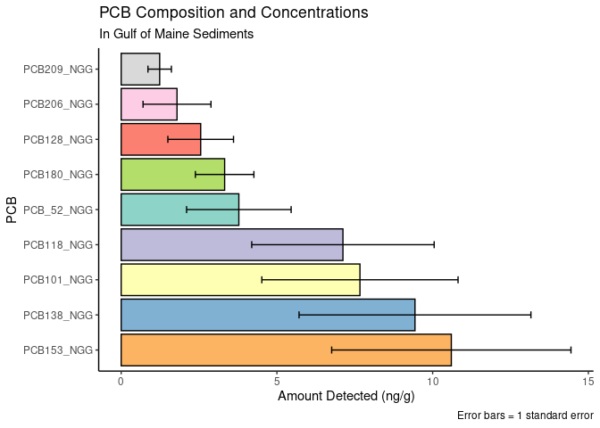
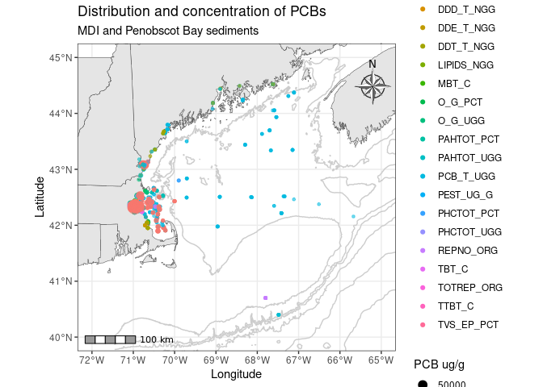

GOM Contaminated Sediments analysis: PCBs
================
Joshua Harkness and Autumn Pauly
2023-10-28

``` r
library(tidyverse)
```

    ## ── Attaching core tidyverse packages ──────────────────────── tidyverse 2.0.0 ──
    ## ✔ dplyr     1.1.3     ✔ readr     2.1.4
    ## ✔ forcats   1.0.0     ✔ stringr   1.5.0
    ## ✔ ggplot2   3.4.4     ✔ tibble    3.2.1
    ## ✔ lubridate 1.9.3     ✔ tidyr     1.3.0
    ## ✔ purrr     1.0.2     
    ## ── Conflicts ────────────────────────────────────────── tidyverse_conflicts() ──
    ## ✖ dplyr::filter() masks stats::filter()
    ## ✖ dplyr::lag()    masks stats::lag()
    ## ℹ Use the conflicted package (<http://conflicted.r-lib.org/>) to force all conflicts to become errors

``` r
library(sf)
```

    ## Linking to GEOS 3.8.0, GDAL 3.0.4, PROJ 6.3.1; sf_use_s2() is TRUE

``` r
library(leaflet)
library(RColorBrewer)
#install.packages("dplyr")
library(dplyr)
```

``` r
PCBs <- read.csv(paste0("/cloud/project/data/datasets_loc/PCBs_loc.csv"), header = T)
Organics <- read.csv(paste0("/cloud/project/data/datasets_loc/Organics_loc.csv"), header = T)
```

``` r
glimpse(PCBs)
```

    ## Rows: 7,848
    ## Columns: 38
    ## $ UNIQUE_ID  <chr> "US00001", "US00002", "US00003", "US00004", "US00005", "US0…
    ## $ LATITUDE   <dbl> 42.35972, 42.36028, 42.38500, 42.38500, 42.38500, 42.38500,…
    ## $ LONGITUDE  <dbl> -71.02861, -71.02778, -71.04611, -71.04611, -71.04611, -71.…
    ## $ SOUNDING_M <dbl> NA, NA, NA, NA, NA, NA, NA, NA, NA, NA, NA, NA, NA, NA, NA,…
    ## $ STATE_NAME <chr> "MA", "MA", "MA", "MA", "MA", "MA", "MA", "MA", "MA", "MA",…
    ## $ QUAD_NAME  <chr> NA, NA, NA, NA, NA, NA, NA, NA, NA, NA, NA, NA, NA, NA, NA,…
    ## $ GEN_LOC_NM <chr> "BOSTON INNER HARBOR", "BOSTON INNER HARBOR", "BOSTON INNER…
    ## $ SPECFC_LOC <chr> "BIH", "BIH", "BIH", "BIH", "BIH", "BIH", "BIH", "BIH", "BI…
    ## $ AREA_CODE  <int> 1, 1, 1, 1, 1, 1, 1, 1, 1, 2, 2, 1, 1, 1, 1, 1, 1, 1, 1, 1,…
    ## $ SAMP_DATE1 <chr> NA, NA, "5/1/1981", "5/1/1981", "5/1/1981", "5/1/1981", "5/…
    ## $ TO_SMP_DT2 <chr> NA, NA, NA, NA, NA, NA, NA, NA, NA, NA, NA, NA, NA, NA, NA,…
    ## $ DPTH_N_COR <chr> NA, NA, NA, NA, NA, NA, NA, NA, NA, NA, NA, NA, NA, NA, "0"…
    ## $ DPTH_CODE  <chr> "Unknown", "Unknown", "Depth", "Depth", "Unknown", "Unknown…
    ## $ COR_GRB_CD <chr> "Grab", "Grab", "Core", "Core", "Grab", "Grab", "Grab", "Gr…
    ## $ PCB_52_NGG <dbl> NA, NA, NA, NA, NA, NA, NA, NA, NA, NA, NA, NA, NA, NA, NA,…
    ## $ PCB101_NGG <dbl> NA, NA, NA, NA, NA, NA, NA, NA, NA, NA, NA, NA, NA, NA, NA,…
    ## $ PCB118_NGG <dbl> NA, NA, NA, NA, NA, NA, NA, NA, NA, NA, NA, NA, NA, NA, NA,…
    ## $ PCB128_NGG <dbl> NA, NA, NA, NA, NA, NA, NA, NA, NA, NA, NA, NA, NA, NA, NA,…
    ## $ PCB138_NGG <dbl> NA, NA, NA, NA, NA, NA, NA, NA, NA, NA, NA, NA, NA, NA, NA,…
    ## $ PCB153_NGG <dbl> NA, NA, NA, NA, NA, NA, NA, NA, NA, NA, NA, NA, NA, NA, NA,…
    ## $ PCB180_NGG <dbl> NA, NA, NA, NA, NA, NA, NA, NA, NA, NA, NA, NA, NA, NA, NA,…
    ## $ PCB206_NGG <dbl> NA, NA, NA, NA, NA, NA, NA, NA, NA, NA, NA, NA, NA, NA, NA,…
    ## $ PCB209_NGG <dbl> NA, NA, NA, NA, NA, NA, NA, NA, NA, NA, NA, NA, NA, NA, NA,…
    ## $ DDT_4_4_C  <dbl> NA, NA, NA, NA, NA, NA, NA, NA, NA, NA, NA, NA, NA, NA, NA,…
    ## $ DDT_2_4_C  <dbl> NA, NA, NA, NA, NA, NA, NA, NA, NA, NA, NA, NA, NA, NA, NA,…
    ## $ DDE_4_4_C  <dbl> NA, NA, NA, NA, NA, NA, NA, NA, NA, NA, NA, NA, NA, NA, NA,…
    ## $ DDD_4_4_C  <dbl> NA, NA, NA, NA, NA, NA, NA, NA, NA, NA, NA, NA, NA, NA, NA,…
    ## $ ENDRIN_C   <dbl> NA, NA, NA, NA, NA, NA, NA, NA, NA, NA, NA, NA, NA, NA, NA,…
    ## $ ENDR_ALD_C <dbl> NA, NA, NA, NA, NA, NA, NA, NA, NA, NA, NA, NA, NA, NA, NA,…
    ## $ ALDRIN_C   <dbl> NA, NA, NA, NA, NA, NA, NA, NA, NA, NA, NA, NA, NA, NA, NA,…
    ## $ DIELDRN_C  <dbl> NA, NA, NA, NA, NA, NA, NA, NA, NA, NA, NA, NA, NA, NA, NA,…
    ## $ CLRDNE_T_C <dbl> NA, NA, NA, NA, NA, NA, NA, NA, NA, NA, NA, NA, NA, NA, NA,…
    ## $ MIREX_C    <dbl> NA, NA, NA, NA, NA, NA, NA, NA, NA, NA, NA, NA, NA, NA, NA,…
    ## $ METHOXYCLC <dbl> NA, NA, NA, NA, NA, NA, NA, NA, NA, NA, NA, NA, NA, NA, NA,…
    ## $ BHC_A_C    <dbl> NA, NA, NA, NA, NA, NA, NA, NA, NA, NA, NA, NA, NA, NA, NA,…
    ## $ BHC_B_C    <dbl> NA, NA, NA, NA, NA, NA, NA, NA, NA, NA, NA, NA, NA, NA, NA,…
    ## $ BHC_D_C    <dbl> NA, NA, NA, NA, NA, NA, NA, NA, NA, NA, NA, NA, NA, NA, NA,…
    ## $ LINDANE_C  <dbl> NA, NA, NA, NA, NA, NA, NA, NA, NA, NA, NA, NA, NA, NA, NA,…

``` r
#PCBs %>%
  #drop_na(c(PCB_52_NGG:PCB209_NGG))
  #mutate(PCBs = sum(c(PCB_52_NGGPCB209_NGG)), na.rm = T)
  #unite("PCBs", PCB_52_NGG:PCB209_NGG, remove = TRUE)

##This is what I (Autumn) tried to do, but it still wouldn't recognize the columns. 
#PCBs %>%
  #drop_na(c(PCB_52_NGG:PCB209_NGG))
  #mutate(PCBs = PCB_52_NGG + PCB101_NGG + PCB118_NGG + PCB128_NGG + PCB138_NGG + PCB153_NGG + PCB180_NGG + PCB206_NGG + PCB209_NGG), na.rm = T)
  #unite("PCBs", PCB_52_NGG:PCB209_NGG, remove = TRUE)
```

``` r
#PCBs <- PCBs %>%
#  mutate(sum_PCBs = PCB101_NGG + PCB118_NGG + PCB128_NGG + PCB138_NGG + PCB153_NGG + PCB180_NGG + PCB206_NGG + PCB209_NGG) %>% 
 # mutate(sumBHCs = BHC_A_C + BHC_B_C + BHC_D_C)

#PCBs <- PCBs %>% 
#  select(-BHC_A_C, -BHC_B_C, -BHC_D_C, -PCB101_NGG,  -PCB118_NGG, -PCB128_NGG, -PCB138_NGG, -PCB153_NGG, #-PCB180_NGG, -PCB206_NGG, -PCB209_NGG)

#glimpse(PCBs)
```

``` r
#PCBs <- PCBs %>%
#  rowwise() %>%
#mutate(PCBs_sum_total = sum(across(c(PCB_52_NGG, PCB101_NGG, PCB118_NGG, PCB128_NGG, PCB138_NGG, #PCB153_NGG, PCB180_NGG, PCB206_NGG, PCB209_NGG)), na.rm = T))

#PCBs %>%
#  group_by(GEN_LOC_NM) %>%
#  select(STATE_NAME, GEN_LOC_NM, SPECFC_LOC, PCBs_sum_total) %>%
#  arrange(desc(PCBs_sum_total))
```

``` r
Summary_Organics <- Organics %>%
  group_by(GEN_LOC_NM) %>%
  drop_na(PCB_T_UGG) %>%
  summarise(mean_PCB_T = mean(PCB_T_UGG),
    sd_PCB_T = sd(PCB_T_UGG),
    n_PCB_T = n(),
    SE_PCB_T = sd(PCB_T_UGG) / sqrt(n()))

Summary_Organics
```

    ## # A tibble: 12 × 5
    ##    GEN_LOC_NM                   mean_PCB_T sd_PCB_T n_PCB_T SE_PCB_T
    ##    <chr>                             <dbl>    <dbl>   <int>    <dbl>
    ##  1 43.5N to 44N; to 50M isobath     4.29    25.3        187  1.85   
    ##  2 BOSTON INNER HARBOR             44.2    285.         119 26.1    
    ##  3 CAPE ANN to 43.5N               26.9    227.         190 16.5    
    ##  4 CAPE COD BAY                     0.0113   0.0137      34  0.00235
    ##  5 CENTRAL BOSTON HARBOR            0.416    0.274       41  0.0427 
    ##  6 GULF OF MAINE, >50M ISOBATH      0.0257   0.0326     150  0.00266
    ##  7 HARBOR APPROACHES                0.251    0.207       24  0.0422 
    ##  8 INLAND / RIVERS                  0.0685   0.235       51  0.0329 
    ##  9 MASS BAYS                        0.0712   0.293      407  0.0145 
    ## 10 NORTHWEST BOSTON HARBOR          0.320    0.763      220  0.0514 
    ## 11 North of 44; to 50M isobath      2.37    22.7        150  1.86   
    ## 12 SOUTHEAST BOSTON HARBOR         18.4     73.2         33 12.7

``` r
Summary_Organics %>%
  ggplot(aes(x = fct_rev(fct_reorder(GEN_LOC_NM, mean_PCB_T)), y = mean_PCB_T, fill = GEN_LOC_NM))+
  geom_col(col = "black")+
  geom_errorbar(aes(ymin = mean_PCB_T - SE_PCB_T, ymax = mean_PCB_T + SE_PCB_T), width = 0.2)+
  coord_flip()+
  scale_fill_viridis_d()+
  theme_bw()+
  theme(legend.position = "none")+
  labs(title = "PCB Concentrations in Gulf of Maine Sediments",
       x = "General location",
       y = "Mean total PCB concentration ug/g",
       caption = "Error bars = 1 standard error")
```

<!-- -->

``` r
Summary_Organics %>%
  filter(GEN_LOC_NM %in% c("BOSTON INNER HARBOR", "CENTRAL BOSTON HARBOR", "SOUTHEAST BOSTON HARBOR", "NORTHWEST BOSTON HARBOR")) %>%
  ggplot(aes(x = fct_rev(fct_reorder(GEN_LOC_NM, mean_PCB_T)), y = mean_PCB_T, fill = GEN_LOC_NM))+
  geom_col(col = "black")+
  geom_errorbar(aes(ymin = mean_PCB_T - SE_PCB_T, ymax = mean_PCB_T + SE_PCB_T), width = 0.2)+
  scale_fill_brewer(type = "qual", palette = 4, direction = 1, aesthetics = "fill")+
  theme_bw()+
  coord_flip()+
  theme(legend.position = "none")+
  labs(title = "PCB Concentrations in Boston Harbor Sediments",
       x = "General location",
       y = "Mean total PCB concentration ug/g",
       caption = "Error bars = 1 standard error")
```

<!-- -->

``` r
Summary_Organics %>%
  filter(GEN_LOC_NM %in% c("CENTRAL BOSTON HARBOR", "NORTHWEST BOSTON HARBOR")) %>%
  ggplot(aes(x = fct_reorder(GEN_LOC_NM, mean_PCB_T), y = mean_PCB_T, fill = GEN_LOC_NM))+
  geom_col(col = "black")+
  geom_errorbar(aes(ymin = mean_PCB_T - SE_PCB_T, ymax = mean_PCB_T + SE_PCB_T), width = 0.2)+
  scale_fill_brewer(type = "qual", palette = 4, direction = 1, aesthetics = "fill")+
  theme_bw()+
  theme(legend.position = "none")+
  labs(title = "PCB Concentrations in Boston Harbor Sediments",
       subtitle = "Central and Northwest Boston Harbor",
       x = "General location",
       y = "Mean total PCB concentration ug/g",
       caption = "Error bars = 1 standard error")
```

<!-- -->

### Specific Locations

``` r
Sum_Org_SPC <- Organics %>%
  group_by(SPECFC_LOC) %>%
  drop_na(PCB_T_UGG) %>%
  summarise(mean_PCB_T = mean(PCB_T_UGG),
    sd_PCB_T = sd(PCB_T_UGG),
    n_PCB_T = n(),
    SE_PCB_T = sd(PCB_T_UGG) / sqrt(n()))

Sum_Org_SPC
```

    ## # A tibble: 193 × 5
    ##    SPECFC_LOC                     mean_PCB_T sd_PCB_T n_PCB_T SE_PCB_T
    ##    <chr>                               <dbl>    <dbl>   <int>    <dbl>
    ##  1 1-U.S. GypsumCo.200TerminalSt.     1.5     NA            1  NA     
    ##  2 2-U.S. GypsumCo.200TerminalSt.     1.1     NA            1  NA     
    ##  3 3-U.S. GypsumCo.200TerminalSt.     0.8     NA            1  NA     
    ##  4 4-U.S. GypsumCo.200TerminalSt.     0.2     NA            1  NA     
    ##  5 BASS RIVER                         1.97     1.70         3   0.980 
    ##  6 BEVERLY HARBOR                     0       NA            1  NA     
    ##  7 BIH                                5.10    20.0         37   3.29  
    ##  8 BOI                                0.116    0.0396       8   0.014 
    ##  9 BOSTON HARBOR                      0.0809   0.0495       4   0.0247
    ## 10 BOSTON HARBOR MARINA               0        0            2   0     
    ## # ℹ 183 more rows

``` r
Sum_Org_SPC %>%
  filter(SPECFC_LOC %in% c("In Piscataqua River NE of Outer Cutts Cove", "Piscataqua River N of Pierce Is.","York River", "Kennebunk River", "Portland Fore River", "Kennebec River to Bath", "Penobscot River to Bangor")) %>%
  ggplot(aes(x = fct_rev(fct_reorder(SPECFC_LOC, mean_PCB_T)), y = mean_PCB_T, fill = SPECFC_LOC))+
  geom_bar(stat="identity", col = "black")+
  geom_errorbar(aes(ymin = mean_PCB_T - SE_PCB_T, ymax = mean_PCB_T + SE_PCB_T), width = 0.2)+
  scale_fill_brewer(type = "qual", palette = 4, direction = 1, aesthetics = "fill")+
  theme_bw()+
  coord_flip()+
  theme(legend.position = "none")+
  labs(title = "PCB Concentrations in Maine Rivers",
       subtitle = "Union River excluded",
       caption = "Error bars = 1 standard error",
       x = "Location",
       y = "Mean total PCB concentration ug/g")
```

<!-- -->

Need to figure out how to keep categories with zero values. For example,
samples from the Penobscot River yielded no PCBs and are entered as zero
values but will not display in ggplot. “Tried scale_x_discrete(drop =
FALSE)” with no effect.

Also would like to combine the values for the two Piscataquis River
sites into one category, so that there is only one bar in these plots.

``` r
Sum_Org_SPC %>%
  filter(SPECFC_LOC %in% c("In Piscataqua River NE of Outer Cutts Cove", "Piscataqua River N of Pierce Is.","York River", "Kennebunk River", "Portland Fore River", "Kennebec River to Bath", "Penobscot River to Bangor", "Union River")) %>%
  ggplot(aes(x = fct_rev(fct_reorder(SPECFC_LOC, mean_PCB_T)), y = mean_PCB_T, fill = SPECFC_LOC))+
  geom_col(col = "black")+
  geom_errorbar(aes(ymin = mean_PCB_T - SE_PCB_T, ymax = mean_PCB_T + SE_PCB_T), width = 0.2)+
  scale_fill_manual(values = c("gray50", "gray50", "gray50", "gray50", "gray50", "firebrick2", "gray50"))+
  theme_bw()+
  coord_flip()+
  theme(legend.position = "none")+
  labs(title = "PCB Concentrations in Maine Rivers",
       subtitle = "With Union River, Ellsworth",
       caption = "Error bars = 1 standard error",
       x = "Location",
       y = "Mean total PCB concentration ug/g")
```

<!-- -->

There are no errorbars for Union River as n = 1; single sample from this
site so only a mean value.

``` r
Sum_Org_SPC %>%
  filter(SPECFC_LOC %in% c("BASS RIVER", "ESSEX RIVER", "MYSTIC RIVER", "FORE RIVER", "CHELSEA RIVER", "Chelsea River, Golf Oil Fuel Off-Loading Pier", "Mill Creek", "Neponset River Bridge", "South River", "Weymouth Fore & Town River", "North & Danvers River")) %>%
  ggplot(aes(x = fct_rev(fct_reorder(SPECFC_LOC, mean_PCB_T)), y = mean_PCB_T, fill = SPECFC_LOC))+
  geom_bar(stat="identity", col = "black")+
  geom_errorbar(aes(ymin = mean_PCB_T - SE_PCB_T, ymax = mean_PCB_T + SE_PCB_T), width = 0.2)+
  scale_fill_brewer(type = "qual", palette = 4, direction = 1, aesthetics = "fill")+
  theme_bw()+
  coord_flip()+
  theme(legend.position = "none")+
  labs(title = "PCB Concentrations in Massachusetts Rivers",
       caption = "Error bars = 1 standard error",
       x = "Location",
       y = "Mean total PCB concentration ug/g")
```

<!-- -->

## Statistical tests

### Difference between general locations

Does total PCB concentration differ significantly between general
locations?

``` r
hist(Organics$PCB_T_UGG)
```

<!-- --> The
distribution of total PCB concentrations is highly skewed, with high
influence outliers. It fails to meet parametric assumptions, so it
should be analyzed with non-parametric methods. We could do
bootstrapping here, but a Kruskal Wallis test is appropriate and
simpler.

``` r
kw1=kruskal.test(Organics$PCB_T_UGG ~ Organics$GEN_LOC_NM)
kw1
```

    ## 
    ##  Kruskal-Wallis rank sum test
    ## 
    ## data:  Organics$PCB_T_UGG by Organics$GEN_LOC_NM
    ## Kruskal-Wallis chi-squared = 305.22, df = 11, p-value < 2.2e-16

Significant – now a Dunn post-hoc test to identify significance between
locations.

``` r
#install.packages("dunn.test")
library(dunn.test)

dunn=dunn.test(Organics$PCB_T_UGG,Organics$GEN_LOC_NM,method="bh")
```

    ##   Kruskal-Wallis rank sum test
    ## 
    ## data: x and group
    ## Kruskal-Wallis chi-squared = 305.2249, df = 11, p-value = 0
    ## 
    ## 
    ##                            Comparison of x by group                            
    ##                              (Benjamini-Hochberg)                              
    ## Col Mean-|
    ## Row Mean |   43.5N to   BOSTON I   CAPE ANN   CAPE COD   CENTRAL    GULF OF 
    ## ---------+------------------------------------------------------------------
    ## BOSTON I |  -8.580242
    ##          |    0.0000*
    ##          |
    ## CAPE ANN |  -2.267240   6.608954
    ##          |    0.0157*    0.0000*
    ##          |
    ## CAPE COD |   1.263044   6.385018   2.518770
    ##          |     0.1136    0.0000*    0.0086*
    ##          |
    ## CENTRAL  |  -8.266858  -2.316164  -6.922390  -7.161257
    ##          |    0.0000*    0.0141*    0.0000*    0.0000*
    ##          |
    ## GULF OF  |  -1.990179   6.419146   0.141015  -2.388203   6.851563
    ##          |     0.0296    0.0000*     0.4439    0.0121*    0.0000*
    ##          |
    ## HARBOR A |  -5.824430  -1.147375  -4.751600  -5.620210   0.633012  -4.752161
    ##          |    0.0000*     0.1359    0.0000*    0.0000*     0.2716    0.0000*
    ##          |
    ## INLAND / |   3.955073   9.744852   5.442675   1.758389   9.775045   5.200293
    ##          |    0.0001*    0.0000*    0.0000*     0.0481    0.0000*    0.0000*
    ##          |
    ## MASS BAY |  -0.898571   8.893072   1.754542  -1.763760   8.216040   1.452708
    ##          |     0.1932    0.0000*     0.0476     0.0484    0.0000*     0.0847
    ##          |
    ## North of |   4.360601   12.08961   6.514231   1.276609   10.80155   6.028459
    ##          |    0.0000*    0.0000*    0.0000*     0.1128    0.0000*    0.0000*
    ##          |
    ## NORTHWES |  -4.400477   4.995650  -2.061251  -3.653067   5.807612  -2.073387
    ##          |    0.0000*    0.0000*     0.0254    0.0002*    0.0000*     0.0252
    ##          |
    ## SOUTHEAS |  -2.658858   2.562417  -1.423638  -3.018050   3.949112  -1.476458
    ##          |    0.0060*    0.0078*     0.0879    0.0020*    0.0001*     0.0824
    ## Col Mean-|
    ## Row Mean |   HARBOR A   INLAND /   MASS BAY   North of   NORTHWES
    ## ---------+-------------------------------------------------------
    ## INLAND / |   7.625903
    ##          |    0.0000*
    ##          |
    ## MASS BAY |   5.634273  -4.740582
    ##          |    0.0000*    0.0000*
    ##          |
    ## North of |   7.918463  -0.905835   5.834998
    ##          |    0.0000*     0.1943    0.0000*
    ##          |
    ## NORTHWES |   3.838720  -6.836496  -4.281813  -8.647419
    ##          |    0.0001*    0.0000*    0.0000*    0.0000*
    ##          |
    ## SOUTHEAS |   2.836188  -5.043804  -2.335094  -5.096827  -0.344662
    ##          |    0.0036*    0.0000*    0.0137*    0.0000*     0.3708
    ## 
    ## alpha = 0.05
    ## Reject Ho if p <= alpha/2

Interpretation: Most general locations have significantly different mean
total PCB concentrations…

## Map Plots

### Static maps

``` r
GOM_states <- st_read("/cloud/project/extra/GOM_DD.shp")
```

    ## Reading layer `GOM_DD' from data source `/cloud/project/extra/GOM_DD.shp' using driver `ESRI Shapefile'
    ## Simple feature collection with 8 features and 6 fields
    ## Geometry type: MULTIPOLYGON
    ## Dimension:     XY
    ## Bounding box:  xmin: -73.72972 ymin: 40.98249 xmax: -59.69256 ymax: 48.06532
    ## Geodetic CRS:  NAD83

``` r
Bathy <- st_read("/cloud/project/extra/BATHYMGM_ARC.shp")
```

    ## Reading layer `BATHYMGM_ARC' from data source 
    ##   `/cloud/project/extra/BATHYMGM_ARC.shp' using driver `ESRI Shapefile'
    ## Simple feature collection with 5383 features and 2 fields
    ## Geometry type: LINESTRING
    ## Dimension:     XY
    ## Bounding box:  xmin: 174878.8 ymin: 577731.9 xmax: 923912.7 ymax: 1311467
    ## Projected CRS: NAD83 / Massachusetts Mainland

``` r
unique(Bathy$CONTOUR)
```

    ##  [1]    -5   -40   -15   -20   -10     0   -50   -30   -70   -60  -100   -90
    ## [13]   -80  -120  -220  -200  -160  -180  -140  -240  -300  -280  -260  -500
    ## [25]  -400 -2000 -1000 -3000 -4000

``` r
Bathy <- Bathy%>%
 filter(CONTOUR %in% c("-100", "-200","-400","-1000","-2000","-3000","-4000"))
ggplot(Bathy) +
  geom_sf(aes())
```

<!-- --> Bathymetry data is
in projected coordinate system (NAD83), other data is geodetic (NAD83).
Wasn’t able to add this layer to map plot – need to change projection.

``` r
Org_no_na <- Organics %>%
  drop_na(PCB_T_UGG)
```

``` r
ggplot(GOM_states)+
  geom_sf(aes())+
  geom_point(data=Org_no_na, (aes(x = LONGITUDE, y = LATITUDE, size = PCB_T_UGG, alpha = 0.5)))+
  xlim(-72,-65)+
  ylim(40,45)+
  theme_bw()+
  labs(title = "Distribution and concentration of PCBs",
       subtitle ="Gulf of Maine sediments",
       x = "Longitude",
       y = "Latitude")+
  guides(size = guide_legend(title = "PCB ug/g"))+
  guides(alpha = FALSE)+
  ggspatial::annotation_scale(
    location = "bl",
    bar_cols = c("grey60", "white"),
    text_family = "ArcherPro Book"
  ) +
  ggspatial::annotation_north_arrow(
    location = "tr", which_north = "true",
    pad_x = unit(0, "in"), pad_y = unit(0.2, "in"),
    style = ggspatial::north_arrow_nautical(
      fill = c("grey40", "white"),
      line_col = "grey20",
      text_family = "ArcherPro Book"))
```

<!-- -->

``` r
ggplot(GOM_states)+
  geom_sf(aes())+
  geom_point(data=Org_no_na, (aes(x = LONGITUDE, y = LATITUDE, size = PCB_T_UGG, alpha = 0.5)))+
  xlim(-69.2,-68)+
  ylim(44,44.5)+
  theme_bw()+
  labs(title = "Distribution and concentration of PCBs",
       subtitle ="MDI and Penobscot Bay sediments",
       x = "Longitude",
       y = "Latitude")+
  guides(size = guide_legend(title = "PCB ug/g"))+
  guides(alpha = FALSE)+
  ggspatial::annotation_scale(
    location = "bl",
    bar_cols = c("grey60", "white"),
    text_family = "ArcherPro Book"
  ) +
  ggspatial::annotation_north_arrow(
    location = "tr", which_north = "true",
    pad_x = unit(0, "in"), pad_y = unit(0.2, "in"),
    style = ggspatial::north_arrow_nautical(
      fill = c("grey40", "white"),
      line_col = "grey20",
      text_family = "ArcherPro Book"))
```

    ## Warning: Removed 1483 rows containing missing values (`geom_point()`).

<!-- -->

``` r
ggplot(GOM_states)+
  geom_sf(aes())+
  geom_point(data=Org_no_na, (aes(x = LONGITUDE, y = LATITUDE, size = PCB_T_UGG, alpha = 0.5)))+
  xlim(-71.2,-69.5)+
  ylim(41.8,43)+
  theme_bw()+
  labs(title = "Distribution and concentration of PCBs",
       subtitle ="Massachusetts and Cape Cod Bay sediments",
       x = "Longitude",
       y = "Latitude")+
  guides(size = guide_legend(title = "PCB ug/g"))+
  guides(alpha = FALSE)+
  ggspatial::annotation_scale(
    location = "bl",
    bar_cols = c("grey60", "white"),
    text_family = "ArcherPro Book"
  ) +
  ggspatial::annotation_north_arrow(
    location = "tr", which_north = "true",
    pad_x = unit(0, "in"), pad_y = unit(0.1, "in"),
    style = ggspatial::north_arrow_nautical(
      fill = c("grey40", "white"),
      line_col = "grey20",
      text_family = "ArcherPro Book"))
```

    ## Warning: Removed 667 rows containing missing values (`geom_point()`).

<!-- -->

### Interactive map

``` r
#labels <- sprintf("<strong>%s</strong><br/>%g ug/g", 
#                  Org_no_na$SPECFC_LOC, Org_no_na$PCB_T_UGG) %>% #lapply(htmltools::HTML)

#head(labels, 1)
```

``` r
#leaflet(data = Org_no_na) %>%
#  addProviderTiles(providers$Esri.WorldTopoMap) %>%
#  setView(lng = -68.5, 
#          lat = 43.5, 
#          zoom = 6) %>%
#  addCircleMarkers(lng = ~LONGITUDE, lat = ~LATITUDE, popup = c(~SPECFC_LOC, #~PCB_T_UGG), label = labels)
```

Note that the two above code chunks are commented out as .rmd will not
knit to github document with html functions. Uncomment to run and change
output type to `html_document` to knit.
