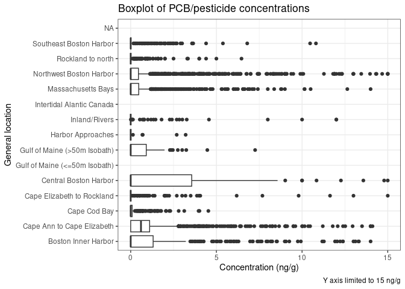
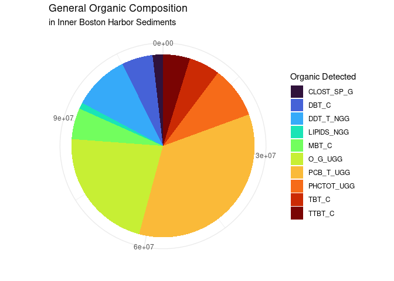
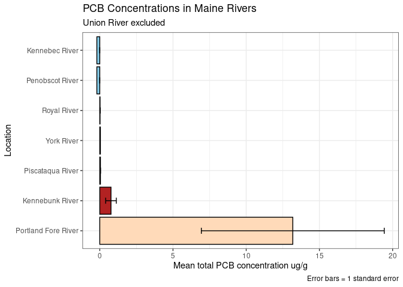
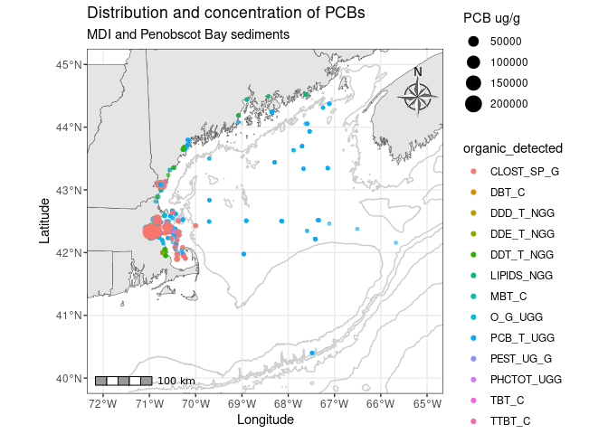

GOM Contaminated Sediments Analysis: PCBs
================
Joshua Harkness and Autumn Pauly
2023-10-28

## Introduction

This document is an analysis of distributions and concentrations of PCB
and Organic contaminants that were reported in a publication by the U.S.
Geological Survey on contaminated sediments in the Gulf of Maine. In
this data set, we analyzed the prevalence of oil and grease, petroleum
Hydrocarbons, polychlorinated biphenyls, DDT compounds, DDE compounds,
DDD compounds, pesticide compounds, lipids, clostridium perfringens,
monobutyl tin, dibutyl tin, tributyl tin, tetrabutyl tin, PCB congeners
\#52-209, DDT 4,4’, DDT 2,4’, DDD 4,4’, DDD 4,2’, endrin, endrin
aldehyde, aldrin, dieldrin, chlordane, mirex, methoxychlor,
hexachlorocyclohexane alpha/beta/gamma isomer, and lindane.

### Background

Polychlorinated biphenyls (PCBs) constitute a group of persistent
synthetic organic pollutants characterized by two interconnected phenyl
rings, forming aromatic structures with a double bond, and chlorine
atoms affixed to the phenyl rings. Due to their notable thermal
stability and chemical properties, PCBs found extensive use in diverse
industrial applications spanning the 1930s to the 1970s. The prohibition
of PCBs in the United States in 1979 resulted from substantial harm
inflicted upon both human and environmental health. The Stockholm
Convention on Persistent Organic Pollutants, initiated in 2001 as an
international treaty, is dedicated to mitigating the production and use
of persistent organic pollutants, including PCBs.

Research suggests that PCBs can induce cancer in animals as well as
various severe non-cancer health impacts, including having effects on
the immune, reproductive, nervous, and endocrine systems. The
International Agency for Research on Cancer (IARC) has classified PCBs
as probable human carcinogens. Their deleterious influence extends to
marine ecosystems, where their exceptional stability, poor
biodegradability, and lipid solubility contribute to bioaccumulation
(Kennish 1996). Functioning as endocrine-disrupting compounds, PCBs
perturb the hormonal equilibrium in animals, potentially leading to
immunodeficiency and reproductive challenges (Clark 1999).

### Loading packages

These are the packages that will be used for analysis.

``` r
library(tidyverse)
library(sf)
library(leaflet)
library(RColorBrewer)
#install.packages("dplyr")
library(dplyr)
library(ggridges)
library(rmarkdown)
```

### Loading PCB and Organics Datasets

This loads the datasets from .csv files and reads them into the
environment.

``` r
PCBs <- read.csv(paste0("/cloud/project/data/datasets_csv/PCBs_loc.csv"), header = T)
Organics <- read.csv(paste0("/cloud/project/data/datasets_csv/Organics_loc.csv"), header = T)
```

### Glimpsing the PCB and Organics Datasets

These data sets are quite large and contain a lot of information.
Pivoting will need to be done to restructure this into a format that
will be easier to interpret.

``` r
glimpse(PCBs)
```

    ## Rows: 7,848
    ## Columns: 39
    ## $ UNIQUE_ID  <chr> "US00001", "US00002", "US00003", "US00004", "US00005", "US0…
    ## $ LATITUDE   <dbl> 42.35972, 42.36028, 42.38500, 42.38500, 42.38500, 42.38500,…
    ## $ LONGITUDE  <dbl> -71.02861, -71.02778, -71.04611, -71.04611, -71.04611, -71.…
    ## $ SOUNDING_M <dbl> NA, NA, NA, NA, NA, NA, NA, NA, NA, NA, NA, NA, NA, NA, NA,…
    ## $ STATE_NAME <chr> "MA", "MA", "MA", "MA", "MA", "MA", "MA", "MA", "MA", "MA",…
    ## $ QUAD_NAME  <chr> NA, NA, NA, NA, NA, NA, NA, NA, NA, NA, NA, NA, NA, NA, NA,…
    ## $ GEN_LOC_NM <chr> "Boston Inner Harbor", "Boston Inner Harbor", "Boston Inner…
    ## $ SPECFC_LOC <chr> "BIH", "BIH", "BIH", "BIH", "BIH", "BIH", "BIH", "BIH", "BI…
    ## $ AREA_CODE  <int> 1, 1, 1, 1, 1, 1, 1, 1, 1, 2, 2, 1, 1, 1, 1, 1, 1, 1, 1, 1,…
    ## $ SAMP_DATE1 <chr> NA, NA, "5/1/1981", "5/1/1981", "5/1/1981", "5/1/1981", "5/…
    ## $ TO_SMP_DT2 <chr> NA, NA, NA, NA, NA, NA, NA, NA, NA, NA, NA, NA, NA, NA, NA,…
    ## $ DPTH_N_COR <chr> NA, NA, NA, NA, NA, NA, NA, NA, NA, NA, NA, NA, NA, NA, "0"…
    ## $ DPTH_CODE  <chr> "Unknown", "Unknown", "Depth", "Depth", "Unknown", "Unknown…
    ## $ COR_GRB_CD <chr> "Grab", "Grab", "Core", "Core", "Grab", "Grab", "Grab", "Gr…
    ## $ site       <chr> "BIH", "BIH", "BIH", "BIH", "BIH", "BIH", "BIH", "BIH", "BI…
    ## $ PCB_52_NGG <dbl> NA, NA, NA, NA, NA, NA, NA, NA, NA, NA, NA, NA, NA, NA, NA,…
    ## $ PCB101_NGG <dbl> NA, NA, NA, NA, NA, NA, NA, NA, NA, NA, NA, NA, NA, NA, NA,…
    ## $ PCB118_NGG <dbl> NA, NA, NA, NA, NA, NA, NA, NA, NA, NA, NA, NA, NA, NA, NA,…
    ## $ PCB128_NGG <dbl> NA, NA, NA, NA, NA, NA, NA, NA, NA, NA, NA, NA, NA, NA, NA,…
    ## $ PCB138_NGG <dbl> NA, NA, NA, NA, NA, NA, NA, NA, NA, NA, NA, NA, NA, NA, NA,…
    ## $ PCB153_NGG <dbl> NA, NA, NA, NA, NA, NA, NA, NA, NA, NA, NA, NA, NA, NA, NA,…
    ## $ PCB180_NGG <dbl> NA, NA, NA, NA, NA, NA, NA, NA, NA, NA, NA, NA, NA, NA, NA,…
    ## $ PCB206_NGG <dbl> NA, NA, NA, NA, NA, NA, NA, NA, NA, NA, NA, NA, NA, NA, NA,…
    ## $ PCB209_NGG <dbl> NA, NA, NA, NA, NA, NA, NA, NA, NA, NA, NA, NA, NA, NA, NA,…
    ## $ DDT_4_4_C  <dbl> NA, NA, NA, NA, NA, NA, NA, NA, NA, NA, NA, NA, NA, NA, NA,…
    ## $ DDT_2_4_C  <dbl> NA, NA, NA, NA, NA, NA, NA, NA, NA, NA, NA, NA, NA, NA, NA,…
    ## $ DDE_4_4_C  <dbl> NA, NA, NA, NA, NA, NA, NA, NA, NA, NA, NA, NA, NA, NA, NA,…
    ## $ DDD_4_4_C  <dbl> NA, NA, NA, NA, NA, NA, NA, NA, NA, NA, NA, NA, NA, NA, NA,…
    ## $ ENDRIN_C   <dbl> NA, NA, NA, NA, NA, NA, NA, NA, NA, NA, NA, NA, NA, NA, NA,…
    ## $ ENDR_ALD_C <dbl> NA, NA, NA, NA, NA, NA, NA, NA, NA, NA, NA, NA, NA, NA, NA,…
    ## $ ALDRIN_C   <dbl> NA, NA, NA, NA, NA, NA, NA, NA, NA, NA, NA, NA, NA, NA, NA,…
    ## $ DIELDRN_C  <dbl> NA, NA, NA, NA, NA, NA, NA, NA, NA, NA, NA, NA, NA, NA, NA,…
    ## $ CLRDNE_T_C <dbl> NA, NA, NA, NA, NA, NA, NA, NA, NA, NA, NA, NA, NA, NA, NA,…
    ## $ MIREX_C    <dbl> NA, NA, NA, NA, NA, NA, NA, NA, NA, NA, NA, NA, NA, NA, NA,…
    ## $ METHOXYCLC <dbl> NA, NA, NA, NA, NA, NA, NA, NA, NA, NA, NA, NA, NA, NA, NA,…
    ## $ BHC_A_C    <dbl> NA, NA, NA, NA, NA, NA, NA, NA, NA, NA, NA, NA, NA, NA, NA,…
    ## $ BHC_B_C    <dbl> NA, NA, NA, NA, NA, NA, NA, NA, NA, NA, NA, NA, NA, NA, NA,…
    ## $ BHC_D_C    <dbl> NA, NA, NA, NA, NA, NA, NA, NA, NA, NA, NA, NA, NA, NA, NA,…
    ## $ LINDANE_C  <dbl> NA, NA, NA, NA, NA, NA, NA, NA, NA, NA, NA, NA, NA, NA, NA,…

``` r
glimpse(Organics)
```

    ## Rows: 7,849
    ## Columns: 28
    ## $ UNIQUE_ID  <chr> "US00001", "US00002", "US00003", "US00004", "US00005", "US0…
    ## $ LATITUDE   <dbl> 42.35972, 42.36028, 42.38500, 42.38500, 42.38500, 42.38500,…
    ## $ LONGITUDE  <dbl> -71.02861, -71.02778, -71.04611, -71.04611, -71.04611, -71.…
    ## $ SOUNDING_M <dbl> NA, NA, NA, NA, NA, NA, NA, NA, NA, NA, NA, NA, NA, NA, NA,…
    ## $ STATE_NAME <chr> "MA", "MA", "MA", "MA", "MA", "MA", "MA", "MA", "MA", "MA",…
    ## $ QUAD_NAME  <chr> NA, NA, NA, NA, NA, NA, NA, NA, NA, NA, NA, NA, NA, NA, NA,…
    ## $ GEN_LOC_NM <chr> "Boston Inner Harbor", "Boston Inner Harbor", "Boston Inner…
    ## $ SPECFC_LOC <chr> "BIH", "BIH", "BIH", "BIH", "BIH", "BIH", "BIH", "BIH", "BI…
    ## $ AREA_CODE  <int> 1, 1, 1, 1, 1, 1, 1, 1, 1, 2, 2, 1, 1, 1, 1, 1, 1, 1, 1, 1,…
    ## $ SAMP_DATE1 <chr> NA, NA, "5/1/1981", "5/1/1981", "5/1/1981", "5/1/1981", "5/…
    ## $ TO_SMP_DT2 <chr> NA, NA, NA, NA, NA, NA, NA, NA, NA, NA, NA, NA, NA, NA, NA,…
    ## $ DPTH_N_COR <chr> NA, NA, NA, NA, NA, NA, NA, NA, NA, NA, NA, NA, NA, NA, "0"…
    ## $ DPTH_CODE  <chr> "Unknown", "Unknown", "Depth", "Depth", "Unknown", "Unknown…
    ## $ COR_GRB_CD <chr> "Grab", "Grab", "Core", "Core", "Grab", "Grab", "Grab", "Gr…
    ## $ site       <chr> "BIH", "BIH", "BIH", "BIH", "BIH", "BIH", "BIH", "BIH", "BI…
    ## $ O_G_UGG    <dbl> NA, NA, NA, NA, 10882.00, 3115.00, 880.00, 542.30, 31.44, N…
    ## $ PHCTOT_UGG <dbl> NA, NA, NA, NA, NA, NA, NA, NA, NA, NA, NA, NA, NA, NA, NA,…
    ## $ PCB_T_UGG  <dbl> NA, NA, NA, NA, 0.500, 0.500, 0.500, 0.500, 0.500, NA, NA, …
    ## $ DDT_T_NGG  <dbl> NA, NA, NA, NA, NA, NA, NA, NA, NA, NA, NA, 76.50, 33.00, 1…
    ## $ DDE_T_NGG  <dbl> NA, NA, NA, NA, NA, NA, NA, NA, NA, NA, NA, NA, NA, NA, NA,…
    ## $ DDD_T_NGG  <dbl> NA, NA, NA, NA, NA, NA, NA, NA, NA, NA, NA, NA, NA, NA, NA,…
    ## $ PEST_UG_G  <lgl> NA, NA, NA, NA, NA, NA, NA, NA, NA, NA, NA, NA, NA, NA, NA,…
    ## $ LIPIDS_NGG <lgl> NA, NA, NA, NA, NA, NA, NA, NA, NA, NA, NA, NA, NA, NA, NA,…
    ## $ CLOST_SP_G <dbl> NA, NA, NA, NA, NA, NA, NA, NA, NA, NA, NA, NA, NA, NA, NA,…
    ## $ MBT_C      <dbl> NA, NA, NA, NA, NA, NA, NA, NA, NA, NA, NA, NA, NA, NA, NA,…
    ## $ DBT_C      <dbl> NA, NA, NA, NA, NA, NA, NA, NA, NA, NA, NA, NA, NA, NA, NA,…
    ## $ TBT_C      <dbl> NA, NA, NA, NA, NA, NA, NA, NA, NA, NA, NA, NA, NA, NA, NA,…
    ## $ TTBT_C     <dbl> NA, NA, NA, NA, NA, NA, NA, NA, NA, NA, NA, NA, NA, NA, NA,…

## Data Transformation

### Pivoting Organics into a Longer Format

This function creates two columns to properly contain the values of the
organics measured during these surveys - the `organic_detected` column
contains the type of organic that was measured and the `amount_detected`
column contains the values for each measurement.

``` r
Organics_long <- Organics %>%
 pivot_longer(cols = `O_G_UGG`:`TTBT_C`, 
               names_to = "organic_detected", 
               values_to = "amount_detected")

Organics_long = select(Organics_long, c(UNIQUE_ID, LATITUDE, LONGITUDE, SOUNDING_M, STATE_NAME, QUAD_NAME, GEN_LOC_NM, SPECFC_LOC, AREA_CODE, SAMP_DATE1, TO_SMP_DT2, DPTH_N_COR, DPTH_CODE, COR_GRB_CD, organic_detected, amount_detected))

#glimpse(Organics_long)
```

### Filter Out NAs and 0 Values

This function will filter out all NA and 0 values from the Organics_long
data set. This will allow us to look only at observations were some form
of Organic was detected.

``` r
Organics_long_no_na_no_zero <- Organics_long %>%
  drop_na(amount_detected) %>%
  filter(amount_detected != "0")
```

### Pivoting PCBs into a Longer Format

This function creates two columns to properly contain the values of PCBs
measured during these surveys - the `pcb` column contains the type of
PCB that was measured and the `amount_detected` column contains the
values for each measurement.

``` r
PCBs_long <- PCBs %>%
  pivot_longer(cols = `PCB_52_NGG`:`LINDANE_C`, 
               names_to = "pcb", 
               values_to = "amount_detected")

#glimpse(PCBs_long)
```

#### Creating Pesticides Data Set

This is creating a data set from the PCBs dataset that will only contain
the pesticides that were measured. For clarity in later visualizations,
we have combined 2,4 DDT with 4,4 DDT and BHC A, B, and D.

``` r
pesticides <- PCBs_long %>%
  mutate(pcb = fct_recode(pcb,
                          "DDT_C" = "DDT_2_4_C",
                          "DDT_C" = "DDT_4_4_C",
                          "BHC_C" = "BHC_A_C",
                          "BHC_C" = "BHC_B_C",
                          "BHC_C" = "BHC_D_C")) %>%
  filter(pcb %in% c("DDT_C", "DDE_4_4", "DDD_4_4", "ENDRIN_C", "ENDR_ALD_C", "ALDRIN_C", "DIELDRN_C", "CLRDNE_T_C", "MIREX_C", "METHOXYCLC", "BHC_C", "LINDANE_C"))

#glimpse(pesticides)
```

### Create PCBs_only dataset

This is creating a data set that only contains the PCBs that were
measured.

``` r
pcbs_only <- PCBs_long %>%
  filter(pcb %in% c("PCB_52_NGG", "PCB101_NGG", "PCB118_NGG", "PCB128_NGG", "PCB138_NGG", "PCB153_NGG", "PCB180_NGG", "PCB206_NGG", "PCB209_NGG"))

glimpse(pcbs_only)
```

    ## Rows: 70,632
    ## Columns: 17
    ## $ UNIQUE_ID       <chr> "US00001", "US00001", "US00001", "US00001", "US00001",…
    ## $ LATITUDE        <dbl> 42.35972, 42.35972, 42.35972, 42.35972, 42.35972, 42.3…
    ## $ LONGITUDE       <dbl> -71.02861, -71.02861, -71.02861, -71.02861, -71.02861,…
    ## $ SOUNDING_M      <dbl> NA, NA, NA, NA, NA, NA, NA, NA, NA, NA, NA, NA, NA, NA…
    ## $ STATE_NAME      <chr> "MA", "MA", "MA", "MA", "MA", "MA", "MA", "MA", "MA", …
    ## $ QUAD_NAME       <chr> NA, NA, NA, NA, NA, NA, NA, NA, NA, NA, NA, NA, NA, NA…
    ## $ GEN_LOC_NM      <chr> "Boston Inner Harbor", "Boston Inner Harbor", "Boston …
    ## $ SPECFC_LOC      <chr> "BIH", "BIH", "BIH", "BIH", "BIH", "BIH", "BIH", "BIH"…
    ## $ AREA_CODE       <int> 1, 1, 1, 1, 1, 1, 1, 1, 1, 1, 1, 1, 1, 1, 1, 1, 1, 1, …
    ## $ SAMP_DATE1      <chr> NA, NA, NA, NA, NA, NA, NA, NA, NA, NA, NA, NA, NA, NA…
    ## $ TO_SMP_DT2      <chr> NA, NA, NA, NA, NA, NA, NA, NA, NA, NA, NA, NA, NA, NA…
    ## $ DPTH_N_COR      <chr> NA, NA, NA, NA, NA, NA, NA, NA, NA, NA, NA, NA, NA, NA…
    ## $ DPTH_CODE       <chr> "Unknown", "Unknown", "Unknown", "Unknown", "Unknown",…
    ## $ COR_GRB_CD      <chr> "Grab", "Grab", "Grab", "Grab", "Grab", "Grab", "Grab"…
    ## $ site            <chr> "BIH", "BIH", "BIH", "BIH", "BIH", "BIH", "BIH", "BIH"…
    ## $ pcb             <chr> "PCB_52_NGG", "PCB101_NGG", "PCB118_NGG", "PCB128_NGG"…
    ## $ amount_detected <dbl> NA, NA, NA, NA, NA, NA, NA, NA, NA, NA, NA, NA, NA, NA…

## Data Visualizations

### Descriptive Visualizations

First, the number of observations collected at each location will be
visualized. This bar plot uses number of observations on its y axis,
thus reflecting sampling intensity by general location. The greatest
number of observations are in the Gulf of Maine below the 50m isobath
(partly this is a product of area extent as well as sampling intensity);
Massachusetts Bays, Boston Harbor sites, and the MA/NH/ME coast are all
generally heavily sampled.

``` r
Organics %>%
  ggplot(aes(x = fct_infreq(GEN_LOC_NM), fill = fct_infreq(GEN_LOC_NM))) +
  geom_bar(stat = "count", color = "black") +
  coord_flip() +
  theme_minimal() +
  scale_fill_viridis_d() +
  theme(legend.position = "none") +
  labs(title = "Number of Observations by General Location",
       x = "General Location",
       y = "Count (n Observations)")
```

<!-- -->

Interpretation: This bar plot shows number of observations within the
Organics dataset in each general location category.

``` r
ggplot(PCBs_long, aes(x = amount_detected)) +
  geom_histogram(fill = "skyblue", color = "black")
```

    ## `stat_bin()` using `bins = 30`. Pick better value with `binwidth`.

<!-- -->

`{ hist-organics-total, warning=FALSE} ggplot(Organics_long, aes(x = amount_detected)) +   geom_histogram(fill = "skyblue", color = "black")`
Interpretation: In both the PCBs and Organics datasets, the amount
detected (concentration) is extremely right skewed, with most of our
values close to zero, and high influence outliers at much higher values.

``` r
ggplot(pesticides, aes(x = GEN_LOC_NM, y = amount_detected)) +
  geom_boxplot() +
  coord_flip() +
  theme_bw() +
  labs(title = "Boxplot of PCB/pesticide concentrations",
       x = "General location",
       y = "Concentration (ng/g)")
```

    ## Warning: Removed 97373 rows containing non-finite values (`stat_boxplot()`).

<!-- -->

``` r
#create a zoomed in version

ggplot(pesticides, aes(x = GEN_LOC_NM, y = amount_detected)) +
  geom_boxplot() +
  coord_flip() +
  theme_bw() +
  labs(title = "Boxplot of PCB/pesticide concentrations",
       x = "General location",
       y = "Concentration (ng/g)",
       caption = "Y axis limited to 15 ng/g") +
  ylim(0,15)
```

    ## Warning: Removed 97480 rows containing non-finite values (`stat_boxplot()`).

<!-- -->

Interpretation: These two boxplots also serve the purpose of indicating
how extremely skewed our dataset is; the first shows the full range of
our data, the second limits the y axis to 0 to 15 ng/g. Mean values are
all less than 2.5 ng/gm, but outliers are present as high as 4000 ng/g.

``` r
pesticides %>%
  filter(amount_detected != 0) %>%
  
  ggplot(aes(x = GEN_LOC_NM, y = amount_detected)) +
  geom_boxplot() +
  coord_flip() +
  theme_bw() +
  labs(title = "Boxplot of PCB/pesticide concentrations",
       x = "General location",
       y = "Concentration (ng/g)") +
  ylim(0,15)
```

    ## Warning: Removed 107 rows containing non-finite values (`stat_boxplot()`).

<!-- -->

Interpretation: Filtering out zero values helps with the skewness; but
since zero values (absence of PCBs from sample) are important to our
analysis, this is not a valid approach.

### PCB Site to Site Comparisons

#### General PCB Summary Statistics

The table below is visualizing the mean, standard deviation, count, and
principal square root values of PCB concentrations for the general
locations.

``` r
Summary_Organics <- Organics %>%
  group_by(GEN_LOC_NM) %>%
  drop_na(PCB_T_UGG) %>%
  summarise(mean_PCB_T = mean(PCB_T_UGG),
    sd_PCB_T = sd(PCB_T_UGG),
    n_PCB_T = n(),
    SE_PCB_T = sd(PCB_T_UGG) / sqrt(n()))

#Summary_Organics
```

Interpretation: Boston Inner Harbor has the highest mean PCB
concentration (average of 44.21 ug/g per observation), followed by Cape
Ann to Cape Elizabeth (average of 26.90 ug/g per observation) and
Southeast Boston Harbor (average of 18.35 ug/g per observation). Boston
Inner Harbor (average standard deviation of 284.81) and Cape Ann to Cape
Elizabeth (average standard deviation of 227.34) have the highest
standard deviations, suggesting that, though they are the locations with
the highest average PCB concentrations, the counts per observation vary
greatly. The ranges of both locations is 3,000 ug/g to 0 ug/g, which is
a wide range of values.

The graph below is plotting the mean PCB concentration (ug/g) found at
each general location with error bards accounting for one standard
error.

``` r
Summary_Organics %>%
  ggplot(aes(x = fct_rev(fct_reorder(GEN_LOC_NM, mean_PCB_T)), y = sapply(mean_PCB_T, FUN=function(x) ifelse(x==0.000000e0, -1,x)), fill = GEN_LOC_NM)) +
  geom_col(col = "black") +
  geom_errorbar(aes(ymin = mean_PCB_T - SE_PCB_T, ymax = mean_PCB_T + SE_PCB_T), width = 0.2) +
  coord_flip() +
  scale_fill_viridis_d(option = "plasma") +
  theme_bw() +
  theme(legend.position = "none") +
  labs(title = "Mean PCB Concentrations in Gulf of Maine Sediments",
       x = "General location",
       y = "Mean total PCB concentration ug/g",
       caption = "Error bars = 1 standard error")
```

<!-- --> Interpretation: As
was reflected upon above, Boston Inner Harbor, Cape Ann to Cape
Elizabeth, and Southeast Boston Harbor have the highest concentrations
of PCBs.

#### PCB Summary Statistics of Boston Harbor

This graph shows the PCB concentrations in Boston Harbor, comparing all
locations.

``` r
Summary_Organics %>%
  filter(GEN_LOC_NM %in% c("Boston Inner Harbor", "Central Boston Harbor", "Southeast Boston Harbor", "Northwest Boston Harbor")) %>%
  ggplot(aes(x = fct_rev(fct_reorder(GEN_LOC_NM, mean_PCB_T)), y = mean_PCB_T, fill = GEN_LOC_NM)) +
  geom_col(col = "black") +
  geom_errorbar(aes(ymin = mean_PCB_T - SE_PCB_T, ymax = mean_PCB_T + SE_PCB_T), width = 0.2) +
  scale_fill_brewer(type = "qual", palette = 4, direction = 1, aesthetics = "fill") +
  theme_bw() +
  coord_flip() +
  theme(legend.position = "none") +
  labs(title = "PCB Concentrations in Boston Harbor Sediments",
       x = "General location",
       y = "Mean total PCB concentration ug/g",
       caption = "Error bars = 1 standard error")
```

<!-- -->

This graph shows the PCB concentrations in Boston Harbor, comparing
Central Boston Harbor and Northwest Boston Harbor.

``` r
Summary_Organics %>%
  filter(GEN_LOC_NM %in% c("Central Boston Harbor", "Northwest Boston Harbor")) %>%
  ggplot(aes(x = fct_reorder(GEN_LOC_NM, mean_PCB_T), y = mean_PCB_T, fill = GEN_LOC_NM)) +
  geom_col(col = "black") +
  geom_errorbar(aes(ymin = mean_PCB_T - SE_PCB_T, ymax = mean_PCB_T + SE_PCB_T), width = 0.2) +
  scale_fill_brewer(type = "qual", palette = 4, direction = 1, aesthetics = "fill") +
  theme_bw() +
  theme(legend.position = "none") +
  labs(title = "PCB Concentrations in Boston Harbor Sediments",
       subtitle = "Central and Northwest Boston Harbor",
       x = "General location",
       y = "Mean total PCB concentration ug/g",
       caption = "Error bars = 1 standard error")
```

<!-- -->

## Visualizing Specific PCB Concentrations

### PCB Summary Statistics of Harbors With Highest Concentrations

This graph identifies the locations with the highest concentrations of
PCBs.

``` r
Summary_Organics %>%
  filter(GEN_LOC_NM %in% c("Boston Inner Harbor", "Cape Ann to Cape Elizabeth", "Southeast Boston Harbor", "Cape Elizabeth to Rockland", "Rockland to north")) %>%
  ggplot(aes(x = fct_rev(fct_reorder(GEN_LOC_NM, mean_PCB_T)), y = mean_PCB_T, fill = GEN_LOC_NM)) +
  geom_col() +
  geom_errorbar(aes(ymin = mean_PCB_T - SE_PCB_T, ymax = mean_PCB_T + SE_PCB_T), width = 0.2) +
  scale_fill_brewer(type = "qual", palette = 4, direction = 1, aesthetics = "fill") +
  theme_minimal() +
  scale_fill_viridis_d()+
  coord_flip() +
  theme(legend.position = "none") +
  labs(title = "Locations with the highest PCB Concentrations",
       x = "General location",
       y = "Mean total PCB concentration ug/g",
       caption = "Error bars = 1 standard error")
```

    ## Scale for fill is already present.
    ## Adding another scale for fill, which will replace the existing scale.

<!-- -->

#### Boston Inner Harbor Concentrations

This plot visualizes the specific organics present in Boston Inner
Harbor. Oil and Grease (173,938.40 moles/g) has the highest
concentration in sediments in the harbor, followed by Petroleum
Hydrocarbons (134,266.0 percent dry weight), and then Clostridium
perfringens (99,230.00 spores/g).

    ## # A tibble: 10 × 3
    ## # Groups:   GEN_LOC_NM [1]
    ##    GEN_LOC_NM          organic_detected amount_detected
    ##    <chr>               <chr>                      <dbl>
    ##  1 Boston Inner Harbor O_G_UGG                173938.  
    ##  2 Boston Inner Harbor PHCTOT_UGG             134266   
    ##  3 Boston Inner Harbor CLOST_SP_G              99230   
    ##  4 Boston Inner Harbor PCB_T_UGG                5261.  
    ##  5 Boston Inner Harbor TBT_C                    1340.  
    ##  6 Boston Inner Harbor DDT_T_NGG                 902.  
    ##  7 Boston Inner Harbor DBT_C                     284.  
    ##  8 Boston Inner Harbor MBT_C                      79.4 
    ##  9 Boston Inner Harbor TTBT_C                      5.08
    ## 10 Boston Inner Harbor LIPIDS_NGG                  3

``` r
Organics_long_no_na_no_zero %>%
  filter(GEN_LOC_NM %in% c("Boston Inner Harbor")) %>%
  ggplot(aes(x= "", y = sum(amount_detected, na.rm = TRUE), fill = organic_detected)) +
  theme_minimal() +
  geom_bar(stat="identity", width=5) +
  coord_polar("y", start= 0) + 
  scale_fill_viridis_d(option = "turbo") +
   labs(title = "Organic Concentrations in Inner Boston Harbor Sediments",
       fill = "Organic Detected",
       x = "", 
       y = "")
```

<!-- -->

#### Cape Ann to Cape Elizabeth Concentrations

This plot visualizes the specific organics present in Cape Ann to Cape
Elizabeth. Clostridium perfringens (724,143.53 spores/g) is PCB with the
highest concentration, though there are trace amounts of PCBs (5,111.91
ug/g) and DDT (480.18 ug/g).

    ## # A tibble: 5 × 3
    ## # Groups:   GEN_LOC_NM [1]
    ##   GEN_LOC_NM                 organic_detected amount_detected
    ##   <chr>                      <chr>                      <dbl>
    ## 1 Cape Ann to Cape Elizabeth CLOST_SP_G               724144.
    ## 2 Cape Ann to Cape Elizabeth PCB_T_UGG                  5112.
    ## 3 Cape Ann to Cape Elizabeth DDT_T_NGG                   480.
    ## 4 Cape Ann to Cape Elizabeth O_G_UGG                     383 
    ## 5 Cape Ann to Cape Elizabeth PEST_UG_G                    84

``` r
Organics_long_no_na_no_zero %>%
  filter(GEN_LOC_NM %in% c("Cape Ann to Cape Elizabeth")) %>%
  ggplot(aes(x="", y = amount_detected, fill = organic_detected)) +
  geom_bar(stat="identity", width=1) +
  coord_polar("y", start=0) +
  scale_fill_viridis_d(option = "turbo") +
  theme_minimal() + 
  theme(axis.title.y = element_blank(), 
        axis.text.y = element_blank())+
  labs(title = "Organic Concentrations from Cape Ann to Cape Elizabeth",
       x = "",
       y = "", 
       fill ="Organic Detected")
```

<!-- -->

#### Southeast Boston Harbor Concentrations

This plot visualizes the specific organics present in Southeast Boston
Harbor. Clostridium perfringens (89,223 spores/g) has the highest
concentration in the harbor, followed by Oil and Grease in sediments
(74,285 moles/g), and Petroleum Hydrocarbons (in units of percent dry
weight).

    ## # A tibble: 11 × 3
    ## # Groups:   GEN_LOC_NM [1]
    ##    GEN_LOC_NM              organic_detected amount_detected
    ##    <chr>                   <chr>                      <dbl>
    ##  1 Southeast Boston Harbor CLOST_SP_G             89223    
    ##  2 Southeast Boston Harbor O_G_UGG                74285    
    ##  3 Southeast Boston Harbor PHCTOT_UGG             12025    
    ##  4 Southeast Boston Harbor PCB_T_UGG                606.   
    ##  5 Southeast Boston Harbor TBT_C                     56.7  
    ##  6 Southeast Boston Harbor DDT_T_NGG                 34.4  
    ##  7 Southeast Boston Harbor DBT_C                     17    
    ##  8 Southeast Boston Harbor MBT_C                      6    
    ##  9 Southeast Boston Harbor TTBT_C                     0.6  
    ## 10 Southeast Boston Harbor DDE_T_NGG                  0.057
    ## 11 Southeast Boston Harbor DDD_T_NGG                  0.047

``` r
Organics_long_no_na_no_zero %>%
  filter(GEN_LOC_NM %in% c("Southeast Boston Harbor")) %>%
  ggplot(aes(x="", y = amount_detected, fill = organic_detected)) +
  geom_bar(stat="identity", width=1) +
  coord_polar("y", start=0) +
  scale_fill_viridis_d(option = "turbo") +
  theme_minimal() +
  labs(title = "Organic Concentrations in Southeast Boston Harbor",
       x = "",
       y = "", 
       fill ="Organic Detected")
```

<!-- -->

#### Cape Elizabeth to Rockland Concentrations

This plot visualizes the specific organics present from Cape Elizabeth
to Rockland. DDD compounds (9,901.23 ug/g) is PCB with the highest
concentration followed by PCBs (802.64 ug/g).

    ## # A tibble: 2 × 3
    ## # Groups:   GEN_LOC_NM [1]
    ##   GEN_LOC_NM                 organic_detected amount_detected
    ##   <chr>                      <chr>                      <dbl>
    ## 1 Cape Elizabeth to Rockland DDT_T_NGG                  9901.
    ## 2 Cape Elizabeth to Rockland PCB_T_UGG                   803.

``` r
Organics_long_no_na_no_zero %>%
  filter(GEN_LOC_NM %in% c("Cape Elizabeth to Rockland")) %>%
  ggplot(aes(x="", y = amount_detected, fill = organic_detected)) +
  geom_bar(stat="identity", width=1) +
  coord_polar("y", start=0) +
  scale_fill_viridis_d(option = "turbo") +
  theme_minimal() +
  labs(title = "Organic Concentrations from Cape Elizabeth to Rockland",
       x = "",
       y = "", 
       fill ="Organic Detected")
```

<!-- -->

#### Rockland to North Concentrations

This plot visualizes the specific organics present from Rockland, ME to
any area northward. As shown in the plot, DDD compounds (1,303.10 ug/g)
is PCB with the highest concentration followed by PCBs (354.77 ug/g).

    ## # A tibble: 2 × 3
    ## # Groups:   GEN_LOC_NM [1]
    ##   GEN_LOC_NM        organic_detected amount_detected
    ##   <chr>             <chr>                      <dbl>
    ## 1 Rockland to north DDT_T_NGG                  1303.
    ## 2 Rockland to north PCB_T_UGG                   355.

``` r
Organics_long_no_na_no_zero %>%
  filter(GEN_LOC_NM %in% c("Rockland to north")) %>%
  ggplot(aes(x="", y = amount_detected, fill = organic_detected)) +
  geom_bar(stat="identity", width=1) +
  coord_polar("y", start=0) +
  scale_fill_viridis_d(option = "turbo") +
  theme_minimal() +
  labs(title = "Organic Concentrations from Rockland to north",
       x = "",
       y = "", 
       fill ="Organic Detected")
```

<!-- -->

``` r
Sum_pesticides_gom <- pesticides %>%
  group_by(pcb, SPECFC_LOC) %>%
  filter(GEN_LOC_NM == "Rockland to north") %>%
  summarise(amount_detected = sum(amount_detected, na.rm = TRUE)) %>%
  drop_na(amount_detected) %>%
  summarise(mean = mean(amount_detected),
    sd = sd(amount_detected),
    n = n(),
    SE = sd(amount_detected) / sqrt(n())) %>%
  arrange(desc(mean))
```

    ## `summarise()` has grouped output by 'pcb'. You can override using the `.groups`
    ## argument.

``` r
Sum_pesticides_gom
```

    ## # A tibble: 10 × 5
    ##    pcb          mean     sd     n     SE
    ##    <fct>       <dbl>  <dbl> <int>  <dbl>
    ##  1 BHC_C      1.61   12.7      62 1.61  
    ##  2 MIREX_C    0.256   1.69     62 0.214 
    ##  3 ALDRIN_C   0.236   1.41     62 0.179 
    ##  4 DDT_C      0.171   1.04     62 0.131 
    ##  5 LINDANE_C  0.123   0.573    62 0.0728
    ##  6 DIELDRN_C  0.0705  0.407    62 0.0517
    ##  7 CLRDNE_T_C 0       0        62 0     
    ##  8 ENDR_ALD_C 0       0        62 0     
    ##  9 ENDRIN_C   0       0        62 0     
    ## 10 METHOXYCLC 0       0        62 0

``` r
Sum_pesticides_gom %>%
  ggplot(aes(x = fct_rev(fct_reorder(pcb, mean)), y = sapply(mean, FUN=function(x) ifelse(x==0.000000e0, -0.02,x)), fill = pcb)) +
  geom_col(color = "black") +
   geom_errorbar(aes(ymin = mean - SE, ymax = mean + SE), width = 0.2) +
  coord_flip() +
  theme_classic() +
  scale_fill_viridis_d() +
  theme(legend.position = "none") +
  labs(title = "Pesticide Concentrations",
       subtitle = "In Gulf of Maine Sediments",
       x = "Pesticide",
       y = "Concentration (ng/g)",
       caption = "Error bars = 1 standard error")
```

<!-- -->

``` r
#Sum_pesticides_rock_n %>%
  #ggplot(aes(x="", y = mean, fill = pcb)) +
  #geom_bar(stat="identity", width=1) +
  #coord_polar("y", start=0) +
  #scale_fill_viridis_d(option = "turbo") +
  #theme_minimal() +
  #labs(title = "Pesticide Composition",
       #subtitle = "Rockland, ME, and points north",
       #x = "",
       #y = "Percent Composition", 
       #fill = "Pesticide")

#AP - I couldn't find what sum_pesticides_rock_n was, so I commented it out! 
```

Interpretation: This bar plot shows concentrations of each pesticide per
ng/g of sediment in the inshore area from Rockland, Maine to the Bay of
Fundy. Benzene hexachloride alpha, beta, and delta isomers (BHC) are the
most prevalent in this area, but are also highly variable (mean = 1.67
+/- 12.91 ng/g). Lindane, the gamma isomer of BHC, which is more
insecticidal, is much less prevalent (mean = 0.13 +/- 0.58 ng/g). Mirex
(mean = 0.26 +/- 1.71 ng/g) and aldrin (mean = 0.24 +/- 1.43 ng/g) are
also prevalent. Chlordane, endrin aldehyde, endrin, and methoxychlor
were not detected (indicated with negative bars.) Pie chart shows
percent composition of the pesticides for this area.

``` r
Sum_pcbs_gom <- pcbs_only %>%
  group_by(pcb, site) %>%
  summarise(amount_detected = sum(amount_detected, na.rm = TRUE)) %>%
  drop_na(amount_detected) %>%
  summarise(mean = mean(amount_detected),
    sd = sd(amount_detected),
    n = n(),
    SE = sd(amount_detected) / sqrt(n())) %>%
  arrange(desc(mean))
```

    ## `summarise()` has grouped output by 'pcb'. You can override using the `.groups`
    ## argument.

``` r
#Sum_pcbs_rock_n
```

``` r
Sum_pcbs_gom %>%
  ggplot(aes(x = fct_rev(fct_reorder(pcb, mean)), y = sapply(mean, FUN=function(x) ifelse(x==0.000000e0, -0.02,x)), fill = pcb)) +
  geom_col(color = "black") +
  geom_errorbar(aes(ymin = mean - SE, ymax = mean + SE), width = 0.2) +
  coord_flip() +
  theme_classic() +
  scale_fill_brewer(type = "qual", palette = 8, direction = 1, aesthetics = "fill") +
  theme(legend.position = "none") +
  labs(title = "PCB Composition and Concentrations",
       subtitle = "In Gulf of Maine Sediments",
       x = "PCB",
       y = "Amount Detected (ng/g)",
       caption = "Error bars = 1 standard error")
```

<!-- -->

``` r
#Sum_pcbs_rock_n %>%
#ggplot(aes(x="", y = mean, fill = pcb)) +
  #geom_bar(stat="identity", width=1) +
  #coord_polar("y", start=0) +
  #scale_fill_viridis_d(option = "turbo") +
  #labs(title = "PCB Composition",
       #subtitle = "Rockland, ME, and points north",
       #x = "",
       #y = "Percent Composition")
```

Interpretation: This bar plot shows concentrations of each
polychlorinated biplhenyl (PCBs) in the area from Rockland, ME to the
Bay of Fundy, and was detected in the PCBs dataset. All PCBs are
similarly prevalent in this area, with PCB 138 being the most abundant
(mean = 0.30 +/- 1.23 ng/g), and PCB 128 being the least abundant (mean
= 0.02 +/- 0.2 ng/g). The pie chart shows percent composition of the
same PCBs for this area.

``` r
Sum_pcbs_gom <- pcbs_only %>%
  group_by(pcb, site) %>%
  summarise(amount_detected = sum(amount_detected, na.rm = TRUE)) %>%
  drop_na(amount_detected) %>%
  summarise(mean = mean(amount_detected),
    sd = sd(amount_detected),
    n = n(),
    SE = sd(amount_detected) / sqrt(n())) %>%
  arrange(desc(mean))
```

    ## `summarise()` has grouped output by 'pcb'. You can override using the `.groups`
    ## argument.

``` r
Sum_pcbs_gom
```

    ## # A tibble: 9 × 5
    ##   pcb         mean    sd     n    SE
    ##   <chr>      <dbl> <dbl> <int> <dbl>
    ## 1 PCB153_NGG 10.6  96.7    633 3.84 
    ## 2 PCB138_NGG  9.43 93.6    633 3.72 
    ## 3 PCB101_NGG  7.67 79.3    633 3.15 
    ## 4 PCB118_NGG  7.12 73.7    633 2.93 
    ## 5 PCB_52_NGG  3.78 42.2    633 1.68 
    ## 6 PCB180_NGG  3.32 23.6    633 0.940
    ## 7 PCB128_NGG  2.55 26.5    633 1.05 
    ## 8 PCB206_NGG  1.79 27.4    633 1.09 
    ## 9 PCB209_NGG  1.24  9.47   633 0.376

``` r
Sum_pcbs_gom %>%
  ggplot(aes(x = fct_rev(fct_reorder(pcb, mean)), y = sapply(mean, FUN=function(x) ifelse(x==0.000000e0, -0.02,x)), fill = pcb)) +
  geom_col(color = "black") +
  geom_errorbar(aes(ymin = mean - SE, ymax = mean + SE), width = 0.2) +
  coord_flip() +
  theme_classic() +
  scale_fill_brewer(type = "qual", palette = 8, direction = 1, aesthetics = "fill") +
  theme(legend.position = "none") +
  labs(title = "PCB Composition and Concentrations",
       subtitle = "In Gulf of Maine Sediments",
       x = "PCB",
       y = "Amount Detected (ng/g)",
       caption = "Error bars = 1 standard error")
```

<!-- -->

### Top 4 Pesticides

``` r
pesticides %>%
  filter(pcb %in% c("BHC_C", "MIREX_C", "ALDRIN_C", "DDT_C")) %>%
  filter(amount_detected <=30) %>%
  filter(amount_detected > 0) %>%
  ggplot(aes(x = amount_detected, y = pcb, fill = pcb)) +
  geom_density_ridges() +
  scale_fill_viridis_d() +
  theme_minimal() +
  theme(legend.position="none") +
  labs(title = "Data Distribution of Top 4 Pesticides",
       x = "Concentration (ng/g)",
       y = "Pesticide",
       caption = "Values > 30 ng/g excluded")
```

    ## Picking joint bandwidth of 0.51

<!-- -->

### Inshore to offshore comparison

``` r
Sum_all_pcb_inshore_offshore <- PCBs_long %>%
  select(GEN_LOC_NM, pcb, amount_detected) %>%
  group_by(pcb, GEN_LOC_NM) %>%
  filter(GEN_LOC_NM %in% c("Gulf of Maine (<=50m Isobath)", "Gulf of Maine (>50m Isobath)")) %>%
  summarise(amount_detected = sum(amount_detected, na.rm = TRUE)) %>%
  drop_na(amount_detected) %>%
  summarise(mean = mean(amount_detected),
    sd = sd(amount_detected),
    n = n(),
    SE = sd(amount_detected) / sqrt(n()))
```

    ## `summarise()` has grouped output by 'pcb'. You can override using the `.groups`
    ## argument.

``` r
#Sum_all_pcb_inshore_offshore
```

JH – There are no observations in the GOM \<=50m Isobath category.

### PCB Summary Statistics of Rivers With Highest Concentrations

As stated in our project proposal, we were interested in visualizing
contaminants in Maine Rivers as well as harbors and bays. The table
below is visualizing the mean, standard deviation, count, and principal
square root values of PCB concentrations for the general river
locations.

``` r
Sum_Org_site <- Organics %>%
  group_by(site) %>%
  drop_na(PCB_T_UGG) %>%
  summarise(mean_PCB_T = mean(PCB_T_UGG),
    sd_PCB_T = sd(PCB_T_UGG),
    n_PCB_T = n(),
    SE_PCB_T = sd(PCB_T_UGG) / sqrt(n()))
```

Below we are identifying specific Maine rivers to use in our analysis.

``` r
Organics %>%
  filter(STATE_NAME == "ME") %>%
  filter(PCB_T_UGG != "NA") %>%
  distinct(site)
```

    ##                                   site
    ## 1        Southern Harbor (North Haven)
    ## 2                           Fore River
    ## 3                          Royal River
    ## 4                    Stonington Harbor
    ## 5                      Kennebunk River
    ## 6                         Lermond Cove
    ## 7                           Bar Harbor
    ## 8                      Rockport Harbor
    ## 9                       Castine Harbor
    ## 10 Portsmouth Naval Shipyard (Kittery)
    ## 11                          Mack Point
    ## 12                         York Harbor
    ## 13                       Camden Harbor
    ## 14                        Wells Harbor
    ## 15        Portland Back Cove & Channel
    ## 16                      Kennebec River
    ## 17               Sears Island Terminal
    ## 18                         Union River
    ## 19                     Penobscot River
    ## 20      Jonesport Harbor - Sawyer Cove
    ## 21              Isle Au Haut Thorofare
    ## 22 Beals Harbor (Barneys Cove - Beals)
    ## 23                         Bass Harbor
    ## 24                      Tenants Harbor
    ## 25                        Spruce Creek
    ## 26                    Piscataqua River
    ## 27                          York River
    ## 28                           Casco Bay
    ## 29                       Penobscot Bay
    ## 30                     Portland Harbor

Below we are visualizing the mean PCBs present in Maine rivers.

``` r
Sum_Org_site %>%
  filter(site %in% c("Piscataqua River", "York River", "Kennebunk River", "Fore River", "Royal River", "Kennebec River", "Penobscot River", "Saco River")) %>%
  ggplot(aes(x = fct_rev(fct_reorder(site, mean_PCB_T)), y = sapply(mean_PCB_T, FUN=function(x) ifelse(x==0.000000e0, -0.2,x)), fill = fct_rev(fct_reorder(site, mean_PCB_T)))) +
  geom_bar(stat="identity", col = "black") +
  scale_x_discrete(drop=FALSE) +
  geom_errorbar(aes(ymin = mean_PCB_T - SE_PCB_T, ymax = mean_PCB_T + SE_PCB_T), width = 0.2) +
  scale_fill_manual(values = c("Kennebec River" = "skyblue",
                               "Penobscot River" = "skyblue",
                               "Royal River" = "orange",
                               "York River" = "darkgoldenrod4",
                               "Kennebunk River" = "firebrick",
                               "Fore River" = "peachpuff",
                               "Saco River" = "dodgerblue",
                               "Piscataqua River" = "green4")) +
  theme_bw() +
  coord_flip() +
  theme(legend.position = "none") +
  labs(title = "PCB Concentrations in Maine Rivers",
       subtitle = "Union River excluded",
       caption = "Error bars = 1 standard error",
       x = "Location",
       y = "Mean total PCB concentration ug/g")
```

<!-- -->

Sites with only one observation or mean = 0 do not have error bars.

``` r
Sum_Org_site %>%
  filter(site %in% c("Piscataqua River", "York River", "Kennebunk River", "Fore River", "Royal River", "Kennebec River", "Penobscot River", "Saco River", "Union River")) %>%
  ggplot(aes(x = fct_rev(fct_reorder(site, mean_PCB_T)), y = sapply(mean_PCB_T, FUN=function(x) ifelse(x==0.000000e0, -2,x)), fill = site)) +
  geom_col(col = "black") +
  geom_errorbar(aes(ymin = mean_PCB_T - SE_PCB_T, ymax = mean_PCB_T + SE_PCB_T), width = 0.2) +
  scale_fill_manual(values = c("Kennebec River" = "skyblue",
                               "Penobscot River" = "skyblue",
                               "Royal River" = "gray50",
                               "York River" = "gray50",
                               "Kennebunk River" = "gray50",
                               "Fore River" = "peachpuff",
                               "Union River" = "mediumorchid",
                               "Piscataqua River" = "green4")) +
  theme_bw() +
  coord_flip() +
  theme(legend.position = "none") +
  labs(title = "PCB Concentrations in Maine Rivers",
       subtitle = "With Union River, Ellsworth",
       caption = "Error bars = 1 standard error",
       x = "Location",
       y = "Mean total PCB concentration ug/g")
```

<!-- -->

There are no errorbars for Union River as n = 1; single sample from this
site so only a mean value.

    ##                                                                                          site
    ## 1                                                                                         BIH
    ## 2                                                                                        MBDS
    ## 3   Reserve Channel, Main Shipping Channel, Boston Harbor to the Western shore of Deer Island
    ## 4                                                                              DORCHESTER BAY
    ## 5                                                                         CRYSTAL COVE MARINA
    ## 6                                                                                  BASS RIVER
    ## 7                                                                               HINGAM HARBOR
    ## 8                                                                              HINGHAM HARBOR
    ## 9                                                                                Mystic River
    ## 10                                                                                 SMITH COVE
    ## 11                                                                            WINTHROP HARBOR
    ## 12                                                                             WINTROP HARBOR
    ## 13                                                                      Little Mystic Channel
    ## 14                                                                          MANCHESTER HARBOR
    ## 15                                                                            SCITUATE HARBOR
    ## 16                                                                        Weymouth Fore River
    ## 17                                                                               SALEM HARBOR
    ## 18                                                                       BOSTON HARBOR MARINA
    ## 19                                                                          GLOUCESTER HARBOR
    ## 20                                                                              BOSTON HARBOR
    ## 21                                                                                DUXBURY BAY
    ## 22                                                                             BEVERLY HARBOR
    ## 23                                                                    PORT NORFOLK YACHT CLUB
    ## 24                                                                              Chelsea River
    ## 25                                                                             Dorchester Bay
    ## 26                                                                    Rowes and Fosters Wharf
    ## 27                                                                                 Mill Creek
    ## 28                                                            Victory Road Park Inlet Channel
    ## 29                                                                 Seaward of Waterfront Park
    ## 30                                                                                 Long Wharf
    ## 31                                                                                South River
    ## 32                                                                            Winthrop Harbor
    ## 33                                                          Winthrop Harbor, entrance channel
    ## 34                                                                      North & Danvers River
    ## 35                                                                          Reserve Channel B
    ## 36                                                                       Inner Confluence "B"
    ## 37                                                                           Reserve "B"-7826
    ## 38                                                                           Reserve "D"-7827
    ## 39                                                               FADS-Reference location-7832
    ## 40                                                                               Gulf Oil Co.
    ## 41                                                                               Gibb Oil ???
    ## 42                                                                       Gibb Oil North Berth
    ## 43                                                                       Gibb Oil South Berth
    ## 44                                                                       ESE of Castle Island
    ## 45                                                          btwn Deer I. & Governors I. Flats
    ## 46                                                                                 Quincy Bay
    ## 47                                                            Nantasket Roads W of Perry Cove
    ## 48                                                                                   Hull Bay
    ## 49                                                                SE of The Graves, Mass. Bay
    ## 50                                                                          Massachusetts Bay
    ## 51                                                                               Cape Cod Bay
    ## 52                                                             HbrView Marina,Town Rvr Quincy
    ## 53                                                                                  Foul Area
    ## 54                                                            Marina Bay, Squantum Pt, Quincy
    ## 55                                                                           Island End River
    ## 56                                                                                 NUT ISLAND
    ## 57                                                                                DEER ISLAND
    ## 58                                                                            Cohasset Harbor
    ## 59                                                                            Scituate Harbor
    ## 60                                                                                        NAR
    ## 61                                                                                        DOB
    ## 62                                                                                        BOI
    ## 63                                                                                        PRR
    ## 64                                                                                        LDF
    ## 65                                                                                        BRS
    ## 66                                                                                        MAB
    ## 67                                                                                       <NA>
    ## 68                                                                                Broad Sound
    ## 69                                                                                Salem Sound
    ## 70                                                                            Foul area north
    ## 71                                                                           Foul area center
    ## 72                                                                            Foul area south
    ## 73                                                                             Foul area east
    ## 74                                                                             Foul area west
    ## 75                                                                         south of Foul area
    ## 76                                                                               Spec. Island
    ## 77                                                                           Third Hbr Tunnel
    ## 78                                                                            MERRIMACK RIVER
    ## 79                                                                                        QUB
    ## 80                                                                         Fort Point Channel
    ## 81                                                             1-U.S. GypsumCo.200TerminalSt.
    ## 82                                                             2-U.S. GypsumCo.200TerminalSt.
    ## 83                                                             3-U.S. GypsumCo.200TerminalSt.
    ## 84                                                             4-U.S. GypsumCo.200TerminalSt.
    ## 85                                                                                       FADS
    ## 86                                                                          JEFFRIES POINT YC
    ## 87                                                                       MBDS Reference sites
    ## 88                                                                        STFP outfall siting
    ## 89                                                                                Hingham Bay
    ## 90                                                                                 Fore River
    ## 91                                                                            Nantasket Roads
    ## 92                                                                              Sculpin Ledge
    ## 93                                                                           Northwest Harbor
    ## 94                                                                         Charleston Channel
    ## 95                                                                             Boston Channel
    ## 96                                                                              Channel Mouth
    ## 97                                                                           Reserved Channel
    ## 98                                                                             Boston Wharves
    ## 99                                                   South Bay area of the Fort Point Channel
    ## 100                                                  between Spectacle Island and Long Island
    ## 101                                                                                Town Brook
    ## 102                                                                            Beverly Harbor
    ## 103                                                         WINTHROP HARBOR, BELLE ISLE INLET
    ## 104                                                                    LOGAN AIRPORT E.BOSTON
    ## 105                                                              Logan Airport Runway End 22L
    ## 106                                                               Logan Airport Runway End 27
    ## 107                                                              Logan Airport Runway End 33L
    ## 108                                                                  Winthrop Basin Anchorage
    ## 109                                                                Wnthrop Basin Spur Channel
    ## 110                                                    Entrance Channel Opposite Snake Island
    ## 111                                                        Entrance Channel at Basin Entrance
    ## 112                                                                    Cottage Park Anchorage
    ## 113                                                                      Cottage Park Channel
    ## 114                                                                    Snake Island Anchorage
    ## 115                                                                    Crystal Cove Anchorage
    ## 116                                                        Entrance Channel off Winthrop Y.C.
    ## 117                                                          Entrance Channel at Crystal Cove

``` r
Sum_Org_site %>%
  filter(site %in% c("BASS RIVER", "ESSEX RIVER", "MYSTIC RIVER", "MERRIMACK RIVER", "Weymouth Fore River", "CHELSEA RIVER", "Chelsea River", "Mill Creek", "Neponset River Bridge", "South River", "Weymouth Fore & Town River", "North & Danvers River", "Island End River")) %>%
  ggplot(aes(x = fct_rev(fct_reorder(site, mean_PCB_T)), y = sapply(mean_PCB_T, FUN=function(x) ifelse(x==0.000000e0, -.7,x)), fill = site)) +
  geom_bar(stat="identity", col = "black") +
  scale_x_discrete(drop=FALSE) +
  geom_errorbar(aes(ymin = mean_PCB_T - SE_PCB_T, ymax = mean_PCB_T + SE_PCB_T), width = 0.2) +
  scale_fill_brewer(type = "qual", palette = 4, direction = 1, aesthetics = "fill") +
  theme_bw() +
  coord_flip() +
  theme(legend.position = "none") +
  labs(title = "PCB Concentrations in Massachusetts Rivers",
       caption = "Error bars = 1 standard error",
       x = "Location",
       y = "Mean total PCB concentration ug/g")
```

<!-- -->

# PCB Statistical Tests

# Static Map Plots

### Loading Map Data

Bathymetry data is in projected coordinate system (NAD83), other data is
geodetic (NAD83). Wasn’t able to add this layer to map plot – need to
change projection.

``` r
GOM_states <- st_read("/cloud/project/extra/GOM_DD.shp")
```

    ## Reading layer `GOM_DD' from data source `/cloud/project/extra/GOM_DD.shp' using driver `ESRI Shapefile'
    ## Simple feature collection with 8 features and 6 fields
    ## Geometry type: MULTIPOLYGON
    ## Dimension:     XY
    ## Bounding box:  xmin: -73.72972 ymin: 40.98249 xmax: -59.69256 ymax: 48.06532
    ## Geodetic CRS:  NAD83

``` r
Bathy <- st_read("/cloud/project/extra/BATHYMGM_ARC.shp")
```

    ## Reading layer `BATHYMGM_ARC' from data source 
    ##   `/cloud/project/extra/BATHYMGM_ARC.shp' using driver `ESRI Shapefile'
    ## Simple feature collection with 5383 features and 2 fields
    ## Geometry type: LINESTRING
    ## Dimension:     XY
    ## Bounding box:  xmin: 174878.8 ymin: 577731.9 xmax: 923912.7 ymax: 1311467
    ## Projected CRS: NAD83 / Massachusetts Mainland

Now the Bathy shapefile is in geodetic NAD83 format.

``` r
st_crs(Bathy)
```

    ## Coordinate Reference System:
    ##   User input: NAD83 / Massachusetts Mainland 
    ##   wkt:
    ## PROJCRS["NAD83 / Massachusetts Mainland",
    ##     BASEGEOGCRS["NAD83",
    ##         DATUM["North American Datum 1983",
    ##             ELLIPSOID["GRS 1980",6378137,298.257222101,
    ##                 LENGTHUNIT["metre",1]]],
    ##         PRIMEM["Greenwich",0,
    ##             ANGLEUNIT["degree",0.0174532925199433]],
    ##         ID["EPSG",4269]],
    ##     CONVERSION["SPCS83 Massachusetts Mainland zone (meters)",
    ##         METHOD["Lambert Conic Conformal (2SP)",
    ##             ID["EPSG",9802]],
    ##         PARAMETER["Latitude of false origin",41,
    ##             ANGLEUNIT["degree",0.0174532925199433],
    ##             ID["EPSG",8821]],
    ##         PARAMETER["Longitude of false origin",-71.5,
    ##             ANGLEUNIT["degree",0.0174532925199433],
    ##             ID["EPSG",8822]],
    ##         PARAMETER["Latitude of 1st standard parallel",42.6833333333333,
    ##             ANGLEUNIT["degree",0.0174532925199433],
    ##             ID["EPSG",8823]],
    ##         PARAMETER["Latitude of 2nd standard parallel",41.7166666666667,
    ##             ANGLEUNIT["degree",0.0174532925199433],
    ##             ID["EPSG",8824]],
    ##         PARAMETER["Easting at false origin",200000,
    ##             LENGTHUNIT["metre",1],
    ##             ID["EPSG",8826]],
    ##         PARAMETER["Northing at false origin",750000,
    ##             LENGTHUNIT["metre",1],
    ##             ID["EPSG",8827]]],
    ##     CS[Cartesian,2],
    ##         AXIS["easting (X)",east,
    ##             ORDER[1],
    ##             LENGTHUNIT["metre",1]],
    ##         AXIS["northing (Y)",north,
    ##             ORDER[2],
    ##             LENGTHUNIT["metre",1]],
    ##     USAGE[
    ##         SCOPE["unknown"],
    ##         AREA["USA - Massachusetts - SPCS - mainland"],
    ##         BBOX[41.46,-73.5,42.89,-69.86]],
    ##     ID["EPSG",26986]]

``` r
Bathy <- st_transform(Bathy, "+init=epsg:4269")
```

    ## Warning in CPL_crs_from_input(x): GDAL Message 1: +init=epsg:XXXX syntax is
    ## deprecated. It might return a CRS with a non-EPSG compliant axis order.

This identifies the depths that the bathymetry layer is being displayed
by.

``` r
unique(Bathy$CONTOUR)
```

    ##  [1]    -5   -40   -15   -20   -10     0   -50   -30   -70   -60  -100   -90
    ## [13]   -80  -120  -220  -200  -160  -180  -140  -240  -300  -280  -260  -500
    ## [25]  -400 -2000 -1000 -3000 -4000

### Mapping PCBs to the Gulf of Maine

This is the basic bathymetry map that will be used in the static maps.

``` r
Bathy_low_res <- Bathy%>%
 filter(CONTOUR %in% c("-100","-500","-1000","-2000","-3000","-4000"))
ggplot(Bathy_low_res) +
  geom_sf(aes())
```

<!-- -->

``` r
Bathy_hi_res <- Bathy%>%
 filter(CONTOUR %in% c("-40","-80","-120","160","200","240","280"))
ggplot(Bathy_hi_res) +
  geom_sf(aes())
```

<!-- --> Using this
bathymetry layer, the distribution and concentration of PCBs can be
mapped.

``` r
ggplot(GOM_states) +
  geom_sf(aes()) +
  geom_sf(data = Bathy_low_res, color = "gray80", width = 1) +
  geom_point(data = Organics, (aes(x = LONGITUDE, y = LATITUDE, color = PCB_T_UGG, alpha = 0.5))) +
  xlim(-72,-65) +
  ylim(40,45) +
  theme_bw() +
  labs(title = "Distribution and concentration of PCBs",
       subtitle ="Gulf of Maine sediments",
       x = "Longitude",
       y = "Latitude") +
  guides(size = guide_legend(title = "PCB ug/g")) +
  guides(alpha = FALSE) +
  ggspatial::annotation_scale(
    location = "bl",
    bar_cols = c("grey60", "white"),
    text_family = "ArcherPro Book"
  ) +
  ggspatial::annotation_north_arrow(
    location = "tr", which_north = "true",
    pad_x = unit(0, "in"), pad_y = unit(0.2, "in"),
    style = ggspatial::north_arrow_nautical(
      fill = c("grey40", "white"),
      line_col = "grey20",
      text_family = "ArcherPro Book"))
```

    ## Warning in layer_sf(geom = GeomSf, data = data, mapping = mapping, stat = stat,
    ## : Ignoring unknown parameters: `width`

    ## Warning: The `<scale>` argument of `guides()` cannot be `FALSE`. Use "none" instead as
    ## of ggplot2 3.3.4.
    ## This warning is displayed once every 8 hours.
    ## Call `lifecycle::last_lifecycle_warnings()` to see where this warning was
    ## generated.

    ## Warning: Removed 342 rows containing missing values (`geom_point()`).

<!-- -->

``` r
Org_no_na_no_zero <- Organics %>%
  drop_na(PCB_T_UGG) %>%
  filter(PCB_T_UGG != "0")
```

This map is mapping the dataset that has no `NA` values or values that
are less than or equal to `0`. The map significantly changes as these
values are dropped. This visualizes where PCBs have been measured in the
Gulf of Maine. (AP - I am not confident about this interpretation, feel
free to change!)

``` r
ggplot(GOM_states) +
  geom_sf(aes()) +
  geom_sf(data = Bathy_low_res, color = "gray80", width = 1) +
  geom_point(data = Org_no_na_no_zero, (aes(x = LONGITUDE, y = LATITUDE, size = PCB_T_UGG, alpha = 0.5))) +
  xlim(-72,-65) +
  ylim(40,45) +
  theme_bw() +
  labs(title = "Distribution and concentration of PCBs",
       subtitle ="Gulf of Maine sediments",
       x = "Longitude",
       y = "Latitude") +
  guides(size = guide_legend(title = "PCB ug/g"))+
  guides(alpha = FALSE) +
  ggspatial::annotation_scale(
    location = "bl",
    bar_cols = c("grey60", "white"),
    text_family = "ArcherPro Book"
  ) +
  ggspatial::annotation_north_arrow(
    location = "tr", which_north = "true",
    pad_x = unit(0, "in"), pad_y = unit(0.2, "in"),
    style = ggspatial::north_arrow_nautical(
      fill = c("grey40", "white"),
      line_col = "grey20",
      text_family = "ArcherPro Book"))
```

    ## Warning in layer_sf(geom = GeomSf, data = data, mapping = mapping, stat = stat,
    ## : Ignoring unknown parameters: `width`

    ## Warning: Removed 38 rows containing missing values (`geom_point()`).

<!-- -->

### Mapping PCBs to the Mount Desert Island Area

This map is displaying the distribution and concentration of PCBs in
sediments within the MDI and Penobscot Bay region.

``` r
ggplot(GOM_states) +
  geom_sf(aes()) +
  geom_sf(data = Bathy_hi_res, color = "gray80", width = 1) +
  geom_point(data=Org_no_na_no_zero, (aes(x = LONGITUDE, y = LATITUDE, size = PCB_T_UGG, alpha = 0.5))) +
  xlim(-69.2,-68) +
  ylim(44,44.5) +
  theme_bw() +
  labs(title = "Distribution and concentration of PCBs",
       subtitle ="MDI and Penobscot Bay sediments",
       x = "Longitude",
       y = "Latitude") +
  guides(size = guide_legend(title = "PCB ug/g")) +
  guides(alpha = FALSE) +
  ggspatial::annotation_scale(
    location = "bl",
    bar_cols = c("grey60", "white"),
    text_family = "ArcherPro Book"
  ) +
  ggspatial::annotation_north_arrow(
    location = "tr", which_north = "true",
    pad_x = unit(0, "in"), pad_y = unit(0.2, "in"),
    style = ggspatial::north_arrow_nautical(
      fill = c("grey40", "white"),
      line_col = "grey20",
      text_family = "ArcherPro Book"))
```

    ## Warning in layer_sf(geom = GeomSf, data = data, mapping = mapping, stat = stat,
    ## : Ignoring unknown parameters: `width`

    ## Warning: Removed 1015 rows containing missing values (`geom_point()`).

<!-- -->

### Mapping PCBs to Massachusetts and Cape Cod Bays

These maps are displaying the distribution and concentration of PCBs in
sediments within the Massachusetts and Cape Cod Bays.

``` r
ggplot(GOM_states) +
  geom_sf(aes()) +
  geom_sf(data = Bathy_hi_res, color = "gray80", width = 1) +
  geom_point(data=Org_no_na_no_zero, (aes(x = LONGITUDE, y = LATITUDE, size = PCB_T_UGG, alpha = 0.5))) +
  xlim(-71.2,-69.5) +
  ylim(41.8,43) +
  theme_bw() +
  labs(title = "Distribution and concentration of PCBs",
       subtitle ="Massachusetts and Cape Cod Bays sediments",
       x = "Longitude",
       y = "Latitude") +
  guides(size = guide_legend(title = "PCB ug/g"))+
  guides(alpha = FALSE) +
  ggspatial::annotation_scale(
    location = "bl",
    bar_cols = c("grey60", "white"),
    text_family = "ArcherPro Book"
  ) +
  ggspatial::annotation_north_arrow(
    location = "tr", which_north = "true",
    pad_x = unit(0, "in"), pad_y = unit(0.1, "in"),
    style = ggspatial::north_arrow_nautical(
      fill = c("grey40", "white"),
      line_col = "grey20",
      text_family = "ArcherPro Book"))
```

    ## Warning in layer_sf(geom = GeomSf, data = data, mapping = mapping, stat = stat,
    ## : Ignoring unknown parameters: `width`

    ## Warning: Removed 367 rows containing missing values (`geom_point()`).

<!-- -->

### General Organics map

``` r
gen_org <- Organics_long_no_na_no_zero %>%
  filter(organic_detected %in% c("O_G_UGG", "MBT_C", "DBT_C", "TBT_C", "PHCTOT_UGG", "CLOST_SP_G", "TTBT_C", "LIPIDS_NGG"))
```

``` r
ggplot(GOM_states) +
  geom_sf(aes()) +
  geom_sf(data = Bathy_low_res, color = "gray80", width = 1) +
  geom_point(data = gen_org, (aes(x = LONGITUDE, y = LATITUDE, color = fct_infreq(organic_detected), size = amount_detected, alpha = 0.5))) +
  xlim(-71.5,-68) +
  ylim(41,43.5) +
  theme_bw() +
  scale_color_brewer(type = "qual", palette = 2, direction = 1) +
  scale_color_discrete(name = "General Organic",
                        breaks = c(
                          "CLOST_SP_G", 
                          "O_G_UGG", 
                          "PHCTOT_UGG", 
                          "MBT_C", 
                          "DBT_C", 
                          "TBT_C", 
                          "TTBT_C", 
                          "LIPIDS_NGG"),
                          labels = c(
                          "Clos. Perf.",
                          "Oil/Grease",
                          "Petroleum HC",
                          "Monobutyl Tin",
                          "Dibutyl ti",
                          "Tributyl tin",
                          "Tetrabutyl tin",
                          "Lipids"
                          )) +
  labs(title = "Distribution and concentration of PCBs",
       subtitle ="Gulf of Maine sediments",
       x = "Longitude",
       y = "Latitude") +
  guides(size = guide_legend(title = "PCB ug/g"))+
  guides(alpha = FALSE) +
  ggspatial::annotation_scale(
    location = "bl",
    bar_cols = c("grey60", "white"),
    text_family = "ArcherPro Book"
  ) +
  ggspatial::annotation_north_arrow(
    location = "tr", which_north = "true",
    pad_x = unit(0, "in"), pad_y = unit(0.2, "in"),
    style = ggspatial::north_arrow_nautical(
      fill = c("grey40", "white"),
      line_col = "grey20",
      text_family = "ArcherPro Book"))
```

    ## Warning in layer_sf(geom = GeomSf, data = data, mapping = mapping, stat = stat,
    ## : Ignoring unknown parameters: `width`

    ## Scale for colour is already present.
    ## Adding another scale for colour, which will replace the existing scale.

    ## Warning: Removed 9 rows containing missing values (`geom_point()`).

<!-- -->

### Mapping Specific PCBs to Gulf of Maine

This map is displaying which specific PCB has been detected in Gulf of
Maine sediments.

``` r
ggplot(GOM_states) +
  geom_sf(aes()) +
  geom_sf(data = Bathy_low_res, color = "gray80", width = 1) +
  geom_point(data=Organics_long_no_na_no_zero, (aes(x = LONGITUDE, y = LATITUDE, size = amount_detected, color = organic_detected, alpha = 0.5))) +
  xlim(-72,-65) +
  ylim(40,45) +
  theme_bw() +
  labs(title = "Distribution and concentration of PCBs",
       subtitle ="MDI and Penobscot Bay sediments",
       x = "Longitude",
       y = "Latitude") +
  guides(size = guide_legend(title = "PCB ug/g")) +
  guides(alpha = FALSE) +
  ggspatial::annotation_scale(
    location = "bl",
    bar_cols = c("grey60", "white"),
    text_family = "ArcherPro Book"
  ) +
  ggspatial::annotation_north_arrow(
    location = "tr", which_north = "true",
    pad_x = unit(0, "in"), pad_y = unit(0.2, "in"),
    style = ggspatial::north_arrow_nautical(
      fill = c("grey40", "white"),
      line_col = "grey20",
      text_family = "ArcherPro Book"))
```

    ## Warning in layer_sf(geom = GeomSf, data = data, mapping = mapping, stat = stat,
    ## : Ignoring unknown parameters: `width`

    ## Warning: Removed 69 rows containing missing values (`geom_point()`).

<!-- -->

``` r
ggplot(GOM_states) +
  geom_sf(aes()) +
  geom_sf(data = Bathy_low_res, color = "gray80", width = 1) +
  geom_point(data=pesticides, (aes(x = LONGITUDE, y = LATITUDE, size = amount_detected, color = pcb, alpha = 0.5))) +
  xlim(-72,-65) +
  ylim(40,45) +
  theme_bw() +
  guides(size = guide_legend(title = "Concentration ug/g")) +
  guides(alpha = FALSE) +
  theme(legend.direction = "vertical", legend.box = "horizontal") +
  scale_color_discrete(name = "Pesticide",
                        breaks = c(
                          "DDT_C", 
                          "DDE_4_4_C", 
                          "DDD_4_4_C", 
                          "ENDRIN_C", 
                          "ENDR_ALD_C", 
                          "ALDRIN_C", 
                          "DIELDRN_C", 
                          "CLRDNE_T_C", 
                          "MIREX_C", 
                          "METHOXYCLC", 
                          "BHC_C",
                          "LINDANE_C"),
                          labels = c(
                          "DDT",
                          "4,4' DDE",
                          "4,4' DDD",
                          "Endrin",
                          "Endrin Aldehyde",
                          "Aldrin",
                          "Dieldrin",
                          "Chlordane",
                          "Mirex",
                          "Methoxychlor",
                          "Benzene Hexachloride",
                          "Lindane")) +
  labs(title = "Distribution and concentration of Pesticides",
       subtitle ="Gulf of Maine sediments",
       x = "Longitude",
       y = "Latitude") +
  ggspatial::annotation_scale(
    location = "bl",
    bar_cols = c("grey60", "white"),
    text_family = "ArcherPro Book"
  ) +
  ggspatial::annotation_north_arrow(
    location = "tr", which_north = "true",
    pad_x = unit(0, "in"), pad_y = unit(0.2, "in"),
    style = ggspatial::north_arrow_nautical(
      fill = c("grey40", "white"),
      line_col = "grey20",
      text_family = "ArcherPro Book"))
```

<!-- -->

``` r
ggplot(GOM_states) +
  geom_sf(aes()) +
  geom_sf(data = Bathy_hi_res, color = "gray80", width = 1) +
  geom_point(data=pesticides, (aes(x = LONGITUDE, y = LATITUDE, size = amount_detected, color = pcb, alpha = 0.5))) +
  xlim(-71.1,-70.7) +
  ylim(42.25,42.45) +
  theme_bw() +
  guides(size = guide_legend(title = "Concentration ug/g")) +
  guides(alpha = FALSE) +
  theme(legend.direction = "vertical", legend.box = "horizontal") +
  scale_color_discrete(name = "Pesticide",
                        breaks = c(
                          "DDT_C", 
                          "DDE_4_4_C", 
                          "DDD_4_4_C", 
                          "ENDRIN_C", 
                          "ENDR_ALD_C", 
                          "ALDRIN_C", 
                          "DIELDRN_C", 
                          "CLRDNE_T_C", 
                          "MIREX_C", 
                          "METHOXYCLC", 
                          "BHC_C",
                          "LINDANE_C"),
                          labels = c(
                          "DDT",
                          "4,4' DDE",
                          "4,4' DDD",
                          "Endrin",
                          "Endrin Aldehyde",
                          "Aldrin",
                          "Dieldrin",
                          "Chlordane",
                          "Mirex",
                          "Methoxychlor",
                          "Benzene Hexachloride",
                          "Lindane")) +
  labs(title = "Distribution and concentration of Pesticides",
       subtitle ="Boston Harbor sediments",
       x = "Longitude",
       y = "Latitude") +
  ggspatial::annotation_scale(
    location = "bl",
    bar_cols = c("grey60", "white"),
    text_family = "ArcherPro Book"
  ) +
  ggspatial::annotation_north_arrow(
    location = "tr", which_north = "true",
    pad_x = unit(0, "in"), pad_y = unit(0.2, "in"),
    style = ggspatial::north_arrow_nautical(
      fill = c("grey40", "white"),
      line_col = "grey20",
      text_family = "ArcherPro Book"))
```

    ## Warning in layer_sf(geom = GeomSf, data = data, mapping = mapping, stat = stat,
    ## : Ignoring unknown parameters: `width`

    ## Warning: Removed 99764 rows containing missing values (`geom_point()`).

<!-- -->

``` r
ggplot(GOM_states) +
  geom_sf(aes()) +
  geom_sf(data = Bathy_hi_res, color = "gray80", width = 1) +
  geom_point(data=pesticides, (aes(x = LONGITUDE, y = LATITUDE, size = amount_detected, color = pcb, alpha = 0.5))) +
  xlim(-69.2,-68) +
  ylim(44,44.5) +
  theme_bw() +
  guides(size = guide_legend(title = "Concentration ug/g")) +
  guides(alpha = FALSE) +
  theme(legend.direction = "vertical", legend.box = "horizontal") +
  scale_color_discrete(name = "Pesticide",
                        breaks = c(
                          "DDT_C", 
                          "DDE_4_4_C", 
                          "DDD_4_4_C", 
                          "ENDRIN_C", 
                          "ENDR_ALD_C", 
                          "ALDRIN_C", 
                          "DIELDRN_C", 
                          "CLRDNE_T_C", 
                          "MIREX_C", 
                          "METHOXYCLC", 
                          "BHC_C",
                          "LINDANE_C"),
                          labels = c(
                          "DDT",
                          "4,4' DDE",
                          "4,4' DDD",
                          "Endrin",
                          "Endrin Aldehyde",
                          "Aldrin",
                          "Dieldrin",
                          "Chlordane",
                          "Mirex",
                          "Methoxychlor",
                          "Benzene Hexachloride",
                          "Lindane")) +
  labs(title = "Distribution and concentration of Pesticides",
       subtitle ="Boston Harbor sediments",
       x = "Longitude",
       y = "Latitude") +
  ggspatial::annotation_scale(
    location = "bl",
    bar_cols = c("grey60", "white"),
    text_family = "ArcherPro Book"
  ) +
  ggspatial::annotation_north_arrow(
    location = "tr", which_north = "true",
    pad_x = unit(0, "in"), pad_y = unit(0.2, "in"),
    style = ggspatial::north_arrow_nautical(
      fill = c("grey40", "white"),
      line_col = "grey20",
      text_family = "ArcherPro Book"))
```

    ## Warning in layer_sf(geom = GeomSf, data = data, mapping = mapping, stat = stat,
    ## : Ignoring unknown parameters: `width`

    ## Warning: Removed 101816 rows containing missing values (`geom_point()`).

<!-- -->

## Interactive map

``` r
pesticides_no_na_no_zero <- pesticides %>%
  drop_na(amount_detected) %>%
  filter(amount_detected != "0") %>%
  drop_na(SOUNDING_M) %>%
  filter(SOUNDING_M != "0")
```

``` r
#summary(pesticides_no_na_no_zero$amount_detected)

#bins <- seq(0, 10, 1)
```

``` r
#palpest <- colorBin("YlOrRd", domain = pesticides_no_na_no_zero$amount_detected, bins = bins)
```

``` r
#markers <- pesticides_no_na_no_zero


#markers <- markers %>%
  #mutate(labels1 = paste0("<strong>", "Site: ", site,"</strong><br>",
   #                      "BHC: ", round(amount_detected[pcb == "BHC_C"], digits = 4), " ng/g<br>",
    #                     "Chlordane: ", round(amount_detected[pcb == "CLRDNE_T_C"], digits = 4), " ng/g<br>",
     #                    "DDT: ", round(amount_detected[pcb == "DDT_C"], digits = 4), " ng/g<br>",
      #                   "DDE: ", round(amount_detected[pcb == "DDE_4_4_C"], digits = 4), " ng/g<br>",
       #                  "DDD: ", round(amount_detected[pcb == "DDD_4_4_C"], digits = 4), " ng/g<br>",
        #                 "Aldrin: ", round(amount_detected[pcb == "ALDRIN_C"], digits = 4), " ng/g<br>",
         #                "Dieldrin: ", round(amount_detected[pcb == "DIELDRN_C"], digits = 4), " ng/g<br>",
          #               "Endrin: ", round(amount_detected[pcb == "ENDRIN_C"], digits = 4), " ng/g<br>",
           #              "Endrin Aldehyde: ", round(amount_detected[pcb == "ENDR_ALD_C"], digits = 4), " ng/g<br>",
            #             "Lindane: ", round(amount_detected[pcb == "LINDANE_C"], digits = 4), " ng/g<br>",
             #            "Mirex: ", round(amount_detected[pcb == "MIREX_C"], digits = 4), " ng/g<br>",
              #           "Methoxychlor: ", round(amount_detected[pcb == "METHOXYCLC"], digits = 4), " ng/g<br>"))


#head(markers$labels1, 1)
```

``` r
#leaflet() %>%
  #addProviderTiles(providers$Esri.WorldTopoMap) %>%
  #setView(lng = -68.5, 
   #       lat = 43.5, 
    #      zoom = 6) %>%
  #addCircleMarkers(lng = markers$LONGITUDE, lat = markers$LATITUDE, popup = markers$labels1, color = palpest, radius = #log(markers$amount_detected*500))
```

``` r
#markers <- pcbs_only %>%
  #drop_na(amount_detected) %>%
  #filter(amount_detected != 0)


#markers <- markers %>%
  #mutate(labels2 = paste0("<strong>", "Site: ", site,"</strong><br>",
                         #"PCB 52: ", round(amount_detected[pcb == "PCB_52_NGG"], digits = 4), " ng/g<br>",
                         #"PCB 101: ", round(amount_detected[pcb == "PCB101_NGG"], digits = 4), " ng/g<br>",
                         #"PCB 118: ", round(amount_detected[pcb == "PCB118_NGG"], digits = 4), " ng/g<br>",
                         #"PCB 128: ", round(amount_detected[pcb == "PCB128_NGG"], digits = 4), " ng/g<br>",
                         #"PCB 138: ", round(amount_detected[pcb == "PCB138_NGG"], digits = 4), " ng/g<br>",
                         #"PCB 153: ", round(amount_detected[pcb == "PCB153_NGG"], digits = 4), " ng/g<br>",
                         #"PCB 180: ", round(amount_detected[pcb == "PCB180_NGG"], digits = 4), " ng/g<br>",
                         #"PCB 206: ", round(amount_detected[pcb == "PCB206_NGG"], digits = 4), " ng/g<br>",
                         #"PCB 209: ", round(amount_detected[pcb == "PCB209_NGG"], digits = 4), " ng/g<br>"))


#head(markers$labels2, 1)
```

``` r
#leaflet() %>%
  #addProviderTiles(providers$Esri.WorldTopoMap) %>%
  #setView(lng = -68.5, 
          #lat = 43.5, 
          #zoom = 6) %>%
  #addCircleMarkers(lng = markers$LONGITUDE, lat = markers$LATITUDE, popup = markers$labels2, color = palpest, radius = #log(markers$amount_detected*500))
```

Note that the above code chunks are commented out as .rmd will not knit
to github document with html functions. Uncomment to run and change
output type to `html_document` to knit.
