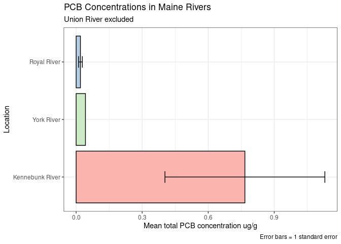

GOM Contaminated Sediments analysis: PCBs
================
Joshua Harkness and Autumn Pauly
2023-10-28

\#Loading packages

``` r
library(tidyverse)
```

    ## ── Attaching core tidyverse packages ──────────────────────── tidyverse 2.0.0 ──
    ## ✔ dplyr     1.1.3     ✔ readr     2.1.4
    ## ✔ forcats   1.0.0     ✔ stringr   1.5.0
    ## ✔ ggplot2   3.4.4     ✔ tibble    3.2.1
    ## ✔ lubridate 1.9.3     ✔ tidyr     1.3.0
    ## ✔ purrr     1.0.2     
    ## ── Conflicts ────────────────────────────────────────── tidyverse_conflicts() ──
    ## ✖ dplyr::filter() masks stats::filter()
    ## ✖ dplyr::lag()    masks stats::lag()
    ## ℹ Use the conflicted package (<http://conflicted.r-lib.org/>) to force all conflicts to become errors

``` r
library(sf)
```

    ## Linking to GEOS 3.8.0, GDAL 3.0.4, PROJ 6.3.1; sf_use_s2() is TRUE

``` r
library(leaflet)
library(RColorBrewer)
#install.packages("dplyr")
library(dplyr)
```

\#Loading PCB and Organics Datasets

``` r
PCBs <- read.csv(paste0("/cloud/project/data/datasets_csv/PCBs_loc.csv"), header = T)
Organics <- read.csv(paste0("/cloud/project/data/datasets_csv/Organics_loc.csv"), header = T)
```

\#Reviewing PCB and Organics Datasets

``` r
glimpse(PCBs)
```

    ## Rows: 7,848
    ## Columns: 39
    ## $ UNIQUE_ID  <chr> "US00001", "US00002", "US00003", "US00004", "US00005", "US0…
    ## $ LATITUDE   <dbl> 42.35972, 42.36028, 42.38500, 42.38500, 42.38500, 42.38500,…
    ## $ LONGITUDE  <dbl> -71.02861, -71.02778, -71.04611, -71.04611, -71.04611, -71.…
    ## $ SOUNDING_M <dbl> NA, NA, NA, NA, NA, NA, NA, NA, NA, NA, NA, NA, NA, NA, NA,…
    ## $ STATE_NAME <chr> "MA", "MA", "MA", "MA", "MA", "MA", "MA", "MA", "MA", "MA",…
    ## $ QUAD_NAME  <chr> NA, NA, NA, NA, NA, NA, NA, NA, NA, NA, NA, NA, NA, NA, NA,…
    ## $ GEN_LOC_NM <chr> "BOSTON INNER HARBOR", "BOSTON INNER HARBOR", "BOSTON INNER…
    ## $ SPECFC_LOC <chr> "BIH", "BIH", "BIH", "BIH", "BIH", "BIH", "BIH", "BIH", "BI…
    ## $ AREA_CODE  <int> 1, 1, 1, 1, 1, 1, 1, 1, 1, 2, 2, 1, 1, 1, 1, 1, 1, 1, 1, 1,…
    ## $ SAMP_DATE1 <chr> NA, NA, "5/1/1981", "5/1/1981", "5/1/1981", "5/1/1981", "5/…
    ## $ TO_SMP_DT2 <chr> NA, NA, NA, NA, NA, NA, NA, NA, NA, NA, NA, NA, NA, NA, NA,…
    ## $ DPTH_N_COR <chr> NA, NA, NA, NA, NA, NA, NA, NA, NA, NA, NA, NA, NA, NA, "0"…
    ## $ DPTH_CODE  <chr> "Unknown", "Unknown", "Depth", "Depth", "Unknown", "Unknown…
    ## $ COR_GRB_CD <chr> "Grab", "Grab", "Core", "Core", "Grab", "Grab", "Grab", "Gr…
    ## $ site       <chr> "BIH", "BIH", "BIH", "BIH", "BIH", "BIH", "BIH", "BIH", "BI…
    ## $ PCB_52_NGG <dbl> NA, NA, NA, NA, NA, NA, NA, NA, NA, NA, NA, NA, NA, NA, NA,…
    ## $ PCB101_NGG <dbl> NA, NA, NA, NA, NA, NA, NA, NA, NA, NA, NA, NA, NA, NA, NA,…
    ## $ PCB118_NGG <dbl> NA, NA, NA, NA, NA, NA, NA, NA, NA, NA, NA, NA, NA, NA, NA,…
    ## $ PCB128_NGG <dbl> NA, NA, NA, NA, NA, NA, NA, NA, NA, NA, NA, NA, NA, NA, NA,…
    ## $ PCB138_NGG <dbl> NA, NA, NA, NA, NA, NA, NA, NA, NA, NA, NA, NA, NA, NA, NA,…
    ## $ PCB153_NGG <dbl> NA, NA, NA, NA, NA, NA, NA, NA, NA, NA, NA, NA, NA, NA, NA,…
    ## $ PCB180_NGG <dbl> NA, NA, NA, NA, NA, NA, NA, NA, NA, NA, NA, NA, NA, NA, NA,…
    ## $ PCB206_NGG <dbl> NA, NA, NA, NA, NA, NA, NA, NA, NA, NA, NA, NA, NA, NA, NA,…
    ## $ PCB209_NGG <dbl> NA, NA, NA, NA, NA, NA, NA, NA, NA, NA, NA, NA, NA, NA, NA,…
    ## $ DDT_4_4_C  <dbl> NA, NA, NA, NA, NA, NA, NA, NA, NA, NA, NA, NA, NA, NA, NA,…
    ## $ DDT_2_4_C  <dbl> NA, NA, NA, NA, NA, NA, NA, NA, NA, NA, NA, NA, NA, NA, NA,…
    ## $ DDE_4_4_C  <dbl> NA, NA, NA, NA, NA, NA, NA, NA, NA, NA, NA, NA, NA, NA, NA,…
    ## $ DDD_4_4_C  <dbl> NA, NA, NA, NA, NA, NA, NA, NA, NA, NA, NA, NA, NA, NA, NA,…
    ## $ ENDRIN_C   <dbl> NA, NA, NA, NA, NA, NA, NA, NA, NA, NA, NA, NA, NA, NA, NA,…
    ## $ ENDR_ALD_C <dbl> NA, NA, NA, NA, NA, NA, NA, NA, NA, NA, NA, NA, NA, NA, NA,…
    ## $ ALDRIN_C   <dbl> NA, NA, NA, NA, NA, NA, NA, NA, NA, NA, NA, NA, NA, NA, NA,…
    ## $ DIELDRN_C  <dbl> NA, NA, NA, NA, NA, NA, NA, NA, NA, NA, NA, NA, NA, NA, NA,…
    ## $ CLRDNE_T_C <dbl> NA, NA, NA, NA, NA, NA, NA, NA, NA, NA, NA, NA, NA, NA, NA,…
    ## $ MIREX_C    <dbl> NA, NA, NA, NA, NA, NA, NA, NA, NA, NA, NA, NA, NA, NA, NA,…
    ## $ METHOXYCLC <dbl> NA, NA, NA, NA, NA, NA, NA, NA, NA, NA, NA, NA, NA, NA, NA,…
    ## $ BHC_A_C    <dbl> NA, NA, NA, NA, NA, NA, NA, NA, NA, NA, NA, NA, NA, NA, NA,…
    ## $ BHC_B_C    <dbl> NA, NA, NA, NA, NA, NA, NA, NA, NA, NA, NA, NA, NA, NA, NA,…
    ## $ BHC_D_C    <dbl> NA, NA, NA, NA, NA, NA, NA, NA, NA, NA, NA, NA, NA, NA, NA,…
    ## $ LINDANE_C  <dbl> NA, NA, NA, NA, NA, NA, NA, NA, NA, NA, NA, NA, NA, NA, NA,…

``` r
glimpse(Organics)
```

    ## Rows: 7,849
    ## Columns: 35
    ## $ UNIQUE_ID  <chr> "US00001", "US00002", "US00003", "US00004", "US00005", "US0…
    ## $ LATITUDE   <dbl> 42.35972, 42.36028, 42.38500, 42.38500, 42.38500, 42.38500,…
    ## $ LONGITUDE  <dbl> -71.02861, -71.02778, -71.04611, -71.04611, -71.04611, -71.…
    ## $ SOUNDING_M <dbl> NA, NA, NA, NA, NA, NA, NA, NA, NA, NA, NA, NA, NA, NA, NA,…
    ## $ STATE_NAME <chr> "MA", "MA", "MA", "MA", "MA", "MA", "MA", "MA", "MA", "MA",…
    ## $ QUAD_NAME  <chr> NA, NA, NA, NA, NA, NA, NA, NA, NA, NA, NA, NA, NA, NA, NA,…
    ## $ GEN_LOC_NM <chr> "BOSTON INNER HARBOR", "BOSTON INNER HARBOR", "BOSTON INNER…
    ## $ SPECFC_LOC <chr> "BIH", "BIH", "BIH", "BIH", "BIH", "BIH", "BIH", "BIH", "BI…
    ## $ AREA_CODE  <int> 1, 1, 1, 1, 1, 1, 1, 1, 1, 2, 2, 1, 1, 1, 1, 1, 1, 1, 1, 1,…
    ## $ SAMP_DATE1 <chr> NA, NA, "5/1/1981", "5/1/1981", "5/1/1981", "5/1/1981", "5/…
    ## $ TO_SMP_DT2 <chr> NA, NA, NA, NA, NA, NA, NA, NA, NA, NA, NA, NA, NA, NA, NA,…
    ## $ DPTH_N_COR <chr> NA, NA, NA, NA, NA, NA, NA, NA, NA, NA, NA, NA, NA, NA, "0"…
    ## $ DPTH_CODE  <chr> "Unknown", "Unknown", "Depth", "Depth", "Unknown", "Unknown…
    ## $ COR_GRB_CD <chr> "Grab", "Grab", "Core", "Core", "Grab", "Grab", "Grab", "Gr…
    ## $ site       <chr> "BIH", "BIH", "BIH", "BIH", "BIH", "BIH", "BIH", "BIH", "BI…
    ## $ REPNO_ORG  <int> 1, 1, 1, NA, NA, 1, 1, NA, 1, NA, 1, 1, 1, 1, 1, 1, 1, NA, …
    ## $ TOTREP_ORG <int> 1, 1, 1, NA, NA, NA, NA, NA, NA, NA, NA, NA, 1, 1, 1, 1, 1,…
    ## $ TVS_EP_PCT <dbl> NA, NA, NA, NA, NA, NA, NA, NA, NA, NA, NA, 10.00, 9.50, 9.…
    ## $ O_G_PCT    <dbl> 0.05, 0.06, NA, NA, NA, NA, NA, NA, NA, NA, NA, NA, NA, NA,…
    ## $ O_G_UGG    <dbl> NA, NA, NA, NA, 10882.00, 3115.00, 880.00, 542.30, 31.44, N…
    ## $ PHCTOT_PCT <dbl> NA, NA, NA, NA, NA, NA, NA, NA, NA, NA, NA, NA, NA, NA, NA,…
    ## $ PHCTOT_UGG <dbl> NA, NA, NA, NA, NA, NA, NA, NA, NA, NA, NA, NA, NA, NA, NA,…
    ## $ PCB_T_UGG  <dbl> NA, NA, NA, NA, 0.500, 0.500, 0.500, 0.500, 0.500, NA, NA, …
    ## $ DDT_T_NGG  <dbl> NA, NA, NA, NA, NA, NA, NA, NA, NA, NA, NA, 76.50, 33.00, 1…
    ## $ DDE_T_NGG  <dbl> NA, NA, NA, NA, NA, NA, NA, NA, NA, NA, NA, NA, NA, NA, NA,…
    ## $ DDD_T_NGG  <dbl> NA, NA, NA, NA, NA, NA, NA, NA, NA, NA, NA, NA, NA, NA, NA,…
    ## $ PEST_UG_G  <lgl> NA, NA, NA, NA, NA, NA, NA, NA, NA, NA, NA, NA, NA, NA, NA,…
    ## $ PAHTOT_PCT <dbl> NA, NA, NA, NA, NA, NA, NA, NA, NA, NA, NA, NA, NA, NA, NA,…
    ## $ PAHTOT_UGG <dbl> NA, NA, NA, NA, NA, NA, NA, NA, NA, NA, NA, NA, NA, NA, NA,…
    ## $ LIPIDS_NGG <lgl> NA, NA, NA, NA, NA, NA, NA, NA, NA, NA, NA, NA, NA, NA, NA,…
    ## $ CLOST_SP_G <dbl> NA, NA, NA, NA, NA, NA, NA, NA, NA, NA, NA, NA, NA, NA, NA,…
    ## $ MBT_C      <dbl> NA, NA, NA, NA, NA, NA, NA, NA, NA, NA, NA, NA, NA, NA, NA,…
    ## $ DBT_C      <dbl> NA, NA, NA, NA, NA, NA, NA, NA, NA, NA, NA, NA, NA, NA, NA,…
    ## $ TBT_C      <dbl> NA, NA, NA, NA, NA, NA, NA, NA, NA, NA, NA, NA, NA, NA, NA,…
    ## $ TTBT_C     <dbl> NA, NA, NA, NA, NA, NA, NA, NA, NA, NA, NA, NA, NA, NA, NA,…

# Pivot Organics longer

Already joined stations with organics (loaded “Organics_loc.csv” above),
so just need to pivot.

``` r
Organics_long <- Organics %>%
 pivot_longer(cols = `REPNO_ORG`:`TTBT_C`, 
               names_to = "organic_detected", 
               values_to = "amount_detected")

Organics_long = select(Organics_long, c(UNIQUE_ID, LATITUDE, LONGITUDE, SOUNDING_M, STATE_NAME, QUAD_NAME, GEN_LOC_NM, SPECFC_LOC, AREA_CODE, SAMP_DATE1, TO_SMP_DT2, DPTH_N_COR, DPTH_CODE, COR_GRB_CD, organic_detected, amount_detected)) %>%
  mutate(site = fct_recode(GEN_LOC_NM,
                           "Rockland to north" = "North of 44; to 50M isobath",
                           "Cape Elizabeth to Rockland" = "43.5N to 44N; to 50M isobath", 
                           "Cape Ann to Cape Elizabeth" = "CAPE ANN to 43.5N", 
                           "Boston Inner Harbor" = "BOSTON INNER HARBOR", 
                           "Cape Code Bay" = "CAPE COD BAY",
                           "Gulf of Maine (>50m Isobath)" = "GULF OF MAINE, >50M ISOBATH",
                           "Northwest Boston Harbor" = "NORTHWEST BOSTON HARBOR",
                           "Southeast Boston Harbor" = "SOUTHEAST BOSTON HARBOR",
                           "Gulf of Maine (<=50m Isobath)" = "GULF OF MAINE, <=50M",
                           "Central Boston Harbor" = "CENTRAL BOSTON HARBOR",
                           "Inland/Rivers" = "INLAND / RIVERS",
                           "Harbor Approaches" = "HARBOR APPROACHES",
                           "Massachusetts Bays" = "MASS BAYS"))

glimpse(Organics_long)
```

    ## Rows: 156,980
    ## Columns: 17
    ## $ UNIQUE_ID        <chr> "US00001", "US00001", "US00001", "US00001", "US00001"…
    ## $ LATITUDE         <dbl> 42.35972, 42.35972, 42.35972, 42.35972, 42.35972, 42.…
    ## $ LONGITUDE        <dbl> -71.02861, -71.02861, -71.02861, -71.02861, -71.02861…
    ## $ SOUNDING_M       <dbl> NA, NA, NA, NA, NA, NA, NA, NA, NA, NA, NA, NA, NA, N…
    ## $ STATE_NAME       <chr> "MA", "MA", "MA", "MA", "MA", "MA", "MA", "MA", "MA",…
    ## $ QUAD_NAME        <chr> NA, NA, NA, NA, NA, NA, NA, NA, NA, NA, NA, NA, NA, N…
    ## $ GEN_LOC_NM       <chr> "BOSTON INNER HARBOR", "BOSTON INNER HARBOR", "BOSTON…
    ## $ SPECFC_LOC       <chr> "BIH", "BIH", "BIH", "BIH", "BIH", "BIH", "BIH", "BIH…
    ## $ AREA_CODE        <int> 1, 1, 1, 1, 1, 1, 1, 1, 1, 1, 1, 1, 1, 1, 1, 1, 1, 1,…
    ## $ SAMP_DATE1       <chr> NA, NA, NA, NA, NA, NA, NA, NA, NA, NA, NA, NA, NA, N…
    ## $ TO_SMP_DT2       <chr> NA, NA, NA, NA, NA, NA, NA, NA, NA, NA, NA, NA, NA, N…
    ## $ DPTH_N_COR       <chr> NA, NA, NA, NA, NA, NA, NA, NA, NA, NA, NA, NA, NA, N…
    ## $ DPTH_CODE        <chr> "Unknown", "Unknown", "Unknown", "Unknown", "Unknown"…
    ## $ COR_GRB_CD       <chr> "Grab", "Grab", "Grab", "Grab", "Grab", "Grab", "Grab…
    ## $ organic_detected <chr> "REPNO_ORG", "TOTREP_ORG", "TVS_EP_PCT", "O_G_PCT", "…
    ## $ amount_detected  <dbl> 1.00, 1.00, NA, 0.05, NA, NA, NA, NA, NA, NA, NA, NA,…
    ## $ site             <fct> Boston Inner Harbor, Boston Inner Harbor, Boston Inne…

## Visualizations

### Descriptive Visualizations

Visualizing the number of observations that were collected for each
general location.

``` r
Organics %>%
  ggplot(aes(x = fct_infreq(GEN_LOC_NM), fill = fct_infreq(GEN_LOC_NM)))+
  geom_bar(stat = "count", color = "black")+
  coord_flip()+
  theme_bw()+
  theme(legend.position = "none")+
  labs(title = "Number of observations by general location",
       x = "General location",
       y = "Count (n Observations)")
```

<!-- -->

This bar plot uses number of observations on its y axis, thus reflecting
sampling intensity by general location. The greatest number of
observations are in the Gulf of Maine below the 50m isobath (partly this
is a product of area extent as well as sampling intensity);
Massachusetts Bays, Boston Harbor sites, and the MA/NH/ME coast are all
generally heavily sampled.

``` r
ggplot(Organics, aes(x = PCB_T_UGG))+
geom_histogram(fill = "skyblue", color = "black")
```

    ## `stat_bin()` using `bins = 30`. Pick better value with `binwidth`.

    ## Warning: Removed 6243 rows containing non-finite values (`stat_bin()`).

<!-- -->

### PCB site to site comparisons

The table below is visualizing the mean, standard deviation, count, and
principal square root values of PCB concentrations for the general
locations.

``` r
Summary_Organics <- Organics %>%
  group_by(GEN_LOC_NM) %>%
  drop_na(PCB_T_UGG) %>%
  summarise(mean_PCB_T = mean(PCB_T_UGG),
    sd_PCB_T = sd(PCB_T_UGG),
    n_PCB_T = n(),
    SE_PCB_T = sd(PCB_T_UGG) / sqrt(n()))

Summary_Organics
```

    ## # A tibble: 12 × 5
    ##    GEN_LOC_NM                   mean_PCB_T sd_PCB_T n_PCB_T SE_PCB_T
    ##    <chr>                             <dbl>    <dbl>   <int>    <dbl>
    ##  1 43.5N to 44N; to 50M isobath     4.29    25.3        187  1.85   
    ##  2 BOSTON INNER HARBOR             44.2    285.         119 26.1    
    ##  3 CAPE ANN to 43.5N               26.9    227.         190 16.5    
    ##  4 CAPE COD BAY                     0.0113   0.0137      34  0.00235
    ##  5 CENTRAL BOSTON HARBOR            0.416    0.274       41  0.0427 
    ##  6 GULF OF MAINE, >50M ISOBATH      0.0257   0.0326     150  0.00266
    ##  7 HARBOR APPROACHES                0.251    0.207       24  0.0422 
    ##  8 INLAND / RIVERS                  0.0685   0.235       51  0.0329 
    ##  9 MASS BAYS                        0.0712   0.293      407  0.0145 
    ## 10 NORTHWEST BOSTON HARBOR          0.320    0.763      220  0.0514 
    ## 11 North of 44; to 50M isobath      2.37    22.7        150  1.86   
    ## 12 SOUTHEAST BOSTON HARBOR         18.4     73.2         33 12.7

The graph below is plotting the mean PCB concentration (ng/g) found at
each general location with error bards accounting for one standard
error.

``` r
Summary_Organics %>%
  ggplot(aes(x = fct_rev(fct_reorder(GEN_LOC_NM, mean_PCB_T)), y = sapply(mean_PCB_T, FUN=function(x) ifelse(x==0.000000e0, -1,x) ), fill = GEN_LOC_NM))+
  geom_col(col = "black")+
  geom_errorbar(aes(ymin = mean_PCB_T - SE_PCB_T, ymax = mean_PCB_T + SE_PCB_T), width = 0.2)+
  coord_flip()+
  scale_fill_viridis_d()+
  theme_bw()+
  theme(legend.position = "none")+
  labs(title = "PCB Concentrations in Gulf of Maine Sediments",
       x = "General location",
       y = "Mean total PCB concentration ug/g",
       caption = "Error bars = 1 standard error")
```

<!-- -->

This graph shows the PCB concentrations in Boston Harbor, comparing all
locations.

``` r
Summary_Organics %>%
  filter(GEN_LOC_NM %in% c("BOSTON INNER HARBOR", "CENTRAL BOSTON HARBOR", "SOUTHEAST BOSTON HARBOR", "NORTHWEST BOSTON HARBOR")) %>%
  ggplot(aes(x = fct_rev(fct_reorder(GEN_LOC_NM, mean_PCB_T)), y = mean_PCB_T, fill = GEN_LOC_NM))+
  geom_col(col = "black")+
  geom_errorbar(aes(ymin = mean_PCB_T - SE_PCB_T, ymax = mean_PCB_T + SE_PCB_T), width = 0.2)+
  scale_fill_brewer(type = "qual", palette = 4, direction = 1, aesthetics = "fill")+
  theme_bw()+
  coord_flip()+
  theme(legend.position = "none")+
  labs(title = "PCB Concentrations in Boston Harbor Sediments",
       x = "General location",
       y = "Mean total PCB concentration ug/g",
       caption = "Error bars = 1 standard error")
```

<!-- --> This graph
shows the PCB concentrations in Boston Harbor, comparing Central Boston
Harbor and Northwest Boston Harbor.

``` r
Summary_Organics %>%
  filter(GEN_LOC_NM %in% c("CENTRAL BOSTON HARBOR", "NORTHWEST BOSTON HARBOR")) %>%
  ggplot(aes(x = fct_reorder(GEN_LOC_NM, mean_PCB_T), y = mean_PCB_T, fill = GEN_LOC_NM))+
  geom_col(col = "black")+
  geom_errorbar(aes(ymin = mean_PCB_T - SE_PCB_T, ymax = mean_PCB_T + SE_PCB_T), width = 0.2)+
  scale_fill_brewer(type = "qual", palette = 4, direction = 1, aesthetics = "fill")+
  theme_bw()+
  theme(legend.position = "none")+
  labs(title = "PCB Concentrations in Boston Harbor Sediments",
       subtitle = "Central and Northwest Boston Harbor",
       x = "General location",
       y = "Mean total PCB concentration ug/g",
       caption = "Error bars = 1 standard error")
```

<!-- -->

### Specific Locations

#### Rivers

Below we are identifying specific Maine rivers.

``` r
Organics %>%
  filter(STATE_NAME == "ME") %>%
  filter(PCB_T_UGG != "NA") %>%
  distinct(SPECFC_LOC)
```

    ##                                                 SPECFC_LOC
    ## 1                            Southern Harbor (North Haven)
    ## 2                                      Portland Fore River
    ## 3                                              Royal River
    ## 4                             Portland Harbor & Fore River
    ## 5                                        Stonington Harbor
    ## 6                                          Kennebunk River
    ## 7                                             Lermond Cove
    ## 8                                               Bar Harbor
    ## 9                                          Rockport Harbor
    ## 10                                          Castine Harbor
    ## 11                     Portsmouth Naval Shipyard (Kittery)
    ## 12                                              Mack Point
    ## 13                                             York Harbor
    ## 14                                           Camden Harbor
    ## 15                                            Wells Harbor
    ## 16                            Portland Back Cove & Channel
    ## 17                                  Kennebec River to Bath
    ## 18                                   Sears Island Terminal
    ## 19                                             Union River
    ## 20                               Penobscot River To Bangor
    ## 21                          Jonesport Harbor - Sawyer Cove
    ## 22                                  Isle Au Haut Thorofare
    ## 23                     Beals Harbor (Barneys Cove - Beals)
    ## 24                                             Bass Harbor
    ## 25                                          Tenants Harbor
    ## 26 Back Channel Near N. shore of entrance to Barters Creek
    ## 27             West of Jamaica Is. in Back Channel of PNSY
    ## 28          Back Channel E side of back gate entr. to PNSY
    ## 29                                              York River
    ## 30                                               Casco Bay
    ## 31                                           Penobscot Bay
    ## 32                                         Portland Harbor

``` r
Sum_Org_site <- Organics %>%
  group_by(site) %>%
  drop_na(PCB_T_UGG) %>%
  summarise(mean_PCB_T = mean(PCB_T_UGG),
    sd_PCB_T = sd(PCB_T_UGG),
    n_PCB_T = n(),
    SE_PCB_T = sd(PCB_T_UGG) / sqrt(n()))
```

Below we are visualizing the mean PCBs present in Maine rivers.

``` r
Sum_Org_site %>%
  filter(site %in% c("York River", "Kennebunk River", "Portland Fore River", "Royal River", "Kennebec River to Bath", "Penobscot River To Bangor")) %>%
  ggplot(aes(x = fct_rev(fct_reorder(site, mean_PCB_T)), y = sapply(mean_PCB_T, FUN=function(x) ifelse(x==0.000000e0, -0.01,x) ), fill = site))+
  geom_bar(stat="identity", col = "black")+
  scale_x_discrete(drop=FALSE)+
  geom_errorbar(aes(ymin = mean_PCB_T - SE_PCB_T, ymax = mean_PCB_T + SE_PCB_T), width = 0.2)+
  scale_fill_brewer(type = "qual", palette = 4, direction = 1, aesthetics = "fill")+
  theme_bw()+
  coord_flip()+
  theme(legend.position = "none")+
  labs(title = "PCB Concentrations in Maine Rivers",
       subtitle = "Union River excluded",
       caption = "Error bars = 1 standard error",
       x = "Location",
       y = "Mean total PCB concentration ug/g")
```

<!-- -->

``` r
#Organics %>%
#  group_by(site, organics_detected) %>%
#  summarise(amount_detected = sum(amount_detected, na.rm = TRUE)) %>%
#  filter(site == c("York River",  "Kennebunk River", "Portland Fore River", "Royal River", "Kennebec #River to Bath", "Penobscot River To Bangor")) %>%
#  arrange(desc(amount_detected))
```

Sites with only one observation or mean = 0 do not have error bars.

``` r
Sum_Org_site %>%
  filter(site %in% c("York River", "Kennebunk River", "Portland Fore River", "Royal River", "Kennebec River to Bath", "Penobscot River To Bangor", "Union River")) %>%
  ggplot(aes(x = fct_rev(fct_reorder(site, mean_PCB_T)), y = sapply(mean_PCB_T, FUN=function(x) ifelse(x==0.000000e0, -2,x)), fill = site))+
  geom_col(col = "black")+
  geom_errorbar(aes(ymin = mean_PCB_T - SE_PCB_T, ymax = mean_PCB_T + SE_PCB_T), width = 0.2)+
  scale_fill_manual(values = c("Kennebec River to Bath" = "skyblue",
                               "Penobstoc River to Bangor" = "skyblue",
                               "Royal River" = "gray50",
                               "York River" = "gray50",
                               "Kennebunk River" = "gray50",
                               "Portland Fore River" = "gray50",
                               "Union River" = "chocolate1"))+
  theme_bw()+
  coord_flip()+
  theme(legend.position = "none")+
  labs(title = "PCB Concentrations in Maine Rivers",
       subtitle = "With Union River, Ellsworth",
       caption = "Error bars = 1 standard error",
       x = "Location",
       y = "Mean total PCB concentration ug/g")
```

<!-- -->

There are no errorbars for Union River as n = 1; single sample from this
site so only a mean value.

``` r
Organics %>%
  filter(STATE_NAME == "MA") %>%
  filter(PCB_T_UGG != "NA") %>%
  distinct(site)
```

    ##                                                                                          site
    ## 1                                                                                         BIH
    ## 2                                                                                        MBDS
    ## 3   Reserve Channel, Main Shipping Channel, Boston Harbor to the Western shore of Deer Island
    ## 4                                                                              DORCHESTER BAY
    ## 5                                                                         CRYSTAL COVE MARINA
    ## 6                                                                                  BASS RIVER
    ## 7                                                                               HINGAM HARBOR
    ## 8                                                                              HINGHAM HARBOR
    ## 9                                                                                Mystic River
    ## 10                                                                                 SMITH COVE
    ## 11                                                                            WINTHROP HARBOR
    ## 12                                                                             WINTROP HARBOR
    ## 13                                                                      Little Mystic Channel
    ## 14                                                                          MANCHESTER HARBOR
    ## 15                                                                            SCITUATE HARBOR
    ## 16                                                                        Weymouth Fore River
    ## 17                                                                               SALEM HARBOR
    ## 18                                                                       BOSTON HARBOR MARINA
    ## 19                                                                          GLOUCESTER HARBOR
    ## 20                                                                              BOSTON HARBOR
    ## 21                                                                                DUXBURY BAY
    ## 22                                                                             BEVERLY HARBOR
    ## 23                                                                    PORT NORFOLK YACHT CLUB
    ## 24                                                                              Chelsea River
    ## 25                                                                             Dorchester Bay
    ## 26                                                                    Rowes and Fosters Wharf
    ## 27                                                                                 Mill Creek
    ## 28                                                            Victory Road Park Inlet Channel
    ## 29                                                                 Seaward of Waterfront Park
    ## 30                                                                                 Long Wharf
    ## 31                                                                                South River
    ## 32                                                                            Winthrop Harbor
    ## 33                                                          Winthrop Harbor, entrance channel
    ## 34                                                                      North & Danvers River
    ## 35                                                                          Reserve Channel B
    ## 36                                                                       Inner Confluence "B"
    ## 37                                                                           Reserve "B"-7826
    ## 38                                                                           Reserve "D"-7827
    ## 39                                                               FADS-Reference location-7832
    ## 40                                                                               Gulf Oil Co.
    ## 41                                                                               Gibb Oil ???
    ## 42                                                                       Gibb Oil North Berth
    ## 43                                                                       Gibb Oil South Berth
    ## 44                                                                       ESE of Castle Island
    ## 45                                                          btwn Deer I. & Governors I. Flats
    ## 46                                                                                 Quincy Bay
    ## 47                                                            Nantasket Roads W of Perry Cove
    ## 48                                                                                   Hull Bay
    ## 49                                                                SE of The Graves, Mass. Bay
    ## 50                                                                          Massachusetts Bay
    ## 51                                                                               Cape Cod Bay
    ## 52                                                             HbrView Marina,Town Rvr Quincy
    ## 53                                                                                  Foul Area
    ## 54                                                            Marina Bay, Squantum Pt, Quincy
    ## 55                                                                           Island End River
    ## 56                                                                                 NUT ISLAND
    ## 57                                                                                DEER ISLAND
    ## 58                                                                            Cohasset Harbor
    ## 59                                                                            Scituate Harbor
    ## 60                                                                                        NAR
    ## 61                                                                                        DOB
    ## 62                                                                                        BOI
    ## 63                                                                                        PRR
    ## 64                                                                                        LDF
    ## 65                                                                                        BRS
    ## 66                                                                                        MAB
    ## 67                                                                                       <NA>
    ## 68                                                                                Broad Sound
    ## 69                                                                                Salem Sound
    ## 70                                                                            Foul area north
    ## 71                                                                           Foul area center
    ## 72                                                                            Foul area south
    ## 73                                                                             Foul area east
    ## 74                                                                             Foul area west
    ## 75                                                                         south of Foul area
    ## 76                                                                               Spec. Island
    ## 77                                                                           Third Hbr Tunnel
    ## 78                                                                            MERRIMACK RIVER
    ## 79                                                                                        QUB
    ## 80                                                                         Fort Point Channel
    ## 81                                                             1-U.S. GypsumCo.200TerminalSt.
    ## 82                                                             2-U.S. GypsumCo.200TerminalSt.
    ## 83                                                             3-U.S. GypsumCo.200TerminalSt.
    ## 84                                                             4-U.S. GypsumCo.200TerminalSt.
    ## 85                                                                                       FADS
    ## 86                                                                          JEFFRIES POINT YC
    ## 87                                                                       MBDS Reference sites
    ## 88                                                                        STFP outfall siting
    ## 89                                                                                Hingham Bay
    ## 90                                                                            Nantasket Roads
    ## 91                                                                              Sculpin Ledge
    ## 92                                                                           Northwest Harbor
    ## 93                                                                         Charleston Channel
    ## 94                                                                             Boston Channel
    ## 95                                                                              Channel Mouth
    ## 96                                                                           Reserved Channel
    ## 97                                                                             Boston Wharves
    ## 98                                                   South Bay area of the Fort Point Channel
    ## 99                                                   between Spectacle Island and Long Island
    ## 100                                                                                Town Brook
    ## 101                                                                            Beverly Harbor
    ## 102                                                         WINTHROP HARBOR, BELLE ISLE INLET
    ## 103                                                                    LOGAN AIRPORT E.BOSTON
    ## 104                                                              Logan Airport Runway End 22L
    ## 105                                                               Logan Airport Runway End 27
    ## 106                                                              Logan Airport Runway End 33L
    ## 107                                                                  Winthrop Basin Anchorage
    ## 108                                                                Wnthrop Basin Spur Channel
    ## 109                                                    Entrance Channel Opposite Snake Island
    ## 110                                                        Entrance Channel at Basin Entrance
    ## 111                                                                    Cottage Park Anchorage
    ## 112                                                                      Cottage Park Channel
    ## 113                                                                    Snake Island Anchorage
    ## 114                                                                    Crystal Cove Anchorage
    ## 115                                                        Entrance Channel off Winthrop Y.C.
    ## 116                                                          Entrance Channel at Crystal Cove

``` r
Sum_Org_site %>%
  filter(site %in% c("BASS RIVER", "ESSEX RIVER", "MYSTIC RIVER", "MERRIMACK RIVER", "Weymouth Fore River", "CHELSEA RIVER", "Chelsea River", "Mill Creek", "Neponset River Bridge", "South River", "Weymouth Fore & Town River", "North & Danvers River", "Island End River")) %>%
  ggplot(aes(x = fct_rev(fct_reorder(site, mean_PCB_T)), y = sapply(mean_PCB_T, FUN=function(x) ifelse(x==0.000000e0, -.7,x)), fill = site))+
  geom_bar(stat="identity", col = "black")+
  scale_x_discrete(drop=FALSE)+
  geom_errorbar(aes(ymin = mean_PCB_T - SE_PCB_T, ymax = mean_PCB_T + SE_PCB_T), width = 0.2)+
  scale_fill_brewer(type = "qual", palette = 4, direction = 1, aesthetics = "fill")+
  theme_bw()+
  coord_flip()+
  theme(legend.position = "none")+
  labs(title = "PCB Concentrations in Massachusetts Rivers",
       caption = "Error bars = 1 standard error",
       x = "Location",
       y = "Mean total PCB concentration ug/g")
```

<!-- -->

``` r
#Organics %>%
#  group_by(GEN_LOC_NM, organic_detected) %>%
#  summarise(amount_detected = sum(amount_detected, na.rm = TRUE)) %>%
#  filter(site %in% c("BASS RIVER"|"ESSEX RIVER"|"MYSTIC RIVER"|"MERRIMACK RIVER"|"Weymouth Fore #River"|"CHELSEA RIVER"|"Chelsea River"|"Mill Creek"|"Neponset River Bridge"|"South River"|"Weymouth #Fore & Town River"|"North & Danvers River"|"Island End River")) %>%
#  arrange(desc(amount_detected))
```

### PCB concentration by depth

``` r
Organics %>%
  ggplot(aes(x = SOUNDING_M, y = PCB_T_UGG))+
  geom_point()+
  xlim(0,50)
```

    ## Warning: Removed 7343 rows containing missing values (`geom_point()`).

<!-- -->

## Statistical tests

## Static map plots

### PCBs

``` r
GOM_states <- st_read("/cloud/project/extra/GOM_DD.shp")
```

    ## Reading layer `GOM_DD' from data source `/cloud/project/extra/GOM_DD.shp' using driver `ESRI Shapefile'
    ## Simple feature collection with 8 features and 6 fields
    ## Geometry type: MULTIPOLYGON
    ## Dimension:     XY
    ## Bounding box:  xmin: -73.72972 ymin: 40.98249 xmax: -59.69256 ymax: 48.06532
    ## Geodetic CRS:  NAD83

``` r
Bathy <- st_read("/cloud/project/extra/BATHYMGM_ARC.shp")
```

    ## Reading layer `BATHYMGM_ARC' from data source 
    ##   `/cloud/project/extra/BATHYMGM_ARC.shp' using driver `ESRI Shapefile'
    ## Simple feature collection with 5383 features and 2 fields
    ## Geometry type: LINESTRING
    ## Dimension:     XY
    ## Bounding box:  xmin: 174878.8 ymin: 577731.9 xmax: 923912.7 ymax: 1311467
    ## Projected CRS: NAD83 / Massachusetts Mainland

Bathymetry data is in projected coordinate system (NAD83), other data is
geodetic (NAD83). Wasn’t able to add this layer to map plot – need to
change projection.

``` r
st_crs(Bathy)
```

    ## Coordinate Reference System:
    ##   User input: NAD83 / Massachusetts Mainland 
    ##   wkt:
    ## PROJCRS["NAD83 / Massachusetts Mainland",
    ##     BASEGEOGCRS["NAD83",
    ##         DATUM["North American Datum 1983",
    ##             ELLIPSOID["GRS 1980",6378137,298.257222101,
    ##                 LENGTHUNIT["metre",1]]],
    ##         PRIMEM["Greenwich",0,
    ##             ANGLEUNIT["degree",0.0174532925199433]],
    ##         ID["EPSG",4269]],
    ##     CONVERSION["SPCS83 Massachusetts Mainland zone (meters)",
    ##         METHOD["Lambert Conic Conformal (2SP)",
    ##             ID["EPSG",9802]],
    ##         PARAMETER["Latitude of false origin",41,
    ##             ANGLEUNIT["degree",0.0174532925199433],
    ##             ID["EPSG",8821]],
    ##         PARAMETER["Longitude of false origin",-71.5,
    ##             ANGLEUNIT["degree",0.0174532925199433],
    ##             ID["EPSG",8822]],
    ##         PARAMETER["Latitude of 1st standard parallel",42.6833333333333,
    ##             ANGLEUNIT["degree",0.0174532925199433],
    ##             ID["EPSG",8823]],
    ##         PARAMETER["Latitude of 2nd standard parallel",41.7166666666667,
    ##             ANGLEUNIT["degree",0.0174532925199433],
    ##             ID["EPSG",8824]],
    ##         PARAMETER["Easting at false origin",200000,
    ##             LENGTHUNIT["metre",1],
    ##             ID["EPSG",8826]],
    ##         PARAMETER["Northing at false origin",750000,
    ##             LENGTHUNIT["metre",1],
    ##             ID["EPSG",8827]]],
    ##     CS[Cartesian,2],
    ##         AXIS["easting (X)",east,
    ##             ORDER[1],
    ##             LENGTHUNIT["metre",1]],
    ##         AXIS["northing (Y)",north,
    ##             ORDER[2],
    ##             LENGTHUNIT["metre",1]],
    ##     USAGE[
    ##         SCOPE["unknown"],
    ##         AREA["USA - Massachusetts - SPCS - mainland"],
    ##         BBOX[41.46,-73.5,42.89,-69.86]],
    ##     ID["EPSG",26986]]

``` r
Bathy <- st_transform(Bathy, "+init=epsg:4269")
```

    ## Warning in CPL_crs_from_input(x): GDAL Message 1: +init=epsg:XXXX syntax is
    ## deprecated. It might return a CRS with a non-EPSG compliant axis order.

Now the Bathy shapefile is in geodetic NAD83 format.

``` r
unique(Bathy$CONTOUR)
```

    ##  [1]    -5   -40   -15   -20   -10     0   -50   -30   -70   -60  -100   -90
    ## [13]   -80  -120  -220  -200  -160  -180  -140  -240  -300  -280  -260  -500
    ## [25]  -400 -2000 -1000 -3000 -4000

``` r
Bathy_low_res <- Bathy%>%
 filter(CONTOUR %in% c("-100","-500","-1000","-2000","-3000","-4000"))
ggplot(Bathy_low_res) +
  geom_sf(aes())
```

<!-- -->

``` r
Bathy_hi_res <- Bathy%>%
 filter(CONTOUR %in% c("-40","-80","-120","160","200","240","280"))
ggplot(Bathy_hi_res) +
  geom_sf(aes())
```

<!-- -->

``` r
ggplot(GOM_states)+
  geom_sf(aes())+
  geom_sf(data = Bathy_low_res, color = "gray80", width = 1)+
  geom_point(data = Organics, (aes(x = LONGITUDE, y = LATITUDE, color = PCB_T_UGG, alpha = 0.5)))+
  xlim(-72,-65)+
  ylim(40,45)+
  theme_bw()+
  labs(title = "Distribution and concentration of PCBs",
       subtitle ="Gulf of Maine sediments",
       x = "Longitude",
       y = "Latitude")+
  guides(size = guide_legend(title = "PCB ug/g"))+
  guides(alpha = FALSE)+
  ggspatial::annotation_scale(
    location = "bl",
    bar_cols = c("grey60", "white"),
    text_family = "ArcherPro Book"
  ) +
  ggspatial::annotation_north_arrow(
    location = "tr", which_north = "true",
    pad_x = unit(0, "in"), pad_y = unit(0.2, "in"),
    style = ggspatial::north_arrow_nautical(
      fill = c("grey40", "white"),
      line_col = "grey20",
      text_family = "ArcherPro Book"))
```

    ## Warning in layer_sf(geom = GeomSf, data = data, mapping = mapping, stat = stat,
    ## : Ignoring unknown parameters: `width`

    ## Warning: The `<scale>` argument of `guides()` cannot be `FALSE`. Use "none" instead as
    ## of ggplot2 3.3.4.
    ## This warning is displayed once every 8 hours.
    ## Call `lifecycle::last_lifecycle_warnings()` to see where this warning was
    ## generated.

    ## Warning: Removed 342 rows containing missing values (`geom_point()`).

<!-- -->

``` r
Org_no_na_no_zero <- Organics %>%
  drop_na(PCB_T_UGG) %>%
  filter(PCB_T_UGG != "0")
```

``` r
ggplot(GOM_states)+
  geom_sf(aes())+
  geom_sf(data = Bathy_low_res, color = "gray80", width = 1)+
  geom_point(data = Org_no_na_no_zero, (aes(x = LONGITUDE, y = LATITUDE, size = PCB_T_UGG, alpha = 0.5)))+
  xlim(-72,-65)+
  ylim(40,45)+
  theme_bw()+
  labs(title = "Distribution and concentration of PCBs",
       subtitle ="Gulf of Maine sediments",
       x = "Longitude",
       y = "Latitude")+
  guides(size = guide_legend(title = "PCB ug/g"))+
  guides(alpha = FALSE)+
  ggspatial::annotation_scale(
    location = "bl",
    bar_cols = c("grey60", "white"),
    text_family = "ArcherPro Book"
  ) +
  ggspatial::annotation_north_arrow(
    location = "tr", which_north = "true",
    pad_x = unit(0, "in"), pad_y = unit(0.2, "in"),
    style = ggspatial::north_arrow_nautical(
      fill = c("grey40", "white"),
      line_col = "grey20",
      text_family = "ArcherPro Book"))
```

    ## Warning in layer_sf(geom = GeomSf, data = data, mapping = mapping, stat = stat,
    ## : Ignoring unknown parameters: `width`

    ## Warning: Removed 38 rows containing missing values (`geom_point()`).

<!-- -->

``` r
ggplot(GOM_states)+
  geom_sf(aes())+
  geom_sf(data = Bathy_hi_res, color = "gray80", width = 1)+
  geom_point(data=Org_no_na_no_zero, (aes(x = LONGITUDE, y = LATITUDE, size = PCB_T_UGG, alpha = 0.5)))+
  xlim(-69.2,-68)+
  ylim(44,44.5)+
  theme_bw()+
  labs(title = "Distribution and concentration of PCBs",
       subtitle ="MDI and Penobscot Bay sediments",
       x = "Longitude",
       y = "Latitude")+
  guides(size = guide_legend(title = "PCB ug/g"))+
  guides(alpha = FALSE)+
  ggspatial::annotation_scale(
    location = "bl",
    bar_cols = c("grey60", "white"),
    text_family = "ArcherPro Book"
  ) +
  ggspatial::annotation_north_arrow(
    location = "tr", which_north = "true",
    pad_x = unit(0, "in"), pad_y = unit(0.2, "in"),
    style = ggspatial::north_arrow_nautical(
      fill = c("grey40", "white"),
      line_col = "grey20",
      text_family = "ArcherPro Book"))
```

    ## Warning in layer_sf(geom = GeomSf, data = data, mapping = mapping, stat = stat,
    ## : Ignoring unknown parameters: `width`

    ## Warning: Removed 1015 rows containing missing values (`geom_point()`).

<!-- -->

``` r
ggplot(GOM_states)+
  geom_sf(aes())+
  geom_sf(data = Bathy_hi_res, color = "gray80", width = 1)+
  geom_point(data=Org_no_na_no_zero, (aes(x = LONGITUDE, y = LATITUDE, size = PCB_T_UGG, alpha = 0.5)))+
  xlim(-71.2,-69.5)+
  ylim(41.8,43)+
  theme_bw()+
  labs(title = "Distribution and concentration of PCBs",
       subtitle ="Boston, MA and Cape Cod Bay sediments",
       x = "Longitude",
       y = "Latitude")+
  guides(size = guide_legend(title = "PCB ug/g"))+
  guides(alpha = FALSE)+
  ggspatial::annotation_scale(
    location = "bl",
    bar_cols = c("grey60", "white"),
    text_family = "ArcherPro Book"
  ) +
  ggspatial::annotation_north_arrow(
    location = "tr", which_north = "true",
    pad_x = unit(0, "in"), pad_y = unit(0.1, "in"),
    style = ggspatial::north_arrow_nautical(
      fill = c("grey40", "white"),
      line_col = "grey20",
      text_family = "ArcherPro Book"))
```

    ## Warning in layer_sf(geom = GeomSf, data = data, mapping = mapping, stat = stat,
    ## : Ignoring unknown parameters: `width`

    ## Warning: Removed 367 rows containing missing values (`geom_point()`).

<!-- -->

``` r
Organics_long_no_na_no_zero <- Organics_long %>%
  drop_na(amount_detected) %>%
  filter(amount_detected != "0")
```

``` r
ggplot(GOM_states) +
  geom_sf(aes()) +
  geom_sf(data = Bathy_low_res, color = "gray80", width = 1) +
  geom_point(data=Organics_long_no_na_no_zero, (aes(x = LONGITUDE, y = LATITUDE, size = amount_detected, color = organic_detected, alpha = 0.5))) +
  xlim(-72,-65) +
  ylim(40,45) +
  theme_bw() +
  labs(title = "Distribution and concentration of PCBs",
       subtitle ="MDI and Penobscot Bay sediments",
       x = "Longitude",
       y = "Latitude") +
  guides(size = guide_legend(title = "PCB ug/g")) +
  guides(alpha = FALSE) +
  ggspatial::annotation_scale(
    location = "bl",
    bar_cols = c("grey60", "white"),
    text_family = "ArcherPro Book"
  ) +
  ggspatial::annotation_north_arrow(
    location = "tr", which_north = "true",
    pad_x = unit(0, "in"), pad_y = unit(0.2, "in"),
    style = ggspatial::north_arrow_nautical(
      fill = c("grey40", "white"),
      line_col = "grey20",
      text_family = "ArcherPro Book"))
```

    ## Warning in layer_sf(geom = GeomSf, data = data, mapping = mapping, stat = stat,
    ## : Ignoring unknown parameters: `width`

    ## Warning: Removed 112 rows containing missing values (`geom_point()`).

<!-- -->

### Pesticides

``` r
PCBs_long <- PCBs %>%
  pivot_longer(cols = `PCB_52_NGG`:`LINDANE_C`, 
               names_to = "pcb", 
               values_to = "amount_detected") %>%

  mutate(site = fct_recode(GEN_LOC_NM,
                           "Rockland to north" = "North of 44; to 50M isobath",
                           "Cape Elizabeth to Rockland" = "43.5N to 44N; to 50M isobath", 
                           "Cape Ann to Cape Elizabeth" = "CAPE ANN to 43.5N", 
                           "Boston Inner Harbor" = "BOSTON INNER HARBOR", 
                           "Cape Code Bay" = "CAPE COD BAY",
                           "Gulf of Maine (>50m Isobath)" = "GULF OF MAINE, >50M ISOBATH",
                           "Northwest Boston Harbor" = "NORTHWEST BOSTON HARBOR",
                           "Southeast Boston Harbor" = "SOUTHEAST BOSTON HARBOR",
                           "Gulf of Maine (<=50m Isobath)" = "GULF OF MAINE, <=50M",
                           "Central Boston Harbor" = "CENTRAL BOSTON HARBOR",
                           "Inland/Rivers" = "INLAND / RIVERS",
                           "Harbor Approaches" = "HARBOR APPROACHES",
                           "Massachusetts Bays" = "MASS BAYS")) %>%
  mutate(pcb = fct_recode(pcb,
                          "DDT_C" = "DDT_2_4_C",
                          "DDT_C" = "DDT_4_4_C",
                          "BHC_C" = "BHC_A_C",
                          "BHC_C" = "BHC_B_C",
                          "BHC_C" = "BHC_D_C"))

glimpse(PCBs_long)
```

    ## Rows: 188,352
    ## Columns: 17
    ## $ UNIQUE_ID       <chr> "US00001", "US00001", "US00001", "US00001", "US00001",…
    ## $ LATITUDE        <dbl> 42.35972, 42.35972, 42.35972, 42.35972, 42.35972, 42.3…
    ## $ LONGITUDE       <dbl> -71.02861, -71.02861, -71.02861, -71.02861, -71.02861,…
    ## $ SOUNDING_M      <dbl> NA, NA, NA, NA, NA, NA, NA, NA, NA, NA, NA, NA, NA, NA…
    ## $ STATE_NAME      <chr> "MA", "MA", "MA", "MA", "MA", "MA", "MA", "MA", "MA", …
    ## $ QUAD_NAME       <chr> NA, NA, NA, NA, NA, NA, NA, NA, NA, NA, NA, NA, NA, NA…
    ## $ GEN_LOC_NM      <chr> "BOSTON INNER HARBOR", "BOSTON INNER HARBOR", "BOSTON …
    ## $ SPECFC_LOC      <chr> "BIH", "BIH", "BIH", "BIH", "BIH", "BIH", "BIH", "BIH"…
    ## $ AREA_CODE       <int> 1, 1, 1, 1, 1, 1, 1, 1, 1, 1, 1, 1, 1, 1, 1, 1, 1, 1, …
    ## $ SAMP_DATE1      <chr> NA, NA, NA, NA, NA, NA, NA, NA, NA, NA, NA, NA, NA, NA…
    ## $ TO_SMP_DT2      <chr> NA, NA, NA, NA, NA, NA, NA, NA, NA, NA, NA, NA, NA, NA…
    ## $ DPTH_N_COR      <chr> NA, NA, NA, NA, NA, NA, NA, NA, NA, NA, NA, NA, NA, NA…
    ## $ DPTH_CODE       <chr> "Unknown", "Unknown", "Unknown", "Unknown", "Unknown",…
    ## $ COR_GRB_CD      <chr> "Grab", "Grab", "Grab", "Grab", "Grab", "Grab", "Grab"…
    ## $ site            <fct> Boston Inner Harbor, Boston Inner Harbor, Boston Inner…
    ## $ pcb             <fct> PCB_52_NGG, PCB101_NGG, PCB118_NGG, PCB128_NGG, PCB138…
    ## $ amount_detected <dbl> NA, NA, NA, NA, NA, NA, NA, NA, NA, NA, NA, NA, NA, NA…

``` r
PCBs_long %>%
  distinct(pcb)
```

    ## # A tibble: 21 × 1
    ##    pcb       
    ##    <fct>     
    ##  1 PCB_52_NGG
    ##  2 PCB101_NGG
    ##  3 PCB118_NGG
    ##  4 PCB128_NGG
    ##  5 PCB138_NGG
    ##  6 PCB153_NGG
    ##  7 PCB180_NGG
    ##  8 PCB206_NGG
    ##  9 PCB209_NGG
    ## 10 DDT_C     
    ## # ℹ 11 more rows

``` r
pesticides <- PCBs_long %>%
  filter(pcb %in% c("DDT_C", "DDE_4_4_C", "DDD_4_4_C", "ENDRIN_C", "ENDR_ALD_C", "ALDRIN_C", "DIELDRN_C", "CLRDNE_T_C", "MIREX_C", "METHOXYCLC", "BHC_C", "LINDANE_C"))
```

``` r
ggplot(GOM_states) +
  geom_sf(aes()) +
  geom_sf(data = Bathy_low_res, color = "gray80", width = 1) +
  geom_point(data=pesticides, (aes(x = LONGITUDE, y = LATITUDE, size = amount_detected, color = pcb, alpha = 0.5))) +
  xlim(-72,-65) +
  ylim(40,45) +
  theme_bw() +
  guides(size = guide_legend(title = "Concentration ng/g")) +
  guides(alpha = FALSE) +
  theme(legend.direction = "vertical", legend.box = "horizontal") +
  scale_color_discrete(name = "Pesticide",
                        breaks = c(
                          "DDT_C", 
                          "DDE_4_4_C", 
                          "DDD_4_4_C", 
                          "ENDRIN_C", 
                          "ENDR_ALD_C", 
                          "ALDRIN_C", 
                          "DIELDRN_C", 
                          "CLRDNE_T_C", 
                          "MIREX_C", 
                          "METHOXYCLC", 
                          "BHC_C",
                          "LINDANE_C"),
                          labels = c(
                          "DDT",
                          "4,4' DDE",
                          "4,4' DDD",
                          "Endrin",
                          "Endrin Aldehyde",
                          "Aldrin",
                          "Dieldrin",
                          "Chlordane",
                          "Mirex",
                          "Methoxychlor",
                          "Benzene Hexachloride",
                          "Lindane")) +
  labs(title = "Distribution and concentration of Pesticides",
       subtitle ="Gulf of Maine sediments",
       x = "Longitude",
       y = "Latitude") +
  ggspatial::annotation_scale(
    location = "bl",
    bar_cols = c("grey60", "white"),
    text_family = "ArcherPro Book"
  ) +
  ggspatial::annotation_north_arrow(
    location = "tr", which_north = "true",
    pad_x = unit(0, "in"), pad_y = unit(0.2, "in"),
    style = ggspatial::north_arrow_nautical(
      fill = c("grey40", "white"),
      line_col = "grey20",
      text_family = "ArcherPro Book"))
```

<!-- -->

## Interactive map

``` r
#labels <- sprintf("<strong>%s</strong><br/>%g ug/g</strong><br/>%g Depth M",
#                  Organics_station$SPECFC_LOC.x, Organics_station$organic_detected, #Organics_station$amount_detected, Organics_station$SOUNDING_M.x) %>%
#  lapply(htmltools::HTML)
#head(labels, 1)
```

``` r
#leaflet(data = Organics_station) %>%
#  addProviderTiles(providers$Esri.WorldTopoMap) %>%
#  setView(lng = -68.5, 
#          lat = 43.5, 
#          zoom = 6) %>%
#  addCircleMarkers(lng = ~LONGITUDE, lat = ~LATITUDE, popup = c(~SPECFC_LOC, ~PCB_T_UGG), label = labels)
```

Note that the two above code chunks are commented out as .rmd will not
knit to github document with html functions. Uncomment to run and change
output type to `html_document` to knit.
