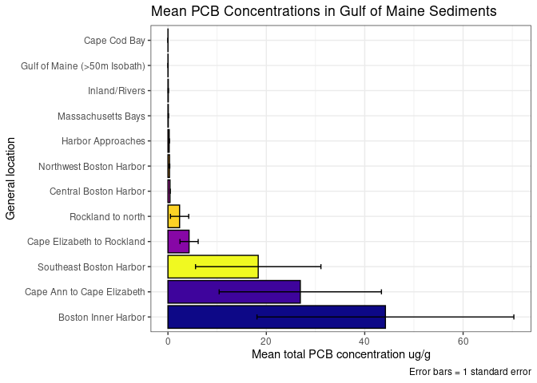

GOM Contaminated Sediments analysis: PCBs
================
Joshua Harkness and Autumn Pauly
2023-10-28

``` r
library(tidyverse)
```

    ## ── Attaching core tidyverse packages ──────────────────────── tidyverse 2.0.0 ──
    ## ✔ dplyr     1.1.3     ✔ readr     2.1.4
    ## ✔ forcats   1.0.0     ✔ stringr   1.5.0
    ## ✔ ggplot2   3.4.4     ✔ tibble    3.2.1
    ## ✔ lubridate 1.9.3     ✔ tidyr     1.3.0
    ## ✔ purrr     1.0.2     
    ## ── Conflicts ────────────────────────────────────────── tidyverse_conflicts() ──
    ## ✖ dplyr::filter() masks stats::filter()
    ## ✖ dplyr::lag()    masks stats::lag()
    ## ℹ Use the conflicted package (<http://conflicted.r-lib.org/>) to force all conflicts to become errors

``` r
library(sf)
```

    ## Linking to GEOS 3.8.0, GDAL 3.0.4, PROJ 6.3.1; sf_use_s2() is TRUE

``` r
library(leaflet)
library(RColorBrewer)
#install.packages("dplyr")
library(dplyr)
```

``` r
PCBs <- read.csv(paste0("/cloud/project/data/datasets_loc/PCBs_loc.csv"), header = T)
Organics <- read.csv(paste0("/cloud/project/data/datasets_loc/Organics_loc.csv"), header = T)
```

``` r
glimpse(PCBs)
```

    ## Rows: 7,848
    ## Columns: 38
    ## $ UNIQUE_ID  <chr> "US00001", "US00002", "US00003", "US00004", "US00005", "US0…
    ## $ LATITUDE   <dbl> 42.35972, 42.36028, 42.38500, 42.38500, 42.38500, 42.38500,…
    ## $ LONGITUDE  <dbl> -71.02861, -71.02778, -71.04611, -71.04611, -71.04611, -71.…
    ## $ SOUNDING_M <dbl> NA, NA, NA, NA, NA, NA, NA, NA, NA, NA, NA, NA, NA, NA, NA,…
    ## $ STATE_NAME <chr> "MA", "MA", "MA", "MA", "MA", "MA", "MA", "MA", "MA", "MA",…
    ## $ QUAD_NAME  <chr> NA, NA, NA, NA, NA, NA, NA, NA, NA, NA, NA, NA, NA, NA, NA,…
    ## $ GEN_LOC_NM <chr> "BOSTON INNER HARBOR", "BOSTON INNER HARBOR", "BOSTON INNER…
    ## $ SPECFC_LOC <chr> "BIH", "BIH", "BIH", "BIH", "BIH", "BIH", "BIH", "BIH", "BI…
    ## $ AREA_CODE  <int> 1, 1, 1, 1, 1, 1, 1, 1, 1, 2, 2, 1, 1, 1, 1, 1, 1, 1, 1, 1,…
    ## $ SAMP_DATE1 <chr> NA, NA, "5/1/1981", "5/1/1981", "5/1/1981", "5/1/1981", "5/…
    ## $ TO_SMP_DT2 <chr> NA, NA, NA, NA, NA, NA, NA, NA, NA, NA, NA, NA, NA, NA, NA,…
    ## $ DPTH_N_COR <chr> NA, NA, NA, NA, NA, NA, NA, NA, NA, NA, NA, NA, NA, NA, "0"…
    ## $ DPTH_CODE  <chr> "Unknown", "Unknown", "Depth", "Depth", "Unknown", "Unknown…
    ## $ COR_GRB_CD <chr> "Grab", "Grab", "Core", "Core", "Grab", "Grab", "Grab", "Gr…
    ## $ PCB_52_NGG <dbl> NA, NA, NA, NA, NA, NA, NA, NA, NA, NA, NA, NA, NA, NA, NA,…
    ## $ PCB101_NGG <dbl> NA, NA, NA, NA, NA, NA, NA, NA, NA, NA, NA, NA, NA, NA, NA,…
    ## $ PCB118_NGG <dbl> NA, NA, NA, NA, NA, NA, NA, NA, NA, NA, NA, NA, NA, NA, NA,…
    ## $ PCB128_NGG <dbl> NA, NA, NA, NA, NA, NA, NA, NA, NA, NA, NA, NA, NA, NA, NA,…
    ## $ PCB138_NGG <dbl> NA, NA, NA, NA, NA, NA, NA, NA, NA, NA, NA, NA, NA, NA, NA,…
    ## $ PCB153_NGG <dbl> NA, NA, NA, NA, NA, NA, NA, NA, NA, NA, NA, NA, NA, NA, NA,…
    ## $ PCB180_NGG <dbl> NA, NA, NA, NA, NA, NA, NA, NA, NA, NA, NA, NA, NA, NA, NA,…
    ## $ PCB206_NGG <dbl> NA, NA, NA, NA, NA, NA, NA, NA, NA, NA, NA, NA, NA, NA, NA,…
    ## $ PCB209_NGG <dbl> NA, NA, NA, NA, NA, NA, NA, NA, NA, NA, NA, NA, NA, NA, NA,…
    ## $ DDT_4_4_C  <dbl> NA, NA, NA, NA, NA, NA, NA, NA, NA, NA, NA, NA, NA, NA, NA,…
    ## $ DDT_2_4_C  <dbl> NA, NA, NA, NA, NA, NA, NA, NA, NA, NA, NA, NA, NA, NA, NA,…
    ## $ DDE_4_4_C  <dbl> NA, NA, NA, NA, NA, NA, NA, NA, NA, NA, NA, NA, NA, NA, NA,…
    ## $ DDD_4_4_C  <dbl> NA, NA, NA, NA, NA, NA, NA, NA, NA, NA, NA, NA, NA, NA, NA,…
    ## $ ENDRIN_C   <dbl> NA, NA, NA, NA, NA, NA, NA, NA, NA, NA, NA, NA, NA, NA, NA,…
    ## $ ENDR_ALD_C <dbl> NA, NA, NA, NA, NA, NA, NA, NA, NA, NA, NA, NA, NA, NA, NA,…
    ## $ ALDRIN_C   <dbl> NA, NA, NA, NA, NA, NA, NA, NA, NA, NA, NA, NA, NA, NA, NA,…
    ## $ DIELDRN_C  <dbl> NA, NA, NA, NA, NA, NA, NA, NA, NA, NA, NA, NA, NA, NA, NA,…
    ## $ CLRDNE_T_C <dbl> NA, NA, NA, NA, NA, NA, NA, NA, NA, NA, NA, NA, NA, NA, NA,…
    ## $ MIREX_C    <dbl> NA, NA, NA, NA, NA, NA, NA, NA, NA, NA, NA, NA, NA, NA, NA,…
    ## $ METHOXYCLC <dbl> NA, NA, NA, NA, NA, NA, NA, NA, NA, NA, NA, NA, NA, NA, NA,…
    ## $ BHC_A_C    <dbl> NA, NA, NA, NA, NA, NA, NA, NA, NA, NA, NA, NA, NA, NA, NA,…
    ## $ BHC_B_C    <dbl> NA, NA, NA, NA, NA, NA, NA, NA, NA, NA, NA, NA, NA, NA, NA,…
    ## $ BHC_D_C    <dbl> NA, NA, NA, NA, NA, NA, NA, NA, NA, NA, NA, NA, NA, NA, NA,…
    ## $ LINDANE_C  <dbl> NA, NA, NA, NA, NA, NA, NA, NA, NA, NA, NA, NA, NA, NA, NA,…

``` r
#PCBs %>%
  #drop_na(c(PCB_52_NGG:PCB209_NGG))
  #mutate(PCBs = sum(c(PCB_52_NGGPCB209_NGG)), na.rm = T)
  #unite("PCBs", PCB_52_NGG:PCB209_NGG, remove = TRUE)

##This is what I (Autumn) tried to do, but it still wouldn't recognize the columns. 
#PCBs %>%
  #drop_na(c(PCB_52_NGG:PCB209_NGG))
  #mutate(PCBs = PCB_52_NGG + PCB101_NGG + PCB118_NGG + PCB128_NGG + PCB138_NGG + PCB153_NGG + PCB180_NGG + PCB206_NGG + PCB209_NGG), na.rm = T)
  #unite("PCBs", PCB_52_NGG:PCB209_NGG, remove = TRUE)
```

``` r
#PCBs <- PCBs %>%
#  mutate(sum_PCBs = PCB101_NGG + PCB118_NGG + PCB128_NGG + PCB138_NGG + PCB153_NGG + PCB180_NGG + PCB206_NGG + PCB209_NGG) %>% 
 # mutate(sumBHCs = BHC_A_C + BHC_B_C + BHC_D_C)

#PCBs <- PCBs %>% 
#  select(-BHC_A_C, -BHC_B_C, -BHC_D_C, -PCB101_NGG,  -PCB118_NGG, -PCB128_NGG, -PCB138_NGG, -PCB153_NGG, #-PCB180_NGG, -PCB206_NGG, -PCB209_NGG)

#glimpse(PCBs)
```

``` r
#PCBs <- PCBs %>%
#  rowwise() %>%
#mutate(PCBs_sum_total = sum(across(c(PCB_52_NGG, PCB101_NGG, PCB118_NGG, PCB128_NGG, PCB138_NGG, #PCB153_NGG, PCB180_NGG, PCB206_NGG, PCB209_NGG)), na.rm = T))

#PCBs %>%
#  group_by(GEN_LOC_NM) %>%
#  select(STATE_NAME, GEN_LOC_NM, SPECFC_LOC, PCBs_sum_total) %>%
#  arrange(desc(PCBs_sum_total))
```

``` r
Summary_Organics_1 <- Organics %>%
  group_by(GEN_LOC_NM) %>%
  drop_na(PCB_T_UGG) %>%
  summarise(mean_PCB_T = mean(PCB_T_UGG),
    sd_PCB_T = sd(PCB_T_UGG),
    n_PCB_T = n(),
    SE_PCB_T = sd(PCB_T_UGG) / sqrt(n()))

Summary_Organics_1
```

    ## # A tibble: 12 × 5
    ##    GEN_LOC_NM                   mean_PCB_T sd_PCB_T n_PCB_T SE_PCB_T
    ##    <chr>                             <dbl>    <dbl>   <int>    <dbl>
    ##  1 43.5N to 44N; to 50M isobath     4.29    25.3        187  1.85   
    ##  2 BOSTON INNER HARBOR             44.2    285.         119 26.1    
    ##  3 CAPE ANN to 43.5N               26.9    227.         190 16.5    
    ##  4 CAPE COD BAY                     0.0113   0.0137      34  0.00235
    ##  5 CENTRAL BOSTON HARBOR            0.416    0.274       41  0.0427 
    ##  6 GULF OF MAINE, >50M ISOBATH      0.0257   0.0326     150  0.00266
    ##  7 HARBOR APPROACHES                0.251    0.207       24  0.0422 
    ##  8 INLAND / RIVERS                  0.0685   0.235       51  0.0329 
    ##  9 MASS BAYS                        0.0712   0.293      407  0.0145 
    ## 10 NORTHWEST BOSTON HARBOR          0.320    0.763      220  0.0514 
    ## 11 North of 44; to 50M isobath      2.37    22.7        150  1.86   
    ## 12 SOUTHEAST BOSTON HARBOR         18.4     73.2         33 12.7

``` r
Summary_Organics_1 %>%
  ggplot(aes(x = fct_rev(fct_reorder(GEN_LOC_NM, mean_PCB_T)), y = mean_PCB_T, fill = GEN_LOC_NM))+
  geom_col(col = "black")+
  geom_errorbar(aes(ymin = mean_PCB_T - SE_PCB_T, ymax = mean_PCB_T + SE_PCB_T), width = 0.2)+
  coord_flip()+
  scale_fill_viridis_d()+
  theme_bw()+
  theme(legend.position = "none")+
  labs(title = "PCB Concentrations in Gulf of Maine Sediments",
       x = "General location",
       y = "Mean total PCB concentration ug/g",
       caption = "Error bars = 1 standard error")
```

<!-- -->

``` r
Summary_Organics_1 %>%
  filter(GEN_LOC_NM %in% c("BOSTON INNER HARBOR", "CENTRAL BOSTON HARBOR", "SOUTHEAST BOSTON HARBOR", "NORTHWEST BOSTON HARBOR")) %>%
  ggplot(aes(x = fct_rev(fct_reorder(GEN_LOC_NM, mean_PCB_T)), y = mean_PCB_T, fill = GEN_LOC_NM))+
  geom_col(col = "black")+
  geom_errorbar(aes(ymin = mean_PCB_T - SE_PCB_T, ymax = mean_PCB_T + SE_PCB_T), width = 0.2)+
  scale_fill_brewer(type = "qual", palette = 4, direction = 1, aesthetics = "fill")+
  theme_bw()+
  coord_flip()+
  theme(legend.position = "none")+
  labs(title = "PCB Concentrations in Boston Harbor Sediments",
       x = "General location",
       y = "Mean total PCB concentration ug/g",
       caption = "Error bars = 1 standard error")
```

<!-- -->

``` r
Summary_Organics_1 %>%
  filter(GEN_LOC_NM %in% c("CENTRAL BOSTON HARBOR", "NORTHWEST BOSTON HARBOR")) %>%
  ggplot(aes(x = fct_reorder(GEN_LOC_NM, mean_PCB_T), y = mean_PCB_T, fill = GEN_LOC_NM))+
  geom_col(col = "black")+
  geom_errorbar(aes(ymin = mean_PCB_T - SE_PCB_T, ymax = mean_PCB_T + SE_PCB_T), width = 0.2)+
  scale_fill_brewer(type = "qual", palette = 4, direction = 1, aesthetics = "fill")+
  theme_bw()+
  theme(legend.position = "none")+
  labs(title = "PCB Concentrations in Boston Harbor Sediments",
       subtitle = "Central and Northwest Boston Harbor",
       x = "General location",
       y = "Mean total PCB concentration ug/g",
       caption = "Error bars = 1 standard error")
```

<!-- -->

## Statistical tests

### Difference between general locations

Does total PCB concentration differ significantly between general
locations?

## Map Plots

### Static maps

``` r
GOM_states <- st_read("/cloud/project/extra/GOM_DD.shp")
```

    ## Reading layer `GOM_DD' from data source `/cloud/project/extra/GOM_DD.shp' using driver `ESRI Shapefile'
    ## Simple feature collection with 8 features and 6 fields
    ## Geometry type: MULTIPOLYGON
    ## Dimension:     XY
    ## Bounding box:  xmin: -73.72972 ymin: 40.98249 xmax: -59.69256 ymax: 48.06532
    ## Geodetic CRS:  NAD83

``` r
Bathy <- st_read("/cloud/project/extra/BATHYMGM_ARC.shp")
```

    ## Reading layer `BATHYMGM_ARC' from data source 
    ##   `/cloud/project/extra/BATHYMGM_ARC.shp' using driver `ESRI Shapefile'
    ## Simple feature collection with 5383 features and 2 fields
    ## Geometry type: LINESTRING
    ## Dimension:     XY
    ## Bounding box:  xmin: 174878.8 ymin: 577731.9 xmax: 923912.7 ymax: 1311467
    ## Projected CRS: NAD83 / Massachusetts Mainland

``` r
unique(Bathy$CONTOUR)
```

    ##  [1]    -5   -40   -15   -20   -10     0   -50   -30   -70   -60  -100   -90
    ## [13]   -80  -120  -220  -200  -160  -180  -140  -240  -300  -280  -260  -500
    ## [25]  -400 -2000 -1000 -3000 -4000

``` r
Bathy <- Bathy%>%
 filter(CONTOUR %in% c("-100", "-200","-400","-1000","-2000","-3000","-4000"))
ggplot(Bathy) +
  geom_sf(aes())
```

<!-- --> Bathymetry data is
in projected coordinate system (NAD83), other data is geodetic (NAD83).
Wasn’t able to add this layer to map plot – need to change projection.

``` r
Org_no_na <- Organics %>%
  drop_na(PCB_T_UGG)
```

``` r
ggplot(GOM_states)+
  geom_sf(aes())+
  geom_point(data=Org_no_na, (aes(x = LONGITUDE, y = LATITUDE, size = PCB_T_UGG, alpha = 0.5)))+
  xlim(-72,-65)+
  ylim(40,45)+
  theme_bw()+
  labs(title = "Distribution and concentration of PCBs",
       subtitle ="Gulf of Maine sediments",
       x = "Longitude",
       y = "Latitude")+
  guides(size = guide_legend(title = "PCB ug/g"))+
  guides(alpha = FALSE)+
  ggspatial::annotation_scale(
    location = "bl",
    bar_cols = c("grey60", "white"),
    text_family = "ArcherPro Book"
  ) +
  ggspatial::annotation_north_arrow(
    location = "tr", which_north = "true",
    pad_x = unit(0, "in"), pad_y = unit(0.2, "in"),
    style = ggspatial::north_arrow_nautical(
      fill = c("grey40", "white"),
      line_col = "grey20",
      text_family = "ArcherPro Book"))
```

<!-- -->

### Interactive map

``` r
#labels <- sprintf("<strong>%s</strong><br/>%g ug/g", 
#                  Org_no_na$SPECFC_LOC, Org_no_na$PCB_T_UGG) %>% #lapply(htmltools::HTML)

#head(labels, 1)
```

``` r
#leaflet(data = Org_no_na) %>%
#  addProviderTiles(providers$Esri.WorldTopoMap) %>%
#  setView(lng = -68.5, 
#          lat = 43.5, 
#          zoom = 6) %>%
#  addCircleMarkers(lng = ~LONGITUDE, lat = ~LATITUDE, popup = c(~SPECFC_LOC, #~PCB_T_UGG), label = labels)
```

Note that the two above code chunks are commented out as .rmd will not
knit to github document with html functions. Uncomment to run and change
output type to `html_document` to knit.
